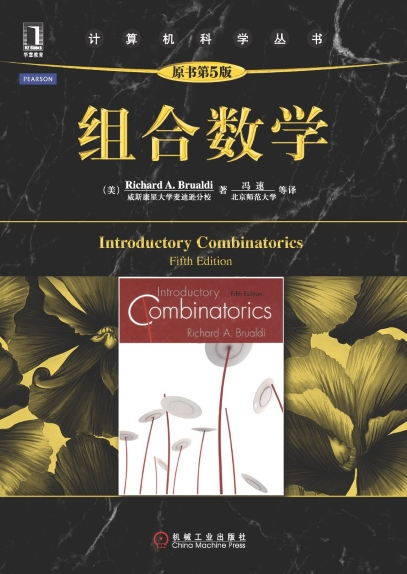
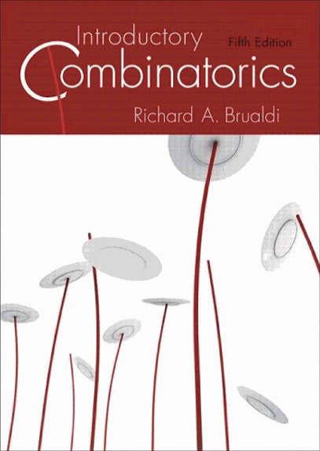

# Introductory-Combinatorics-5ed

组合数学第五版（Introductory-Combinatorics-5ed）作业

> [!NOTE]
> 本仓库现在已经使用 VitePress 进行部署，可以直接访问 链接 获取更佳的阅读效果。
>

本仓库对组合数学（第五版）黑皮书中的练习题进行解答。
题目描述以英文版为基准，涵盖第一章到第八章的**非**标星 :star: 题目，
也有少数标星题目在讨论范围中。

如果你发现解答错误、描述不清晰或者格式不当等问题，
可以直接提交 PR 修改，也可以在 Issue 或 Discussions 中提问交流。

不用感到拘束，随意讨论。 :speech_balloon:

Feel free, enjoy! :tada:

## 文件说明

- [docs/exercises](./docs/exercises/) 中存放原始题解内容
- [docs/extras](./docs/extras/) 下存放题解中使用 PPT 制作的图片和一些整理的笔记

旧版本的文档移动到 stale 分支，有需要的可以自行取用，不再维护。 :wastebasket:

## 贡献流程

下载源码，推荐使用 Visual Studio Code 进行编辑

```sh
git clone https://github.com/furtherun/Introductory-Combinatorics-5ed
```

安装仓库所需依赖，本仓库使用 pnpm 进行依赖管理

```sh
pnpm install
```

有条件的话，提交前进行格式检查和格式化。这不是必须的，**没有条件可以不做**，自由提交。

```sh
pnpm run lint
```

或者

```sh
pnpm run lint:fix
```

## 参考资料



