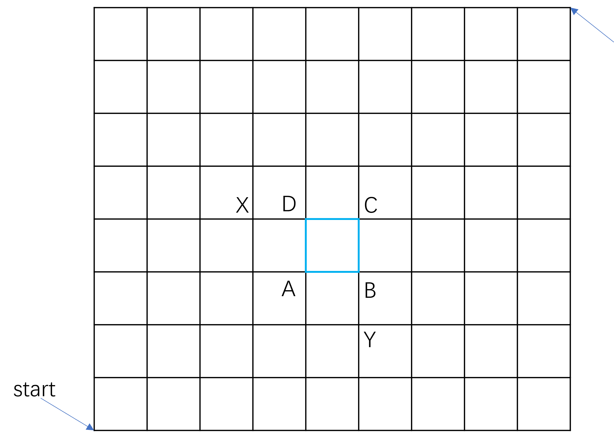

# 第2章 排列与组合EX

## EX1

> For each of the four subsets of the two properties (a) and (b), count the number  of four-digit numbers whose digits are either 1,2,3,4, or 5:  
>
> (a) The digits are distinct.  
>
> (b) The number is even.
>
> Note that there are four problems here: $\emptyset$ (no further restriction), {a} (property  (a) holds), {b} (property (b) holds), {a,b} (both properties (a) and (b) hold)

当条件a和条件b都不满足时，每一位都可以取任意数，共$4^5$种。

当只满足条件a时，总共有$P(5,4) = 120$种。

当只满足条件b时，总共有$2\times 5^3 = 250$种。

当同时满足条件a和条件b时，总共有$2 \times P(4,3) = 48$种。

## EX2

> How many orderings are there for a deck of 52 cards if all the cards of the same  suit are together?

组间排列有P(4, 4) = 24种，组内排列有P(13, 13) = 13!，一共$P(4,4)\times (P(13,13))^4 = 24 \times (13!)^4$种。

## EX3

> In how many ways can a poker hand (five cards) be dealt? How many different  poker hands are there?

题目的难点在于题意：有多少种五张牌的发牌方式？五张牌的手牌有几种？（一副牌默认是52张）

发牌是一张一张发的，是有顺序的，所以发牌方式有P(52, 5) 种；手牌种类不关注顺序，一共有$\dbinom{52}{5}$种。

## EX4

> How many distinct positive divisors does each of the following numbers have?  
>
> (a) $3^4 \times 5^2 \times 7^6 \times 11$  
>
> (b) 620
>
> (c) $10^{10}$

### EX4Q(a)

3、5、7和11都是素数，共有$5 \times 3 \times 7 \times 2 = 210$个不同的正因子。

### EX4Q(b)

先进行质因数分解，卡西欧计算器可以直接使用Fact，$620 = 2^2 \times 5 \times 31$，一共有$3 \times 2 \times 2 = 12$个不同的正因子。

### EX4Q(c)

$10^{10} = 2^{10} \times 5^{10}$，有$11 \times 11=121$个不同的正因子。

## EX5

> Determine the largest power of 10 that is a factor of the following numbers  (equivalently, the number of terminal 0s, using ordinary base 10 representation):
>
> (a) 50!
>
> (b) 1000!

数字末尾0的数量等于10因子的数量，10因子的数量又受限于5因子的数量，下面考虑有多少个5因子。

### EX5Q(a)

5的倍数（一个5因子），每十个数中有2个，总共有10个。

25的倍数（两个5因子）：25和50。

125的倍数（三个5因子）：最小是125>50，不合理。

总共10+2=12个，50!末尾有12个0。

### EX5Q(b)

一个5因子：共200个。

两个5因子：共40个。

三个5因子：共8个。

四个5因子：共1个（仅625）。

总计：200+40+8+1=249个。

## EX6

> How many integers greater than 5400 have both of the following properties?  
>
> (a) The digits are distinct.
>
> (b) The digits 2 and 7 do not occur.

总共还有8个数，{0, 1, 3, 4, 5, 6, 8, 9}，按照数字的位数进行分类。

显然，5位、6位、7位、8位均符合要求，只需要保证最高位不为0即可，记$S_i$为满足要求的i位数集合。

|      $S_i$       |      $S_8$       |      $S_7$       |      $S_6$       | $S_5$ |
| :--------------: | :--------------: | :--------------: | :--------------: | :---: |
|number| $7\times P(7,7)$ | $7\times P(7,6)$ | $7\times P(7,5)$ | $7\times P(7,4)$ |

对于4位数，进行分类：第一类是以{6, 8, 9}开头的；第二类是以5开头，第二位是{6, 8, 9}；第三类是以54开头的所有数。

$$
S_4 = 3 \times P(7,3) + 1\times 3 \times P(6,2) + 1 \times 1 \times P(6,2)
$$

### EX6PS

这题是**21年考试题目**

## EX7

> In how many ways can four men and eight women be seated at a round table if  there are to be two women between consecutive men around the table?

先排4名男性，每人中间隔两个空位，是循环排列共$\displaystyle \frac{P(4,4)}{4} = 3 !$种排法；固定位置后（可以看作线性排序），8名女性依次坐在剩下的空位中有$P(8,8)$种排法，合计$3! \times 8!$种排法。

## EX8

> In how many ways can six men and six women be seated at a round table if the  men and women are to sit in alternate seats?

先排6名男性，每人中间隔一个空位，共$5!$种排法；6名女性依次落座，共$6!$种排法，合计$5! \times 6!$种排法。

## EX9

> In how many ways can 15 people be seated at a round table if B refuses to sit  next to A? What if B only refuses to sit on A's right?

A先入座，之后B从与A不相邻的12个座位中选择一个位置，剩下的人依次落座。共$12 \times 13!$种排法，如果仅限制A的右边，则是$13 \times 13!$种排法。

## EX10

> A committee of five people is to be chosen from a club that boasts a membership  of 10 men and 12 women. How many ways can the committee be formed if it is  to contain at least two women? How many ways if, in addition, one particular  man and one particular woman who are members of the club refuse to serve  together on the committee?

按照包含女性人数进行分类，记$S_i$为包含i名女性的组合方式。

| $S_i$  |              $S_2$              |              $S_3$               |              $S_4$               |              $S_5$               |
| :----: | :-----------------------------: | :------------------------------: | :------------------------------: | :------------------------------: |
| number | $\dbinom{12}{2} \dbinom{10}{3}$ | $\dbinom{12}{3}  \dbinom{10}{2}$ | $\dbinom{12}{4}  \dbinom{10}{1}$ | $\dbinom{12}{5}  \dbinom{10}{0}$ |

一共有23562种组合方式，之后讨论对于每种$S_i$，是否出现女性(Alice)和男性(Bob)。

|   A   |   B   |              $S_2$              |              $S_3$              |              $S_4$              |              $S_5$              |
| :---: | :---: | :-----------------------------: | :-----------------------------: | :-----------------------------: | :-----------------------------: |
| 没有  | 没有  | $\dbinom{11}{2}  \dbinom{9}{3}$ | $\dbinom{11}{3}  \dbinom{9}{2}$ | $\dbinom{11}{4}  \dbinom{9}{1}$ | $\dbinom{11}{5}  \dbinom{9}{0}$ |
|  有   | 没有  | $\dbinom{11}{1}  \dbinom{9}{3}$ | $\dbinom{11}{2} \dbinom{9}{2}$  | $\dbinom{11}{3}  \dbinom{9}{1}$ | $\dbinom{11}{4}  \dbinom{9}{0}$ |
| 没有  |  有   | $\dbinom{11}{2} \dbinom{9}{2}$  | $\dbinom{11}{3}  \dbinom{9}{1}$ | $\dbinom{11}{4} \dbinom{9}{0}$  |       $\text{impossible}$       |

## EX11

> How many sets of three integers between 1 and 20 are possible if no two consecutive integers are to be in a set?

参考[文章](https://math.stackexchange.com/questions/3465771/how-many-sets-of-three-integers-between-1-and-20-are-possible-if-no-two-consecut)中的解法，求直观的方式还是逆向求解。

选出三个数一共有$\dbinom{20}{3}$种方案，减掉1开头，2开头……等两个连续数和随机第三个数的方案$19 \times 18$种，还需要补回重复减去的三个连续数$18$种，总计816种。


另一种思考是，把问题考虑成排列3个绿球和17个蓝球，要求绿球不能相邻。排序之后，绿球对应的位置即为所选的数字。

显然，这种是在蓝球间的空位进行插入，一共有$\dbinom{18}{3}= 816$种。两种解法答案一致，进一步验证了结果。


*参考答案给出的方法是构造出方程的解。*

## EX12

> A football team of 11 players is to be selected from a set of 15 players, 5 of  whom can play only in the backfield, 8 of whom can play only on the line, and  2 of whom can play either in the backfield or on the line. Assuming a football  team has 7 men on the line and 4 men in the backfield, determine the number  of football teams possible.

不选双位球员（既能踢后卫又能踢边卫的球员）；选一个双位球员踢后卫；选两个双位球员踢后卫；后卫和边卫各有一个双位球员；边卫有一个双位球员；边卫有两个双位球员。

$$
\binom{5}{4}  \binom{8}{7} + \binom{5}{3}\binom{2}{1} \binom{8}{7} + \binom{5}{2}\binom{2}{2} \binom{8}{7} + \\
\binom{5}{3}\binom{2}{1} \binom{8}{6}\binom{2}{1} + \binom{5}{4}\binom{8}{6}\binom{2}{1} + \binom{5}{4}\binom{8}{5}\binom{2}{2} = 1400
$$

## EX13

> There are 100 students at a school and three dormitories, A, B, and C, with  capacities 25, 35 and 40, respectively.  
>
> (a) How many ways are there to fill the dormitories?  
>
> (b) Suppose that, of the 100 students, 50 are men and 50 are women and that  A is an all-men's dorm, B is an all-women's dorm, and C is co-ed. How  many ways are there to fill the dormitories?

### EX13Q(a)

A、B和C依次分配。

$$
\binom{100}{25}\binom{75}{35}\binom{40}{40}
$$

### EX13Q(b)

$$
\binom{50}{25}\binom{50}{35}\binom{40}{40}
$$

## EX14

> A classroom has two rows of eight seats each. There are 14 students, 5 of whom  always sit in the front row and 4 of whom always sit in the back row. In how  many ways can the students be seated?

座位是有序的，需要使用排列。
$$
P(8,5)\times P(8,4) \times P(7,5) = \frac{(8!)^2 \cdot 7!}{3! \cdot 4! \cdot 2!} = 28449792000
$$

## EX15

> At a party there are 15 men and 20 women.
>
> (a) How many ways are there to form 15 couples consisting of one man and  one woman?
>
> (b) How many ways are there to form 10 couples consisting of one man and  one woman?

### EX15Q(a)

女多男少，以男性为基准，每名男性从女性中选择一位进行配对。

$$
P(20, 15) = 20 \times 19 \cdots \times 5
$$

### EX15Q(b)

从男性和女性中各选10人进行配对。

$$
\binom{15}{10}\binom{20}{10}\times 10!
$$

## EX16

> Prove that
>
> $$
> \binom{n}{r} = \binom{n}{n-r}
> $$
>
> by using a combinatorial argument and not the values of these numbers as given  in Theorem 3.3.1.

从大小为n的集合中选出r个元素，等价于从该集合中选择n-r个元素留下剔除其余r个元素。

## EX17

> In how many ways can six indistinguishable rooks be placed on a 6-by-6 board  so that no two rooks can attack one another? In how many ways if there are  two red and four blue rooks?

没有区别：从第一行开始，每行选择不同列进行摆放，第一行有6种选法，第二行有5种，故共有6!=720种放置方法。

有颜色：在排列好6个车后进行染色，选出2辆车染红色，剩余车染蓝色。染色方案有$\dbinom{6}{2} = 15$种，放置方法一共有$15 \times 6! = 10800$种。

## EX18

> In how many ways can two red and four blue rooks be placed on an 8-by-8 board  so that no two rooks can attack one another?

选择棋盘占用的行数、占用的列数，对于每一行选择不同列进行摆放，最后决定每一列的染色。

$$
\binom{8}{6} \binom{8}{6} \times P(6,6) \times  \binom{6}{2}\binom{4}{4}  = 8467200
$$

### PS

选择列号的过程就是就是列号集合的一个排序过程。

## EX19

> We are given eight rooks, five of which are red and three of which are blue.  
>
> (a) In how many ways can the eight rooks be placed on an 8-by-8 chessboard  so that no two rooks can attack one another?  
>
> (b) In how many ways can the eight rooks be placed on a 12-by-12 chessboard  so that no two rooks can attack one another?

### EX19Q(a)

与EX17的思想相同。

$$
\binom{8}{8} \binom{8}{8} \times P(8,8) \times \binom{8}{3} = 2257920
$$

也可以直接使用定理2.4.4的公式，

$$
\frac{(8!)^2}{3! \times 5!} = 2257920
$$

### EX19Q(b)

与EX18思想相同。

$$
\binom{12}{8} \binom{12}{8} \times P(8,8) \times \binom{8}{3} = 55324684800
$$

### EX19PS

**21年考试题目，稍有修改**。

## EX20

> Determine the number of circular permutations of {0, 1,2, ... ,9} in which 0 and  9 are not opposite. (Hint: Count those in which 0 and 9 are opposite.)

逆向思维，总的排列数减去0和9相对的排列数。

$$
P(10, 10)/10 - P(8,8) = 322560
$$

## EX21

> How many permutations are there of the letters of the word ADDRESSES? How  many 8-permutations are there of these nine letters?

多重集合$\{1 \cdot A, 2 \cdot D, 2 \cdot E, 1 \cdot R, 3 \cdot S \}$的9排列。

依照定理2.4.2，代入公式

$$
\frac{9!}{1! \cdot 2! \cdot 2! \cdot 1! \cdot 3!} = 15120
$$

多重集合$\{1 \cdot A, 2 \cdot D, 2 \cdot E, 1 \cdot R, 3 \cdot S \}$的8排列，按照缺少的字母进行分类求解。

|                             集合                             |                            排列数                            |
| :----------------------------------------------------------: | :----------------------------------------------------------: |
|      $\{ 2 \cdot D, 2 \cdot E, 1 \cdot R, 3 \cdot S \}$      |      $\dfrac{8!}{2! \cdot 2! \cdot 1! \cdot 3!} = 1680$      |
| $\{1 \cdot A, 1 \cdot D, 2 \cdot E, 1 \cdot R, 3 \cdot S \}$ | $\dfrac{8!}{1! \cdot 1! \cdot 2! \cdot 1! \cdot 3!} = 3360$  |
| $\{1 \cdot A, 2 \cdot D, 1 \cdot E, 1 \cdot R, 3 \cdot S \}$ | $\dfrac{8!}{1! \cdot 2! \cdot 1! \cdot 1! \cdot 3!} = 3360$  |
|      $\{1 \cdot A, 2 \cdot D, 2 \cdot E,  3 \cdot S \}$      |     $\dfrac{8!}{1! \cdot 2! \cdot 2!  \cdot 3!} = 1680$      |
| $\{1 \cdot A, 2 \cdot D, 2 \cdot E, 1 \cdot R, 2 \cdot S \}$ | $\dfrac{8!}{1! \cdot 2! \cdot 2! \cdot 1! \cdot 2!} = 5040 $ |

因此，总的8排列数是15120。

### EX21PS

9排列（全排列）和8排列是相同的。

## EX22

> A footrace takes place among four runners. If ties are allowed (even all four  runners finishing at the same time), how many ways are there for the race to  finish?

可以所有人都是第一名，但不能所有人都是第四名。

| 第一名 | 第二名 | 第三名 | 第四名 | 排列数                                           |
| :----: | :----: | :----: | :----: | ------------------------------------------------ |
|   4    |   0    |   0    |   0    | 1                                                |
|   3    |   1    |   0    |   0    | $\dbinom{4}{3} = 4$                              |
|   2    |   2    |   0    |   0    | $\dbinom{4}{2} = 6$                              |
|   2    |   1    |   1    |   0    | $\dbinom{4}{2} \cdot \dbinom{2}{1} = 12$         |
|   1    |   3    |   0    |   0    | $\dbinom{4}{1} = 4$                              |
|   1    |   2    |   1    |   0    | $\dbinom{4}{1} \dbinom{3}{2} = 12$               |
|   1    |   1    |   2    |   0    | $\dbinom{4}{1} \dbinom{3}{1} = 12$               |
|   1    |   1    |   1    |   1    | $\dbinom{4}{1} \dbinom{3}{1} \dbinom{2}{1} = 24$ |

合计总排列数为75。

## EX23

> Bridge is played with four players and an ordinary deck of 52 cards. Each player  begins with a hand of 13 cards. In how many ways can a bridge game start?  (Ignore the fact that bridge is played in partnerships.)

$$
\dbinom{52}{13} \dbinom{39}{13} \dbinom{26}{13} = \frac{52!}{(13!)^4}
$$

## EX24

> A roller coaster has five cars, each containing four seats, two in front and two  in back. There are 20 people ready for a ride. In how many ways can the ride  begin? What if a certa:in two people want to sit in different cars?

$$
P(20, 4) \times P(16, 4) \times P(12, 4) \times P(8, 4) \times P(4, 4) = 20!
$$

事实上，当区分前后左右时，每个位置都是不同的。Alice不想和Bob坐同一个车厢，先选择Alice的位置；排除掉同一个车厢中的3个位置，再给Bob选择位置；其他人按序就坐。有些类似EX9。

$$
20 \times 16 \times 18!= 320 \times 18!
$$

### EX24PS

参考答案讨论了是否区分左右的问题。

## EX25

> A ferris wheel(大缆车) has five cars, each containing four seats in a row. There are 20  people ready for a ride. In how many ways can the ride begin? What if a certain  two people want to sit in different cars?

对每个位子都进行区分，并且1号车厢与5号车厢相邻（其实车厢没有编号）。那么总的排列数为$\dfrac{20!}{5}$。同上，Alice不想和Bob坐同一个车厢，先选择Alice的位置；排除掉同一个车厢中的3个位置，再给Bob选择位置；其他人按序就坐。

$$
\frac{20}{5} \times 16 \times 18! = 64 \times 18!
$$

### EX25PS

同样是道英语问题，roller coaster是过山车，ferries wheel是大缆车，这是书上的翻译。后者通俗来说叫“摩天轮”就不会产生疑惑了。

那么其实此题才更接近EX9，上一题是线性问题，本题是环形问题。

## EX26

> A group of mn people are to be arranged into m teams each with n players.
>
> (a) Determine the number of ways if each team has a different name.
>
> (b) Determine the number of ways if the teams don't have names.

### EX26Q(a)

每个队依次选择n个人，或者看作多重集合$\{n \cdot A, n \cdot B, \cdots, n \cdot M\}$的排列问题。

$$
\binom{mn}{n} \binom{mn-n}{n} \cdots \binom{n}{n} = \frac{(mn)!} {(n!)^m}
$$

### EX26Q(b)

变成了平均分组问题。

$$
\frac{(mn)!} {m! \cdot (n!)^m}
$$

### EX26PS

本题考查定理2.4.3，a和b的区别是据盒子有没有标签。

## EX27

> In how many ways can five indistinguishable rooks be placed on an 8-by-8 chessboard so that no rook can attack another and neither the first row nor the first  column is empty?

根据是否包含坐标(1, 1)进行划分。

| 坐标(1, 1) |                              棋盘数                              |
| :--------: | :--------------------------------------------------------------: |
|     是     |         $\dbinom{7}{4} \dbinom{7}{4} \times 4! = 29400$          |
|     否     | $7 \times 7 \times \dbinom{6}{3}\dbinom{6}{3} \times 3!= 117600$ |

放置方法一共有147000。

## EX28

> A secretary works in a building located nine blocks east and eight blocks north  of h.is home. Every day he walks 17 blocks to work. (See the map that follows.)
>
> (a) How many different routes are possible for him?  
>
> (b) How many different routes are possible if the one block in the easterly  direction, which begins four blocks east and three blocks north of his home,  is under water (and he can't swim)? (Hint: Count the routes that use the  block under water.)

### EX28Q(a)

一共要走17个街区，其中9次向东，8次向北。
$$
\binom{17}{9} = 24310
$$

### EX28Q(b)

根据答案推测，所谓“街区”是ABCD围成的块，每次移动都在点上移动，题目要求不能经过ABCD任意一点。



那么考虑删除以A、B、C和D作为中间节点的路径即可。其中，D节点为中间节点的路径中不包括A节点，那么他只能从节点X上**转移**过来，同理B的上一个节点只能是Y，不存在以C为中间节点的路径。

$$
\binom{17}{9} - (\binom{7}{4}\binom{10}{5} + \binom{7}{3} \binom{9}{4} + \binom{7}{2} \binom{9}{4}) = 24310 - 15876 = 8434
$$

## EX29

> Let S be a multiset with repetition numbers $n_1, n_2, \dots , n_k$, where $n_1 = 1$. Let  $n =  n_2 + \cdots + n_k$. Prove that the number of circular permutations of S equals
> 
> $$
> \frac{n!}{ n_2! \cdots n_k !}
> $$

因为$n_1 = 1$，可以通过先放置数量为1的元素，来把循环排列问题转化成线性排列问题。从a处剪开环还有n（不包括$n_1$）个位置，剩下的部分就是n元素的多重集合排列，即为

$$
\frac{n!}{n_2! \cdots n_k !}
$$

## EX30

> We are to seat five boys, five girls, and one parent in a circular arrangement  around a table. In how many ways can this be done if no boy is to sit next to a  boy and no girl is to sit next to a girl? What if there are two parents?

先考虑男生的座位，满足循环排列，有$\dfrac{P(5, 5)}{5} $种排法；之后考虑女生的排列，要求男生旁边不是男生，女生旁边不是女生，两个男生之间必须安排一名女生且最多是一名女生，有P(5, 5)种排法；最后，家长可以排在任意两人之间，有10种排法。

$$
s = \frac{P(5, 5)}{5} \times P(5, 5) \times 10 = 28800
$$

当两名家长中间人数为奇数时，第二名家长有5个插入点，并且中间的人不能交换性别。一共有$5 \times s$种排列方式。

当两名家长中间人数为偶数时，第二名家长有5个插入点，并且调整一侧的性别顺序，使家长相邻的均是男孩（女孩）。一共有$5 \times 2 \times s$种排列方式。

因此，一共有432000种排列方式。

### EX30PS

两名家长的情况，最好先分析家长，之后再分析男生和女生。

## EX31

> In a soccer tournament of 15 teams, the top three teams are awarded gold, silver,  and bronze cups, and the last three teams are dropped to a lower league. We  regard two outcomes of the tournament as the same if the teams that receive  the gold, silver, and bronze cups, respectively, are identical and the teams which  drop to a lower league are also identical. How many different possible outcomes  are there for the tournament?

前三名有序，后三名无序。

$$
P(15,3)\times \binom{12}{3} = \frac{15!}{3! \cdot 9!} = 600600
$$

### EX31PS

参考答案的分母漏掉了$9!$，分析逻辑是没有问题的。

## EX32

> Determine the number of 11-permutations of the multiset  S = {3·a, 4·b, 5·c}.

多重集合的大小为12，考虑去掉一个元素后的集合进行11排列。

|                  集合                   |                   排列数                    |
| :-------------------------------------: | :-----------------------------------------: |
| $\{ 2 \cdot a, 4 \cdot b, 5 \cdot c \}$ | $\dfrac{11!}{2! \cdot 4! \cdot 5!} = 6930$  |
| $\{ 3 \cdot a, 3 \cdot b, 5 \cdot c \}$ | $\dfrac{11!}{3! \cdot 3! \cdot 5!} = 9240$  |
| $\{ 3 \cdot a, 4 \cdot b, 4 \cdot c \}$ | $\dfrac{11!}{3! \cdot 4! \cdot 4!} = 11550$ |

该多重集合的11排列为27720。

### EX32PS

该题进一步验证，n元素多重集合的n排列数和n-1排列数相等。

## EX33

> Determine the number of 10-permutations of the multiset  S = {3·a, 4·b, 5·c}.

|                  集合                   |                   排列数                   |
| :-------------------------------------: | :----------------------------------------: |
| $\{ 1 \cdot a, 4 \cdot b, 5 \cdot c \}$ | $\dfrac{10!}{1! \cdot 4! \cdot 5!} = 1260$ |
| $\{ 3 \cdot a, 2 \cdot b, 5 \cdot c \}$ | $\dfrac{10!}{3! \cdot 2! \cdot 5!} = 2520$ |
| $\{ 3 \cdot a, 4 \cdot b, 3 \cdot c \}$ | $\dfrac{10!}{3! \cdot 4! \cdot 3!} = 4200$ |
| $\{ 2 \cdot a, 3 \cdot b, 5 \cdot c \}$ | $\dfrac{10!}{2! \cdot 3! \cdot 5!} = 2520$ |
| $\{ 3 \cdot a, 3 \cdot b, 4 \cdot c \}$ | $\dfrac{10!}{3! \cdot 3! \cdot 4!} = 4200$ |
| $\{ 2 \cdot a, 4 \cdot b, 4 \cdot c \}$ | $\dfrac{10!}{2! \cdot 4! \cdot 4!} = 3150$ |

10排列共有17850种。

### EX33PS

21年考试题目。

## EX34

> Determine the number of 11-permutations of the multiset  S = {3·a,  3·b, 3·c, 3·d}.

多重集合大小为12，11排列数等于12排列数。
$$
\frac{12!}{(3!)^4} = 369600
$$

## EX35

> List all 3-combinations and 4-combinations of the multiset  {2·a, 1·b, 3·c}.

*本题求组合，而不是排列。*

3组合$\{2 \cdot a, 1 \cdot b\}, \{1 \cdot a, 1 \cdot b, 1 \cdot c\}, \{2 \cdot a, 1 \cdot c\}, \{1 \cdot a, 2 \cdot c\}, \{3 \cdot c\}, \{1 \cdot b, 2 \cdot c\}$；

4组合$\{2 \cdot a, 1 \cdot b, 1 \cdot c\}, \{2 \cdot a, 2 \cdot c\}, \{1 \cdot a, 1 \cdot b, 2 \cdot c\}, \{1 \cdot a, , 3 \cdot c\}, \{ 1 \cdot b, 3 \cdot c\}$。

## EX36

> Determine the total number of combinations (of any size) of a multiset of objects  of k different types with finite repetition numbers $n_1, n_2, \dots , n_k$, respectively.

设$x_i$表示从重复数为$n_i$的对象中取出$x_i$个，显然$x_i$有$n_i +1$个取值。

因此，多重集合的所有组合共有$(n_1+1)(n_2+1) \cdot (n_k + 1)$。

## EX37

> A bakery sells six different kinds of pastry. If the bakery has at least a dozen of  each kind, how many different options for a dozen of pastries are there? What  if a box is to contain at least one of each kind of pastry?

可以把题目抽象为多重集合$\{12 \cdot a, 12 \cdot b, 12 \cdot c, 12 \cdot d, 12 \cdot e, 12 \cdot f\}$的12组合问题，满足定理2.5.1。

$$
\binom{12+6-1}{5} = 6188
$$

以上问题可以抽象为求方程$ x_1 + x_2 + \cdots + x_k = r$的非负整数解个数。

如果每种酥皮糕点至少有一块，可以令$y_i = x_i-1$，问题转化成求方程$y_1 + y_2 + \cdots + y_6 = 6$的非负整数解个数。

$$
\binom{6 + 6-1}{5} = 462
$$

## EX38

> How many integral solutions of   $ x_1 + x_2 + x_3 + x_4 = r30$ satisfy $x_1 \ge 2, x_2 \ge 0, x_3 \ge -5, x_4 \ge 8$?

记$y_1 = x_1 - 2, y_2 = x_2, y_3 = x_3 + 5, y_4 = x_4 - 8$，问题转化为求方程$y_1 + y_2 +y_3 +y_4 = 25$的非负整数解个数。

$$
\binom{25 + 4-1}{3} = 3276
$$

## EX39

> There are 20 identical sticks lined up in a row occupying 20 distinct places as  follows:  
> 
> $$
> \text{| | | | | | | | | | | | | | | | | | | | | | | | |}
> $$
> 
> Six of them are to be chosen.
>
> (a) How many choices are there?  
>
> (b) How many choices are there if no two of the chosen sticks can be consecutive?  
>
> (c) How many choices are there if there must be at least two sticks between  each pair of chosen sticks?

### EX39Q(a)

简单选择，$\dbinom{20}{6} = 38760$。

### EX39Q(b)

问题转化成向14个方块的间隔中插入6根棍子，$\dbinom{15}{6} = 5005$。

或者考虑成把剩余的14根棍由新插入的6根棍划分成7部分，每一部分的数量是$x_i$，中间的部分至少是1，即$x_2 ,\cdots , x_6 \ge 1$。
$$
x_1 + (x_2-1) + (x_3-1) + (x_4-1) + (x_5-1) + (x_6-1) + x_7 = 14-5 = 9
$$

### EX39Q(c)

中间部分至少是2，即$x_2 ,\cdots , x_6 \ge 2$。

$$
y_1 + y_2 + y_3 + y_4 + y_5 + y_6 + y_7 = 14 - 5\times2 = 4
$$

因此有$\dbinom{7+4-1}{7-1} = \dbinom{10}{6}  = 210$种选择。

## EX40

> There are n sticks lined up in a row, and k of them are to be chosen.  
>
> (a) How many choices are there?
>
> (b) How many choices are there if no two of the chosen sticks can be consecutive?  
>
> (c) How many choices are there if there must be at least I sticks between each  pair of chosen sticks?

### EX40Q(a)

显然，$k \le n$， 一共有$\dbinom{n}{k}$种选法。

### EX40Q(b)

考虑成把剩余的n-k根棍k+1部分，每一部分的数量是$x_i$，中间的部分至少是1，即$x_2 ,\cdots , x_{k} \ge 1$。

$$
x_1 + \sum_{i=2}^{k}(x_i-1) + + x_{k+1} = n-{k-1} = n-k-(k-1) = n+1-2k
$$

一共有$\dbinom{n+1-2k+(k+1-1)}{k+1-1} = \dbinom{n-k+1}{k}$种选法。

### EX40Q(c)

中间部分至少是$l$，即$x_2 ,\cdots , x_6 \ge l$。

$$
y_1 + \sum_{i=2}^{k} + y_{k+1} = n-k-l(k-1)
$$

因此有$\dbinom{n-k-l(k-1) +(k+1-1)}{k+1-1} = \dbinom{n-l(k-1)}{k}$种选择。

## EX41

> In how many ways can 12 indistinguishable apples and 1 orange be distributed  among three children in such a way that each child gets at least one piece of  fruit?

设每个孩子分到的水果数为$x_i \ge 1$，有方程$y_1 + y_2 + y_3 = 13-3$，因此分配数有$\dbinom{10 + 3-1}{3-1} = \dbinom{12}{2}$种，再考虑把一个孩子苹果换成橘子有三种换法，因此一共有198种方法。

或者换一种思路，先分配橘子，之后给其他孩子补一个苹果，保证每人都有水果，之后考虑分配10个苹果给三个孩子。

## EX42

> Determine the number of ways to distribute 10 orange drinks, 1 lemon drink,  and 1 lime drink to four thirsty students so that each student gets at least one  drink, and the lemon and lime drinks go to different students.

先选择两名学生分配柠檬汁和酸橙汁，有P(4, 2)种分配方式；之后给剩余两名学生各发1罐橘子汁，确保每人都有一罐饮料；最后把剩余的橘子汁进行分配。

$$
P(4, 2) \times \binom{8+4-1}{4-1} = 1980
$$

## EX43

> Determine the number of r-combinations of the multiset $\{ 1 \cdot a_1, \infty \cdot a_2, \dots, \infty \cdot a_k \}$.

|    分类     |                       组合数                        |
| :---------: | :-------------------------------------------------: |
| 不包含$a_1$ |    $\dbinom{r + (k-1)-1}{r} = \dbinom{r+k-2}{r}$    |
|  包含$a_1$  | $\dbinom{(r-1)+(k-1)-1}{r-1} = \dbinom{r+k-3}{r-1}$ |

总的组合数为$\dbinom{r+k-2}{r} + \dbinom{r+k-3}{r-1}$。

## EX44

> Prove that the number of ways to distribute n different objects among k children  equals $k^n$.

显然：每件物品都可以发给任意孩子，有k种选择。

## EX45

> Twenty different books are to be put on five book shelves, each of which holds  at least twenty books.  
>
> (a) How many different arrangements are there if you only care about the  number of books on the shelves (and not which book is where)?
>
> (b) How many different arrangements are there if you care about which books  are where, but the order of the books on the shelves doesn't matter?  
>
> (c) How many different arrangements are there if the order on the shelves does  matter?

### Q(a)

不考虑书的不同，设每个书架上放置$x_i$本书，满足$\sum x_i = 20$。

一共有$\dbinom{20+5-1}{5-1} = 10626$种摆放方法。

### Q(b)

每本书都可以放到任意书架上，共有$5^{20}$种摆放方法。

### Q(c)

先给书进行排序，共P(20, 20)个序列。之后按序列进行放书，每个书架按序选择$x_i$本书。

一共有$P(20, 20) \times \dbinom{20+5-1}{5-1} = 10626 \times 20!$种摆放方法。

## EX46

> (a) There is an even number 2n of people at a party, and they talk together  in pairs, with everyone talking with someone (so n pairs). In how many  different ways can the 2n people be talking like this?  
>
> (b) Now suppose that there is an odd number 2n + 1 of people at the party  with everyone but one person talking with someone. How many different  pairings are there?

### EX46Q(a)

平均分组问题，分成n个组。

$$
\frac{(2n)!}{n! (2!)^n} = \frac{(2n-1)!! \cdot 2^n \cdot n!}{n! \cdot 2^n} = (2n-1)!!
$$

阶乘展开化简，还需要双阶乘。

### EX46Q(b)

排除1人，剩下人进行平均分组。

$$
(2n+1) \times \frac{(2n)!}{n! (2!)^n} = \frac{(2n+1)!}{n! (2!)^n} = (2n+1)!!
$$

### EX46PS

本题和第一章题目[EX36](https://www.yuque.com/furtherun/math-note/hub56k#EX36)大同小异。

## EX47

> There are 2n + 1 identical books to be put in a bookcase with three shelves. In  how many ways can this be done if each pair of shelves together contains more  books than the other shelf?

[参考链接](https://math.stackexchange.com/questions/66383/combinatorics-how-many-ways-to-sort-books-on-a-shelf)中提供的思路，不妨设三层中书的数量分别是$x_1, x_2, x_3$，由$x_1 + x_2 > x_3$和$x_1 + x_2 + x_3 = 2n+1$，可以推出$x_3 < n+\frac{1}{2}$，考虑到$x_3$是整数，因此$x_3 \le n$，再由对称性可知，$x_1 \le n, n_2 \le n$。

题目转化为在$x_1 \le n, x_2 \le n$的条件下，满足$x_1 + x_2 \ge n+1$的整数解。

当$x_1 = 1$时，$x_2$只能取n；当$x_1 = 2$时，$x_2$可以取n或n-1。因此，$1 + 2 + 3 + \cdots + n = \frac{n(n-1)}{2} = \binom{n+1}{2}$。

参考答案采用逆向思维，假设每层都放了n本书（最多放n本），再分别从中抽走$b_i$本，这样有$b_1 + b_2 + b_3 = n-1, b_i >= 0$，满足方程非负整数解的模型。

## EX48

> Prove that the number of permutations of m A's and at most n B's equals
> 
> $$
> \binom{m+n+1}{m+1}
> $$

其实难理解的地方——什么是at most n(最多n个)，这里是说所有小于等于n的排列数之和。

容易知道m个A和k个B的排列数是$\dbinom{m+k}{m}$，那么m个A和不超过n个B的排列数则是$\displaystyle \sum_{k=0}^{n}\binom{m+k}{m}$。即证，

$$
\binom{m+n+1}{m+1} =  \sum_{k=0}^{n}\binom{m+k}{m}
$$

事实上，由笛卡尔公式（定理2.3.3）代换，可以得到，

$$
\begin{aligned}
\binom{m+n+1}{m+1} &= \binom{m+n}{m} + \binom{m+n}{m+1} \\
&= \binom{m+n}{m} + [\binom{m+n-1}{m} + \binom{m+n-1}{m+1}] \\
& = \sum_{k=1}^{n} \binom{m+k}{m} + \binom{m+1}{m+1} \\
& = \sum_{k=0}^{n} \binom{m+k}{m}
\end{aligned}
$$

QED. 本题参考[链接](https://math.stackexchange.com/questions/65947/combinatorics-number-of-permutations-of-m-as-and-at-most-n-bs)。参考答案采用双射（一一对应）进行构造，截断m+1个A和n个B的排列中最后一个A及其右边的B。

## EX49

> Prove that the number of permutations of at most m A's and at most n B's  equals
> 
> $$
> \binom{m+n+2}{m+1} -1
> $$

对于每一个A（at most k A's），根据EX48的结论有

$$
\binom{k+n+1}{k+1} = \binom{k+n+1}{n}
$$

因此，把所有的情况加和，

$$
\begin{aligned}
\sum_{k=0}^{m} \binom{k+n+1}{n} =& \binom{n+1}{n} + \binom{n+2}{n} + \cdots + \binom{n+(m+1)}{n} \\
=& \binom{n+1}{n+1} + (\binom{n+1}{n} + \binom{n+2}{n} + \cdots + \binom{n+(m+1)}{n})-1\\
=& (\binom{n+1}{n+1} + \binom{n+1}{n}) + \binom{n+2}{n} + \cdots + \binom{n+(m+1)}{n}-1\\
=& (\binom{n+2}{n+1}  + \binom{n+2}{n}) + \cdots + \binom{n+(m+1)}{n}-1 \\
=& \binom{n+m+2}{n+1} -1
\end{aligned}
$$

## EX50

> In how many ways can five identical rooks be placed on the squares of an 8-by-8  board so that four of them form the corners of a rectangle with sides parallel to  the sides of the board?

选择小棋盘（矩形）$\dbinom{8}{2}\dbinom{8}{2}$，占住四个角，剩余一辆车放置在其余60格之一，一共有47040种放置方法。

## EX51

> Consider the multiset $\{n \cdot a,1, 2, 3, \cdots, n \}$ of size 2n. Determine the number of  its n-combinations.

|             分类             |      组合数       |
| :--------------------------: | :---------------: |
|            有n个a            |         1         |
| 有k个a，和其余n-k个数，k < n | $\dbinom{n}{n-k}$ |

$$
1 + \sum_{k=0}^{n-1}\binom{n}{n-k} = \sum_{k=0}^{n} \binom{n}{n-k} = \binom{n}{0} + \binom{n}{1} + \cdots + \binom{n}{n} = 2^n
$$

参考答案的思路是求出$\{1, 2, 3, \cdots, n \}$的所有子集，再通过向集合中补充a把集合大小变成n。

## EX52

> Consider the multiset $\{n \cdot a, n \cdot b, 1, 2, 3, \cdots,  n+1 \}$ of size 3n + 1. Determine the  number of its n-combinations.

$S = \{1, 2, \cdots, n+1\}$，记k为从集合S中取出元素的数量，有$\dbinom{n+1}{k}$种选法；剩余n-k项从a和b中选择，有n-k+1种选法（定理2.5,1）。因此，一共有$(n-k+1)\dbinom{n+1}{k}$种选法。

$$
\begin{aligned}
\sum_{k=0}^{n}(n-k+1)\dbinom{n+1}{k}&=\sum_{k=0}^{n}(n-k+1)\frac{(n+1)!}{(n+1-k)! \cdot k!} \\
&=\sum_{k=0}^{n}(n+1)\frac{n!}{(n-k)! \cdot (k)!} \\
&=(n+1)\sum_{k=0}^{n}\binom{n}{k} \\
&=(n+1)2^n
\end{aligned}
$$

本题参考[链接](https://math.stackexchange.com/questions/203583/number-combinations-multi-set)。

## EX53

> Find a one-to-one correspondence between the permutations of the set $\{ 1, 2, 3, \cdots,  n \}$ and the towers $A_0 \subset A_1 \subset A_2 \cdots \subset A_n$ where $|A_k| = k$ for $k=0, 1, 2, \dots, n$.

记集合$\{1, 2, 3, \cdots,  n \}$
的排列为$x_1 x_2 x_3 \cdots x_n$，
对应的塔集则为$\emptyset \subset {x_1} \subset \{x_1, x_2\} \cdots \subset \{x_1, x_2, x_3, \cdots, x_n\}$。

## EX54

> Determine the number of towers of the form $\emptyset \subseteq A \subseteq B \subseteq \{ 1, 2, 3, \cdots,  n \}$.

当$|B|=k$时，B有$\dbinom{n}{k}$种组合；A是B的子集，A有$2^k$种组合。因此塔集有，

$$
\sum_{k=0}^{n} \binom{n}{k} \cdot 2^k
$$

由二项式定理，可以发现，

$$
(x+1)^n = \sum_{k=0}^{n} \binom{n}{k}x^k\cdot 1^{n-k} = \sum_{k=0}^{n} \binom{n}{k}x^k
$$

带入$x=2$得，

$$
\sum_{k=0}^{n} \binom{n}{k} \cdot 2^k = 3^n
$$

因此塔集总数为$3^n$。

### EX54PS

**21年考试题目。**

## EX55

> How many permutations are there of the letters in the words  
>
> (a) TRISKAIDEKAPHOBIA (fear of the number 13)?
>
> (b) FLOCCINAUCINIHILIPILIFICATION (estimating something as worthless)?
>
> (c) PNEUMONOULTRAMICROSCOPICSILICOVOLCANOCONIOSIS (a lung disease  caused by inhaling fine particles of silica)? (This word is, by some accounts,  the longest word in the English language.)  
>
> (d) DERMATOGLYPHICS (skin patterns or the study of them)? (This word  is the (current) longest word in the English language that doesn't repeat a  letter; another word of the same length is UNCOPYRIGHTABLE)

*Life is short, **I** need Python!*

题目都是多重集合的排序问题，提供一个[在线Python](https://www.online-python.com/online_python_compiler)。

### EX55Q(a)

```python
from collections import Counter
s = "TRISKAIDEKAPHOBIA"
print(len(s), Counter(s).most_common())

#17 [('I', 3), ('A', 3), ('K', 2), ('T', 1), ('R', 1), ('S', 1), ('D', 1), ('E', 1), ('P', 1), ('H', 1), ('O', 1), ('B', 1)]
```

$$
\frac{17!}{(3!)^2 \cdot 2! \cdot (1!)^{14}} = \frac{17!}{2 \times(3!)^2}
$$

### EX55Q(b)

```python
from collections import Counter
s = "FLOCCINAUCINIHILIPILIFICATION"
print(len(s), Counter(s).most_common())
#29 [('I', 9), ('C', 4), ('L', 3), ('N', 3), ('F', 2), ('O', 2), ('A', 2), ('U', 1), ('H', 1), ('P', 1), ('T', 1)]
```

$$
\frac{29!}{9! \cdot 4! \cdot (3!)^2 \cdot (2!)^3}
$$

### EX55Q(c)

```python
from collections import Counter
s = "PNEUMONOULTRAMICROSCOPICSILICOVOLCANOCONIOSIS"
print(len(s), Counter(s).most_common())
#45 [('O', 9), ('I', 6), ('C', 6), ('N', 4), ('S', 4), ('L', 3), ('P', 2), ('U', 2), ('M', 2), ('R', 2), ('A', 2), ('E', 1), ('T', 1), ('V', 1)]
```

$$
\frac{45!}{9! \cdot (6!)^2 \cdot (4!)^2 \cdot 3! \cdot (2!)^5}
$$

### EX55Q(d)

```python
from collections import Counter
s = "DERMATOGLYPHICS"
print(len(s), Counter(s).most_common())
#15 [('D', 1), ('E', 1), ('R', 1), ('M', 1), ('A', 1), ('T', 1), ('O', 1), ('G', 1), ('L', 1), ('Y', 1), ('P', 1), ('H', 1), ('I', 1), ('C', 1), ('S', 1)]
```

$$
\frac{15!}{(1!)^{15}} = 15!
$$

## EX56

What is the probability that a poker hand contains a *flush* (that is, five cards of  the same suit)?

本题计算概率，样本空间的大小为$\dbinom{52}{5}$；
事件集是同花$4 \times \dbinom{13}{5}$。
因此抽出同花的概率为

$$
\frac{4 \times \dbinom{13}{5}}{\dbinom{52}{5}} \times 100 \% = 0.198\%
$$

### EX56PS

参考[Texas hold 'em](https://en.wikipedia.org/wiki/Texas_hold_%27em)中对flush牌型的解释，flush应该是同花（书上翻译为同花顺），德州扑克的总牌数是52张。

个人习惯，没有特殊说明均保留3位有效数字。

## EX57

> What is the probability that a poker hand contains exactly one pair (that is, a  poker hand with exactly four different ranks)?

5张牌中仅有2张号一样，样本空间大小仍为$\dbinom{52}{5}$；
事件集大小为$13\times \dbinom{4}{2} \times \dbinom{12}{3} \times 4^3$。
因此抽出一对的概率为

$$
\frac{13\times \dbinom{4}{2} \times \dbinom{12}{3} \times 4^3}{\dbinom{52}{5}} \times 100 \% = 42.3\%
$$

## EX58

> What is the probability that a poker hand contains cards of five different ranks  but does not contain a flush or a straight?

抽出5张不同的牌不包含同花或者顺子（两者都没有的意思，not (flush or straigh)，~~自然语言真有意思~~😁）。

去掉同花，去掉顺子，其中同花顺被减了两次，要加回来。

5张不同的牌事件集大小为$\dbinom{13}{5} \times4^5$；顺子的事件集大小为$10 \times 4^5$；同花顺的事件集大小为$4 \times 10$。因此抽出的牌型不含同花和顺子的概率为

$$
\frac{\dbinom{13}{5}\times4^5 - 10 \times 4^5 - \dbinom{13}{5} \times 4  + 4 \times 10}{\dbinom{52}{5}} \times 100 \% = 50.1\%
$$

### EX58PS

 [Straight](https://en.wikipedia.org/wiki/Texas_hold_%27em) :  Sequence of 5 cards in increasing value (Ace can precede 2 and follow up King) ，顺子有10种，从A开头到10开头。

## EX59

> Consider the deck of 40 cards obtained from an ordinary deck of 52 cards by  removing the jacks (11s), queens (12s), and kings (13s), where now the 1 (ace)  can be used to follow a 10. Compute the probabilities for the various poker  hands described in the example in Section 3.6.

### 满堂红

样本空间$|S| = \dbinom{40}{5}$，
所谓满堂红是“三带二”的牌型，$10 \times \dbinom{4}{3} \times 9 \times \dbinom{4}{2}$。

$$
\frac{10 \times \dbinom{4}{3} \times 9 \times \dbinom{4}{2}}{\dbinom{40}{5}} \times 100 \% =0.328 \%
$$

### 顺子

事件E的集合大小为$7 \times 4^5$。

$$
\frac{7 \times 4^5}{\dbinom{40}{5}} \times 100 \%= 1.09 \%
$$

### 同花顺

事件E的集合大小为$7 \times 4$。
$$
\frac{7 \times 4}{\dbinom{40}{5}} \times 100 \%= 0.00426 \%
$$

### 两个对

从牌中选出2种数字作为对，每一对要选2个颜色，从剩余牌号中选出1张，事件集E的大小为$\dbinom{10}{2} \times \dbinom{4}{2} \dbinom{4}{2} \times 32$。

$$
\frac{\dbinom{10}{2} \times \dbinom{4}{2} \dbinom{4}{2} \times 32}{\dbinom{40}{5}} \times 100 \%= 7.88 \%
$$

### 至少有一个A

使用减法原理逆向求解，求事件F：没有A的事件概率，F的集合大小为$\dbinom{36}{5}$，事件E的概率则是

$$
1 - \frac{\dbinom{36}{5}}{\dbinom{40}{5}} \times 100 \% = 42.7%
$$

## EX60

> A bagel store sells six different kinds of bagels. Suppose you choose 15 bagels at  random. What is the probability that your choice contains at least one bagel of  each kind? If one of the kinds of bagels is Sesame, what is the probability that  your choice contains at least three Sesame bagels?

设每种百吉饼的有$x_i$张，
并且有$\displaystyle \sum_{i= 1}^6 x_i = 15, x_i \ge 0$，
因此样本空间的大小就是该方程的非负整数解的个数$\dbinom{15+6-1}{6-1} = 15504$。

事件E：每种百吉饼至少一张，要求$x_i \ge 1$，
方程转化为$\displaystyle \sum_{i= 1}^6 y_i = 9, y_i = x_i -1 \ge 0$。
事件E的集合大小为$\dbinom{9+6-1}{6-1} = 2002$，因此事件E的概率为12.9%。

事件F：芝麻味的百吉饼至少三张，不妨假设$x_1 \ge 3$，事件F的集合大小为$\dbinom{12+6-1}{6-1} = 6188$，事件F的概率是，39.9%。

## EX61

> Consider an 9-by-9 board and nine rooks of which five are red and four are blue.  Suppose you place the rooks on the board in nonattacking positions at random.  What is the probability that the red rooks are in rows 1,3,5,7, 9? What is  the probability that the red rooks are both in rows 1,2,3,4,5 and in columns  1,2,3,4,5?

样本空间$|S| = 9! \times \dbinom{9}{5}$，事件E的集合大小$9! \times 1$，因此概率为$0.794\%$。

红车占左上的$5 \times 5$棋盘，蓝车占右下角$4 \times 4$的棋盘，事件F的集合大小为$5!\times 4!$，因此概率为$0.00630\%$。

## EX62

> Suppose a poker hand contains seven cards rather than five. Compute the probabilities of the following poker hands:  
>
> (a) a seven-card straight  
>
> (b) four cards of one rank and three of a different rank  
>
> (c) three cards of one rank and two cards of each of two different ranks
>
> (d) two cards of each of three different ranks, and a card of a fourth rank  
>
> (e) three cards of one rank and four cards of each of four different ranks  
>
> (f) seven cards each of different rank

### EX62Q(a)

$$
\frac{8\times 4^7}{\dbinom{52}{7}} \times 100\% = 0.0980 \%
$$

### EX62Q(b)

$$
\frac{13 \times 1 \times 12 \times \dbinom{4}{3}}{\dbinom{52}{7}} \times 100\% = 0.000466 \%
$$

对比EX59两个对。

### EX62Q(c)

$$
\frac{13 \times \dbinom{4}{3} \times \dbinom{12}{2} \times (\dbinom{4}{2})^2}{\dbinom{52}{7}} \times 100\% = 0.0924 \%
$$

### EX62Q(d)

$$
\frac{ \dbinom{13}{3} \times (\dbinom{4}{2})^3 \times 10 \times 4}{\dbinom{52}{7}} \times 100\% = 1.85 \%
$$

### EX62Q(e)

$$
\frac{13 \times\dbinom{4}{3}  \times \dbinom{12}{4} \times (\dbinom{4}{1})^4}{\dbinom{52}{7}} \times 100\% = 1.23\%
$$

### EX62Q(f)

$$
\frac{\dbinom{13}{7}  \times 4^7}{\dbinom{52}{7}} \times 100\% = 21.0\%
$$

## EX63

> Four (standard) dice (cubes with 1, 2,3, 4, 5, 6, respectively, dots on their six  faces), each of a different color, are tossed, each landing with one of its faces up,  thereby showing a number of dots. Determine the following probabilities:  
>
> (a) The probability that the total number of dots shown is 6  
>
> (b) The probability that at most two of the dice show exactly one dot  
>
> (c) The probability that each die shows at least two dots  
>
> (d) The probability that the four numbers of dots shown are all different  
>
> (e) The probability that there are exactly two different numbers of dots shown

### EX63Q(a)

记每个骰子🎲的点数分别为$x_i≥1$，$\sum x_i = 6$等价于$\sum y_i = 2$的非负整数解个数$\dbinom{2+4-1}{2}= 10$。样本空间大小为$6^4$，概率为$\dfrac{10}{6^4} \times 100 \% = 0.772 \%$。

### EX63Q(b)

$$
\frac{5^4+\dbinom{4}{1}\times 5^3 + \dbinom{4}{2} \times5^2}{6^4} \times 100\% = 98.4\%
$$

### EX63Q(c)

$$
\frac{5^4}{6^4} \times 100\% = 48.2\%
$$

### EX63Q(d)

$$
\frac{P(6,4)}{6^4} \times 100\% = 27.8\%
$$

### EX63Q(e)

这里再次感觉书上的翻译很别扭，应该是正好有两种点数，形如(a, a, a, b)或(a, a, b, b)。

$$
\frac{\dbinom{4}{3} \times 6 \times 5 + \dbinom{4}{2} \times \dbinom{6}{2} }{6^4} \times 100\% = 16.2\%
$$

前一类是不对称分组，后一类是对称分组。

## EX64

> Let n be a positive integer. Suppose we choose a sequence $i_1, i_2, \cdots, i_n$ of integers  between 1 and n at random.  
>
> (a) What is the probability that the sequence contains exactly n - 2 different  integers?  
>
> (b) What is the probability that the sequence contains exactly n - 3 different  integers?

### EX64Q(a)

可能是一个数出现3次，n-3个数出现1次；或者是两个数各出现2次，n-4个数出现1次。

$$
\frac{\dbinom{n}{1}\dbinom{n-1}{n-3}\dfrac{n!}{3!\cdot (1!)^{n-3}}+\dbinom{n}{2}\dbinom{n-2}{n-4}\dfrac{n!}{(2!)^2 \cdot (1!)^{n-2}}}{n^n} \times 100\% =\\
\frac{\dbinom{n}{1}\dbinom{n-1}{2} \dbinom{n}{3} \times (n-3)!+ \dbinom{n}{2}\dbinom{n-2}{2} \dbinom{n}{2} \times(n-2)!/ 2}{n^n} \times 100\% = \\
\frac{(n-2)\dbinom{n}{2} \dbinom{n}{3} \times (n-3)!+ \dbinom{n}{2}\dbinom{n-2}{2} \dbinom{n}{2} \dbinom{n-2}{2}\times (n-4)!}{n^n} \times 100\%
$$

验证了答案与参考答案一致，思路没有问题。

### EX64Q(b)

可能是一个数出现4次，n-4个数出现1次；或者1个数出现3次，另一个数出现2次，n-5个数出现1次；或者三个数出现2次，n-6个数出现1次。

$$
\frac{\dbinom{n}{1}\dbinom{n-1}{n-4}\dfrac{n!}{4!\cdot (1!)^{n-4}}+\dbinom{n}{1}\dbinom{n-1}{1}\dbinom{n-2}{n-5}\dfrac{n!}{3!\cdot 2!\cdot (1!)^{n-5}} +\dbinom{n}{3}\dbinom{n-3}{n-6} \dfrac{n!}{(2!)^3 (1!)^{n-6}}}{n^n} \times 100\% =\\
\frac{\dbinom{n}{1}\dbinom{n-1}{3}\dbinom{n}{4}  (n-4)!+\dbinom{n}{1}\dbinom{n-1}{1}\dbinom{n-2}{3}\dbinom{n}{3} (n-3)!/2 +\dbinom{n}{3}\dbinom{n-3}{3} \dbinom{n}{2}(n-2)!/4}{n^n} \times 100\%
$$
