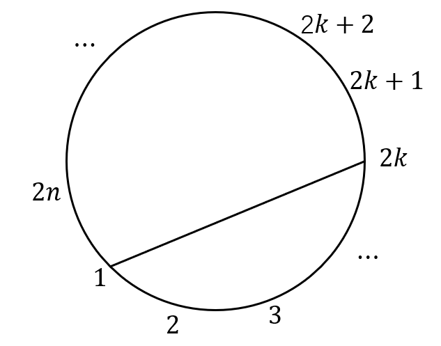
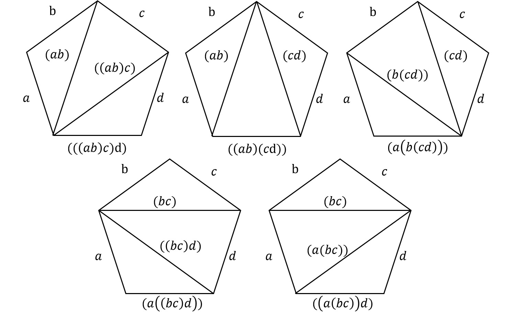
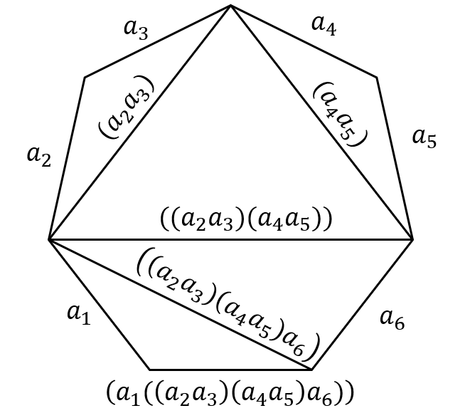
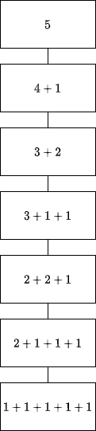

# 第8章 特殊计数序列

## EX1

>Let 2n (equally spaced) points on a circle be chosen. Show that the number of ways to join these points in pairs, so that the resulting n line segments do not intersect, equals the nth Catalan number $C_n$.



记该问题的解为$h_n$，选择一端固定在1上的线段为基线，另一端指向2k，圆上的2n个点被分为两组，一组有2k-2个，另一组有2n-2k个，同时问题$h_n$被划分为$h_{k-1}$和$h_{n-k}$。所以有，

$$
h_n = \sum_{k=1}^{n}h_{k-1}h_{n-k}, \quad n \ge 1, h_0 = h_1 = 1
$$

显然$h_n$与卡特兰数$C_n$有相同的递推关系和初始项，因此，

$$
h_n = \frac{1}{n+1} \binom{2n}{n}
$$

### EX1注

本题与第7章EX41是类似的问题

## EX2

> Prove that the number of 2-by-n arrays
>
> $$
> \begin{matrix}
> x_{11} & x_{12} & \cdots & x_{1n} \\
> x_{21} & x_{22} & \cdots & x_{2n} \\
> \end{matrix}
> $$
>
> that can be made from the numbers 1,2, ..., 2n such that
>
> $$
> x_{11} \le x_{12} \le \cdots \le x_{1n} \\
> x_{21} \le x_{22} \le \cdots \le x_{2n} \\
> $$
>
> $$
> x_{11} \le x_{21}, x_{12} x_{22}, ..., x_{1n} \le x_{2n}
> $$
>
> equals the $n$th Catalan number, $C_n$.

将数组第一行的元素标记为+1，第二行元素标记为-1。
问题可以转化为：将+1和-1按照从左到右的顺序排列，并且保证第i个+1在第i个-1前面，即$x_{1i} \le x_{2i}$（$1\le i \le n$）。

这与前k项和满足

$$
a_1 + a_2 + \cdots + a_k \ge 0
$$

等价，该问题与卡特兰数的组合意义相同，解即为第n个卡特兰数。

## EX3

>Write out all of the multiplication schemes for four numbers and the triangularization of a convex polygonal region of five sides corresponding to them.

考虑固定顺序的乘法，因此一共有$C_{n-1} = C_{3} = \frac{1}{4} \binom{6}{3} = 5$种方案，与之对应的三角形划分如图所示。



## EX4

>Determine the triangularization of a convex polygonal region corresponding to the following multiplication schemes:
>
> (a) $(a_1 \times (((a_2 \times a_3) \times (a_4 \times a_5)) \times a_6))$
>
> (b) $(((a_1 \times a_2)\times (a_3 \times (a_4 \times a_5))) \times((a_6 \times a_7) \times a_8))$

### EX4(a)

以EX4(a)为例，步骤同上一题，



## EX5

加星题，略。

## EX6

> Let the sequence $h_0, h_1, ... , h_n, \cdots$ be defined
> by $h_n = 2n^2 - n + 3, (n  \ge 0)$.
> Determine the difference table, and find a formula for $\displaystyle \sum_{k=0}^{n} h_k$.

$h_n$是2次多项式，因此有$\Delta^3 h_n = 0$，

计算$h_0 =3, h_1 = 4, h_2 = 9$，一阶差分$\Delta^1 h_0 = 1, \Delta^1 h_1 = 5$, 二阶差分$\Delta^2 h_0 = 4$，即得到第0条对角线。

$$
\begin{array}{cccc}
 3 & 4  & 9  & \cdots \\
 1 & 5 & 9 & \cdots \\
 4 & 4  & 4  & \cdots \\
 0 & 0  & 0  & \cdots
\end{array}
$$

所以$h_n = 3 \binom{n}{0} + \binom{n}{1} + 4 \binom{n}{2}$，进而

$$
\begin{aligned}
   \sum_{k=0}^{n} h_k =& 3 \sum_{k=0}^{n} \binom{k}{0} + \sum_{k=0}^{n} \binom{k}{1} + 4 \sum_{k=0}^{n} \binom{k}{2} \\
   =& 3 \binom{n+1}{1} + \binom{n+1}{2} + 4 \binom{n+1}{3} \quad n \ge 0
\end{aligned}
$$

## EX7

> The general term $h_n$ of a sequence is a polynomial in n of degree 3.
> If the first four entries of the Oth row of its difference table are 1, -1, 3, 10,
> determine $h_n$ and a formula
> for $\displaystyle \sum_{k=0}^{n} h_k$·

由题意，$h_n$是3次多项式，那么$\Delta^4 h_n=0$，求出差分表第0条对角线，

$$
\begin{array}{ccccc}
 1 & -1  & 3  & 10 & \cdots \\
 -2 & 4 & 7 & \cdots \\
 6 & 3  &  \cdots \\
  -3 & \cdots \\
  0 & \cdots
\end{array}
$$

因此$h_n = \binom{n}{0} -2 \binom{n}{1} + 6 \binom{n}{2} -3 \binom{n}{3}$，进而

$$
\begin{aligned}
    \sum_{k=0}^{n} h_k =&  \sum_{k=0}^{n} \binom{k}{0}  -2 \sum_{k=0}^{n} \binom{k}{1} + 6 \sum_{k=0}^{n} \binom{k}{2} -3 \sum_{k=0}^{n} \binom{k}{3} \\
    =&  \binom{n+1}{1} -2 \binom{n+1}{2} + 6 \binom{n+1}{3} -3 \binom{n+1}{4} \quad n \ge 0k
\end{aligned}
$$

## EX8

>Find the sum of the fifth powers of the first n positive integers.

设$h_n = n^5$，那么它的六阶差分为0，求出差分表，

$$
\begin{array}{ccccc}
 0 & 1  & 32  &  243 & 1024 & 3125 \cdots \\
 1 & 31 & 211 & 781 & 2101 \cdots \\
 30& 180  & 570 & 1320 &  \cdots \\
  150 & 390 & 750 & \cdots \\
  240 & 360 & \cdots \\
  120 & \cdots \\
  0 & \cdots
\end{array}
$$

$$
k^5 = \binom{k}{1} + 30 \binom{k}{2} + 150 \binom{k}{3} + 240 \binom{k}{4} + 120 \binom{k}{5}
$$

$$
\begin{aligned}
   \sum_{k=1}^{n} k^5 =& \sum_{k=1}^{n} \binom{k}{1} + 30\sum_{k=1}^{n} \binom{k}{2} + 150 \sum_{k=0}^{n} \binom{k}{3} + 240 \sum_{k=0}^{n} \binom{k}{4} + 120 \sum_{k=0}^{n} \binom{k}{5} \\
   =& \binom{n+1}{2} + 30 \binom{n+1}{3} + 150 \binom{n+1}{4} + 240 \binom{n+1}{5} + 120 \binom{n+1}{6}
\end{aligned}
$$

## EX9

> Prove that the following formula holds for the kth-order differences of a sequence
> $h_0, h_1, \cdots, h_n, \cdots$:
>
> $$
> \Delta^k h_n = \sum_{j=0}^{k}(-1)^{k-j} \binom{k}{j} h_{n+j}
> $$
>

采用数学归纳法证明，当k=0时，有

$$
\Delta h_n = (-1)^0 \binom{0}{0} h_{0} = h_0
$$

成立，假设当$k=m$时结论成立，即有

$$
\Delta^m h_n = \sum_{j=0}^{m}(-1)^{m-j} \binom{m}{j} h_{n+j}
$$

当$k=m+1$时，

$$
\begin{aligned}
\Delta^{m+1} h_n = & \Delta^{m} h_{n+1} - \Delta^{m} h_{n} \\
=& \sum_{j=0}^{m} (-1)^{m-j} \binom{m}{j} h_{n+1+j} - \sum_{j=0}^{m} (-1)^{m-j} \binom{m}{j} h_{n+j} \\
=& \sum_{j=1}^{m+1} (-1)^{m-j+1} \binom{m}{j-1} h_{n+j} - \sum_{j=0}^{m} (-1)^{m-j} \binom{m}{j} h_{n+j} \\
=& (h_{n+(m+1)}- (-1)^{m}h_n) + \sum_{j=1}^{m} ((-1)^{m-j+1} \binom{m}{j-1} - (-1)^{m-j} \binom{m}{j}) h_{n+j} \\
=& (-1)^{(m+1)-(m+1)} h_{n+(m+1)} + (-1)^{(m+1) - 0} h_{n + 0} + \sum_{j=1}^{m} ((-1)^{m+1-j} \binom{m}{j-1} + (-1)^{m+1-j} \binom{m}{j}) h_{n+j} \\
=& (-1)^{(m+1)-(m+1)} h_{n+(m+1)} + (-1)^{(m+1) - 0} h_{n + 0} + \sum_{j=1}^{m} (-1)^{m+1-j}  \binom{m+1}{j}) h_{n+j} \\
=& \sum_{j=0}^{m+1} (-1)^{m+1-j} \binom{m+1}{j} h_{n+j}
\end{aligned}
$$

综上，证毕。

## EX10

> If $h_n$ is a polynomial in n of degree m, prove that the constants $c_0, c_1, \cdots, c_m$ such that
>
> $$
> h_n = c_0 \binom{n}{0} + c_1 \binom{n}{1} + \cdots + c_m \binom{n}{m}
> $$
>
> are uniquely determined. (Cf. Theorem 8.2.2.)

本题主要证明**唯一性**，假设存在不同的序列$\{c_i\}_{i=0}^{m}$和
序列$\{d_i\}_{i=0}^{m}$使得存在i满足
$c_i \neq d_i$，其中$0 \le i \le m$，

$$
\begin{aligned}
h_n =& c_0 \binom{n}{0} + c_1 \binom{n}{1} + \cdots + c_m \binom{n}{m} \\
=& d_0 \binom{n}{0} + d_1 \binom{n}{1} + \cdots + d_m \binom{n}{m}
\end{aligned}
$$

$$
\sum_{k=0}^{m} (c_k - d_k) \binom{n}{k} = 0
$$

显然$\dbinom{n}{k} \gt 0$，那么只能是$c_k -d_k =0, 0 \le k \le m$，这与假设矛盾，因此假设不成立。

## EX11

>Compute the Stirling numbers of the second kind S(8, k), (k = 0, 1, ..., 8).

第二类Stirling数的性质，

1. $S(p, 0) = 0, p \ge 1$
2. $S(p, p) = 1, p \ge 0$
3. $S(p, k) = kS(p-1, k) + S(p-1, k-1)$

进行打表，
| $k$       | 0   | 1   | 2   | 3   | 4    | 5    | 6   | 7   | 8   |
| --------- | --- | --- | --- | --- | ---- | ---- | --- | --- | --- |
| $S(8, k)$ | 0   | 1   | 127 | 966 | 1701 | 1050 | 266 | 28  | 1   |

### EX11 验证程序

```cpp
 #include <iostream>
#include <vector>

using namespace std;
int main() {
    auto stirList = vector<vector<int>>(10, vector<int>(10, 0));
    for(int p = 1; p < 10; ++ p) {
        stirList[p][p] = 1;
    } 
    for(int p = 2; p < 10; ++ p) {
        for(int k = 1; k < p; ++ k) {
            stirList[p][k] = stirList[p-1][k] * k + stirList[p-1][k-1];
        }
    }
    for(int p = 0; p < 10; ++ p) {
        for(int k = 0; k <= p; ++ k) {
            printf("%d\t", stirList[p][k]);
        }
        printf("\n");
    }
    
    printf("\n S(8, k), k = 0, 1, 2, ..., 8\n");
    for(int k = 0; k <= 8; ++ k) {
        printf("%d\t", stirList[8][k]);
    }
    return 0;
}
```

## EX12

> Prove that the Stirling numbers of the second kind satisfy the following relations:
>
> (a) $S(n, 1) = 1, \quad (n \ge 1)$
>
> (b) $S(n, 2) = 2^{n-1} -1, \quad (n \ge 2)$
>
> (c) $S(n, n-1) = \binom{n}{n}, \quad (n \ge 1)$
>
> (d) $S(n, n-2) = \binom{n}{3} + 3 \binom{n}{4} \quad (n \ge 2)$

### EX12(a)

由定理8.2.5知$S(p, k)$是把p个元素集合划分到k个不可区分的盒子且没有空盒子的划分个数。
因此，$S(p, 1)$是把p个元素划分到1个盒子且没有空盒子的划分个数，显然只有1种。

### EX12(b)

$$
S(p, p) = 1, S(p, 1) = 1
$$

$$ \begin{aligned}
    S(n, 2) = & 2S(n-1, 2) + S(n-1, 1) \\
    =& 2S(n-1, 2) + 1 \\
    =& 2(2S(n-2, 2) + S(n-2, 1)) + 1 \\
    =& 2^2 S(n-2, 2) + (1 + 2) \\
    =& 2^3 S(n-3, 2) + (1 + 2 + 2^2) \\
    =& \cdots \\
    =& 2^{n-2} S(n-(n-2), 2) + (1 + 2 + 2^2 + \cdots + 2^{n-3}) \\
    =& \frac{1-2^{n-1}}{1-2} \\
    =& 2^{n-1} - 1
\end{aligned}
$$

### EX12(c)

使用数学归纳法证明，当n=1时，$S(1, 0) = 0 = \binom{1}{2}$，显然成立。假设当$n=k$时有$S(k,k-1) = \binom{k}{2}$，当$n=k+1$时有，

$$
\begin{aligned}
    S(k+1, k) =& kS(k, k) + S(k, k-1) \\
    = k + \binom{k}{2} \\
    = k + \frac{k(k-1)}{2} \\
    = \frac{k(k+1)}{2} \\
    = \binom{k+1}{2}
\end{aligned}
$$

综上，证毕。

### EX12(d)

考虑问题：将n个元素划分到n-2个不可区分的盒子且没有空盒子的个数S(n, n-2)。

如果有一个盒子中有三个元素，有$\binom{n}{3}$种情况；如果有两个盒子各有两个元素，先从n个元素中选出2个，再从剩余n-2个元素中选出2个，两种情况对称，因此是$\displaystyle \frac{\binom{n}{2}\binom{n-2}{2}}{2!} = 3\binom{n}{4}$。

因此有$S(n, n-2) = \displaystyle \binom{n}{3} + 3\binom{n}{4}$。

## EX13

> Let X be a p-element set and let Y be a k-element set. Prove that the number of functions $f : X \rightarrow Y$ which map X onto Y equals
>
> $$
> k! S(p, k) = S^{\sharp}(p, k)
> $$
>

X映射到Y是满射，映射函数等价于把p个元素放入到k个**可区分**的盒子中，即有$S^{\sharp}(p, k)$个；
同时由可区分盒子与不可区分盒子划分的关系，有$S^{\sharp}(p, k) = k!S(p, k)$，
因此映射函数的个数也等于$k!S(p, k)$。

### EX13吐槽

**到上函数**是什么鬼？没想到**onto**竟然是满射的意思，学到了。

## EX14

加星题，略。

## EX15

> The number of partitions of a set of n elements into k **distinguishable** boxes (some of which may be empty) is $k_n$. By counting in a different way, prove that
>
> $$
> k^n = \binom{k}{1} 1! S(n, 1) + \binom{k}{2} 2! S(n, 2) + \cdots + \binom{k}{n} n! S(n, n)
> $$
>
> If $k \ge n$, define $S(n, k)$ to be 0.

方法一：考虑把n个元素分别放在k个盒子中，每个元素有k种放置放法，因此共$k^n$种方法。

方法二：先区分盒子是否非空，从k个盒子中选出i个非空盒子，问题变为把n个元素放入i个可区分盒子且盒子非空中的方法数，即为$S^{\sharp}(n, i)$，i可能的取值为$i=1,2, \cdots, k$，

$$
\sum_{i=1}^{k} \binom{k}{i} S^{\sharp} (n, i) = \sum_{i=1}^{k} \binom{k}{i} i! S(n, i)
$$

方法一和方法二是同一问题的两种解决方法，因此等价，所以有，

$$
k^n = \binom{k}{1} 1! S(n, 1) + \binom{k}{2} 2! S(n, 2) + \cdots + \binom{k}{n} n! S(n, n)
$$

### EX15注

本题中文书中有翻译错误，把可区分写成了不可区分。
EX13应该也是翻译错误（onto）。

## EX16

> Compute the Bell number $B_8$. (Cf. Exercise 11.)

Bell数$B_p$是第p行的第二类Stirling数$S(p, k)$之和。

$$
0+1+127+966+1701+1050+266+28+1=4140
$$

### EX16验证程序

```cpp
#include <iostream>
#include <vector>

using namespace std;
int main() {
    auto stirList = vector<vector<int>>(10, vector<int>(10, 0));
    for(int p = 1; p < 10; ++ p) {
        stirList[p][p] = 1;
    } 
    for(int p = 2; p < 10; ++ p) {
        for(int k = 1; k < p; ++ k) {
            stirList[p][k] = stirList[p-1][k] * k + stirList[p-1][k-1];
        }
    }
    for(int p = 0; p < 10; ++ p) {
        for(int k = 0; k <= p; ++ k) {
            printf("%d\t", stirList[p][k]);
        }
        printf("\n");
    }
    
    printf("\n S(8, k), k = 0, 1, 2, ..., 8\n");
    int bellNum = 0;
    for(int k = 0; k <= 8; ++ k) {
        printf("%d\t", stirList[8][k]);
        bellNum += stirList[8][k];
    }
    printf("\n Bell number B8 is %d\n", bellNum);
    return 0;
}
```

## EX17

> Compute the triangle of Stirling numbers of the first kind s(n, k) up to n = 7.

第一类Stirling数的递推关系为，

$$
s(p, k) = (p-1) s(p-1, k) + s(p-1, k-1)
$$

初始条件与第二类Stirling数相同，$s(p, p) = 1, s(p, 0) = 0, p \ge 1, s(0, 0) = 1$。

### EX17验证程序

```cpp
#include <iostream>
#include <vector>

using namespace std;
int main() {
    auto firstStirList = vector<vector<int>>(10, vector<int>(10, 0));
    for(int p = 1; p < 10; ++ p) {
        firstStirList[p][p] = 1;
    } 
    for(int p = 2; p < 10; ++ p) {
        for(int k = 1; k < p; ++ k) {
            firstStirList[p][k] = firstStirList[p-1][k] * (p-1) 
                                + firstStirList[p-1][k-1];
        }
    }
    for(int p = 0; p < 10; ++ p) {
        for(int k = 0; k <= p; ++ k) {
            printf("%d\t", firstStirList[p][k]);
        }
        printf("\n");
    }
    
    printf("\n s(7, k), k = 0, 1, 2, ..., 7\n");
    for(int k = 0; k <= 7; ++ k) {
        printf("%d\t", firstStirList[7][k]);
    }
    return 0;
}
```

### EX17考试说明

第一类Stirling数本次考试不考，当然是在我做完第一类Stirling数的题目后才通知的。~~感觉亏了一个亿~~。

总体来说不是很难，也是通过递推式做计算。

## EX18

> Write $[n]_k$ as a polynomial in n for k = 5,6, and 7.

由定义可以求出$[n]_5$，

$$
\begin{aligned}
   [n]_5 =& n(n-1)(n-2)(n-3)(n-4) \\
   =& n^5-10n^4+35n^3-50n^2+24n
\end{aligned}
$$

也可以通过查表写$[n]_7$，

$$
\begin{aligned}
[n]_7 = & \sum_{k=0}^{7}(-1)^{7-k}s(7,k) n^k \\
=& n^7 - 21 n^6 + 175 n^5 - 735 n^4 + 1624 n^3 - 1764 n^2 + 720 n
\end{aligned}
$$

## EX19

> Prove that the Stirling numbers of the first kind satisfy the following formulas:
>
> (a) $s(n, 1) = (n-1) !, \quad (n \ge 1)$
>
> (b) $s(n, n-1) = \binom{n}{2}, \quad (n \ge 1)$

结合递归式，易证。

## EX20

> VerifY that $[n]_n$ = n!, and write n! as a polynomial in n using the Stirling numbers of the first kind. Do this explicitly for n = 6.

$[n]_p$的定义形式$[n]_p = n(n-1)(n-2) \cdots (n-(p-1)), p \ge 1$，当n=0时，$[n]_0 = 1$。

带入$p = n$显然有$[n]_n = n!, n \ge 0$。

$[n]_p$与第一类Stirling数的关系，
$[n]_p = \displaystyle \sum_{k=0}^{p} (-1)^{k-p} s(p, k) n^k$，

带入$p = n$有，

$$
n! = [n]_n = \sum_{k=0}^{n} (-1)^{n-k} s(p, k) n^k
$$

当$n=6$时，结合s(p, k)三角形有，

$$
6! = 6^6 -15 \times 6^5 + 85 \times 6^4 - 225 \times 6^3 + 274 \times 6^2 -120 \times 6^1 + 0 \times 6^0
$$

## EX21

> For each integer n = 1,2,3,4,5, construct the diagram of the set $\mathcal{P}_n$ of partitions of n, partially ordered by majorization.

~~这里的图（diagram）指的是Ferrers图，这是很容易画出的，以$5=4+1$为例，~~



### EX21注

本题应该是优超（majorize）关系的Hasse图。

## EX22

> (a) Calculate the partition number $p_6$ and construct the diagram of the
> set $\mathcal{P}_6$, partially ordered by majorization.
>
> (b) Calculate the partition number $p_7$ and construct the diagram of the
> set $\mathcal{P}_7$, partially ordered by majorization.

### EX22(a)

以(a)为例，6对应的分拆为，

$$
6, \; 51, \; 42, \;411,\;33,\;321,\;3111,\;222,\;2211,\;21111,\;111111
$$

因此$p_6 = 11$。

## EX23

> A total order on a finite set has a unique maximal element (a largest element) and a unique minimal element (a smallest element). What are the largest partition and smallest partition in the lexicographic order on $\mathcal{P}_n$ (a total order)?

最大分拆为n，最小分拆为$n=1+1+\cdots+1$。

## EX24

> A partial order on a finite set may have many maximal elements and minimal elements. In the set $\mathcal{P}_n$ of partitions of n partially ordered by majorization, prove that there is a unique maximal element and a unique minimal element.

### EX24说明

看了几份答案，似乎都不是严格的证明，只是稍微解释了$n$比其它都大，$\underbrace{1+1+\cdots+1}_{n\text{个}}$比其它都小。

## EX25

> Let $t_1, t_2, \cdots, t_m$ be distinct positive integers, and let
>
> $$
> q_n = q_n(t_1, t_2, \cdots, t_m)
> $$
>
> equal the number of partitions of n in which all parts are taken from $t_1, t_2, \cdots, t_m$. Define $q_0 = 1$. Show that the generating function for $q_0, q_1, \cdots, q_n, \cdots$ is
>
> $$
> \prod_{k=1}^{m}(1-x^{t_k})^{-1}
> $$
>

$$
\begin{aligned}
   \prod_{k=1}^{m}(1-x^{t_k})^{-1} = & \frac{1}{1-x^{t_1}} \frac{1}{1-x^{t_2}} \cdots \frac{1}{1-x^{t_m}} \\
   =& (\sum_{n_1=0}^{\infty}x^{t_1 n_1}) (\sum_{n_2=0}^{\infty} x^{t_2 n_2}) \cdots (\sum_{n_m=0}^{\infty} x^{t_m n_m}) \\
   =& \sum_{n_1=0}^{\infty} \sum_{n_2=0}^{\infty} \cdots \sum_{n_m = 0}^{\infty} x^{n_1 t_1 + n_2 t_2 \cdots + n_m t_m} \\
   =& \sum_{n=0}^{\infty} q_n x^n
\end{aligned}
$$

由分拆数的性质，$q_n$等于方程$n_1t_1 + n_2t_2 + \cdots + n_m t_m = n$非负整数解$n_1, n_2, \cdots, n_m$的个数，
所以$q_0, q_1, \cdots, q_n, \cdots$的生成函数为

$$
\prod_{k=1}^{m} (1-x^{t_k})^{k}
$$

## EX26

> Determine the conjugate of each of the following partitions:
>
> (a) $12 = 5 + 4 + 2 + 1$
>
> (b) $15 = 6 + 4 + 3 + 1 + 1$
>
> (c) $20 = 6 + 6 + 4 + 4$
>
> (d) $21 = 6 + 5 + 4 + 3 + 2 + 1$
>
> (e) $29=8+6+6+4+3+2$

### EX26(a)

以(a)为例，先画出Ferrrers图，再画出共轭分拆的图，


因此共轭分拆为$12 = 4 + 3 +2 + 2 + 1$。

## EX27

> For each integer n > 2, determine a self-conjugate partition of n that has at least two parts.

设$\lambda$是n的分拆$n_1 + n_2 + \cdots + n_k$，当n为奇数时，取$n_1 = \frac{(n+1)}{2}, n_2 = n_3 = \cdots = n_{k} = 1, k = \frac{n+1}{2}$。

当n为偶数时，取$n_1 = \frac{n}{2}, n_2 = 2, n_3 = n_4 = \cdots = n_k = 1, k = \frac{n}{2}$。

以n=7和n=8分别为奇数和偶数的例子，如图，


## EX28

> Prove that conjugation reverses the order of majorization; that is, if $\lambda$ and $\mu$ are partitions of n and $\lambda$ is majorized by $\mu$, then $\mu^{\ast}$ is majorized by $\lambda^{\ast}$.

由题意，当$\lambda$被$\mu$优超时，有

$$
\lambda_1 + \lambda_2 + \cdots + \lambda_i \le \mu_1 + \mu_2 + \mu_i, \quad 1 \le i \le k \tag{1}
$$

假设$\mu^{} \not \le \lambda^{\ast}$，即存在k使，

$$
\mu_1^{\ast} + \mu_2^{\ast} + \cdots + \mu_{i}^{\ast} \le \lambda_1^{\ast} + \lambda_2^{\ast} + \cdots + \lambda_i^{\ast}, \quad 1 \le i \lt k
$$

$$
\mu_1^{\ast} + \mu_2^{\ast} + \cdots + \mu_{k}^{\ast} \gt \lambda_1^{\ast} + \lambda_2^{\ast} + \cdots + \lambda_k^{\ast}
$$

即有$\mu_k^{\ast} \gt \lambda_k^{\ast}$，记$u = \mu_k^{\ast}, v = \lambda_k^{\ast}$。又因为$\mu^*$和$\lambda^{\ast}$都是n的分拆，所以有

$$
\mu_{k+1}^{\ast} + \mu_{k+2}^{\ast} + \cdots   \le \lambda_{k+1}^{\ast} + \lambda_{k+2}^{\ast} + \cdots
$$

如图，由互换行列前后的关系可得，


$$
\mu_{k+1}^{\ast} + \mu_{k+2}^{\ast}  \cdots = \sum_{1}^{u} (u_i - k), \; \lambda_{k+1}^{\ast} + \lambda_{k+2}^{\ast} + \cdots = \sum_{i=1}^{v} (\lambda_i - k)
$$

根据放缩，

$$
\sum_{i=1}^{v} (\mu_i - k) \lt \sum_{i=1}^{u} \le \sum_{i=1}^{v}(\lambda_i - k)
$$

可得

$$
\mu_1 + \mu_2 + \cdots + \mu_v \lt \lambda_1 + \lambda_2 + \cdots + \lambda_v \tag{2}
$$

其中(1)式与(2)式矛盾，因此假设不成立，综上，证毕。

## EX29

> Prove that the number of partitions of the positive integer n into parts each of which is at most 2
> equals $\lfloor n/2 \rfloor +1$.
> (Remark: There is a formula, namely the nearest integer to $\frac{(n+3)^2}{12},
> for the number of partitions of n into parts each of which is at most 3 but it is much more difficult to prove.
> There is also one for partitions with no part more than 4, but it is even more complicated and difficult to prove.)

当$n=2r$时，每一部分至多是2的分拆为

$$
1^n, \; 2^1 1^{n-2}, \; 2^2 1^{n-4}, \; \cdots, \; 2^r
$$

当$n=2r+1$时，每一部分最多是2的分拆为

$$
1^n, \; 2^1 1^{n-2}, \; 2^2 1^{n-4}, \; \cdots, \; 2^r1^1
$$

不论奇偶，都是分拆为r+1个部分，当r为偶数时，$r+1 = \frac{n}{2} + 1 = \lfloor n/2 \rfloor + 1$，当r为奇数时，$r+1 = \frac{n-1}{2} + 1 = \lfloor (n+1)/2 \rfloor = \lfloor n /2 \rfloor + 1$。

综上，分拆成每一部分至多是2的分拆数等于$\lfloor n/2 \rfloor$。

## EX30

> Prove that the partition function satisfies
>
> $$
> p_n \gt p_{n-1} \quad (n \ge 2)
> $$

考虑n-1的分拆数和n的分拆数，显然所有n-1的分拆数+1都是n的分拆数，此外n还有它自己作为分拆数，因此一定有$p_n \gt p_{n-1}$。

## EX31

> Evaluate $h_{k-1}^{(k)}$ the number of regions into which k-dimensional space is partitioned by k - 1 hyperplanes in general position.

$$
h_{k-1}^{(k)} = \binom{k-1}{0} + \binom{k-1}{1} + \cdots + \binom{k-1}{k-1} + \binom{k-1}{k} = 2^{k-1}
$$

### EX31注

超平面是8.4节的内容，本次考试不涉及。

## EX32

> Use the recurrence relation (8.31) to compute the small Schroder numbers $s_8$ and $s_9$.

小Schroder数的性质：

1. $s_1 = s_2 = 1$
2. $(n+2) s_{n+2} -3(2n+1)x_{n+1} + (n-1)s_n = 0, n \ge 1$

由递推关系和初始项，可以计算出$s_3 = 3, s_4 =11, s_5 = 45, s_6 = 197, s_7 = 903$，

$$
8s_8 - 3\times 13 \times 903 + 5 \times 197 = 0
$$

求出$s_8 = 4279$，同理可以求出$9s_9 - 3 \times 15 \times 4279 + 6 \times 903 = 0$，得$s_9 = 20793$。

## EX33

> Use the recurrence relation (8.32) to compute the large Schroder numbers $R_7$ and $R_8$. Verify that $R_7 = 2s_8$ and $R_8 = 2s_9$, as stated in Corollary 8.5.8.

大Schroder数的性质：

$$
R_n = \sum_{r=0}^{n} \frac{1}{n-r+1} \frac{(2n-r)!}{r![(n-r)!]^2}
$$

带入$n=7$计算，

$$
\begin{aligned}
R_7 =& \sum_{r=0}^{7} \frac{1}{8-r} \frac{(14-r)!}{r![(7-r)!]^2} \\
=& \frac{1}{8} \frac{14!}{0!(7!)^2} + \frac{1}{7} \frac{13!}{1!(6!)^2} + \frac{1}{6} \frac{12!}{2!(5!)^2} + \frac{1}{5} \frac{11!}{3!(4!)^2} + \frac{1}{4} \frac{10!}{4!(3!)^2} + \frac{1}{3} \frac{9!}{5! (2!)^2} + \frac{1}{2} \frac{8!}{6! (1!)^2} + \frac{1}{1} \frac{7!}{7! (0!)^2} \\
=&  8558 = 2\times 4279 = 2s_8
\end{aligned}
$$

### EX33注

题目要求使用**递推关系**计算，大Schroder数的递推关系为，

$$
R_n = R_{n-1} + \sum_{k=1}^{n} R_{k-1} R_{n-k}
$$

注意与Catalan数进行区分。

## EX34

> Use the generating function for the large Schroder numbers to compute the first few large Schroder numbers.

大Schroder数序列的生成函数为

$$
\sum_{n=0}^{\infty} R_n x^n = \frac{1}{2x} (-(x-1) - \sqrt{x^2 -6x + 1})
$$

$\sqrt{x^2-6x+1}$在x=0处的泰勒级数为$1-3x-4x^2-12x^3-44x^4+\cdots$，

因此，

$$
\begin{aligned}
\sum_{k=0}^{\infty} R_n x^n =& \frac{1}{2x} (-(x-1) - (1-3x-4x^2-12x^3-44x^4 + \cdots)) \\
=& \frac{2x+4x^2+ 12x^3 + 44x^4 + \cdots}{2x} \\
=& 1 + 2x + 6x^2 + 22 x^3 + \cdots
\end{aligned}
$$

综上，有$R_0 = 1, R_1 = 2, R_2 = 6, R_3 = 22$。

## EX35

> Use the generating function for the small Schroder numbers to compute the first few small Schroder numbers.

小Schroder数序列的生成函数为

$$
\sum_{n=1}^{\infty} s_n x^n = \frac{1}{4}(1+x-\sqrt{x^2 - 6x + 1})
$$

同上，带入$\sqrt{x^2-6x+1}$的泰勒级数，

$$
\begin{aligned}
   \sum_{k=1}^{\infty}  s_n x^n =& \frac{4x + 4x^2 + 12x^3 + 44x^4 + \cdots }{4}\\
   =& x + x^2 + 3x^3 + 11x^4 + \cdots
\end{aligned}
$$

综上，有$r_1 = 1, r_2 = 1, r_3 = 3, r_4 = 11$。

## EX36

> Prove that the Catalan number $C_n$ equals the number of lattice paths from (0,0) to (2n, 0) using only upsteps (1, 1) and downsteps (1, -1) that never go above the horizontal axis (so there are as many up steps as there are downsteps). (These are sometimes called *Dyck paths*.)

记上行步(1,1)为-1，下行步(1,-1)为+1，步行序列为$a_1, a_2, \cdots, a_{2n}$。

因为起点y坐标与终点y坐标相同，那么一定有n个上行步（+1）和n个下行步（-1），并且从不经过水平轴上方的格路径，即前k项和$a_1 + a_2 + \cdots + a_k \ge 0, 1 \le k \le 2n$，该问题与第n个Catalan数的组合意义相同，因此等于$C_n$。

## EX37

加星题，略。
