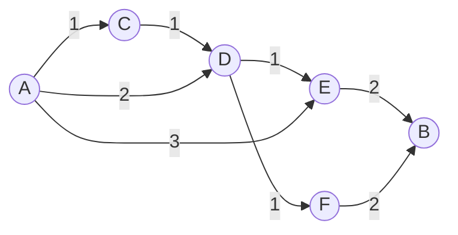

# 第 1 章 什么是组合数学

## EX1

> Show that an m-by-n chessboard has a perfect cover by dominoes **if and only if**  at least one of m and n is even.

充分性：不妨令 m 是偶数，那么至少存在一种方式（所有的多米诺骨牌竖放），可以实现完美覆盖。

必要性：不妨假设实现完美覆盖时使用了 x 块多米诺骨牌，那么棋盘总共有 2x 个方格，并且得到等式 2x=mn，mn 可以整除 2，故两者至少有一个为偶数。

*注意，多米诺骨牌特指 2 格牌。*

:::details 简评
我认为**当且仅当**的证明过程要从充分性和必要性分开来回答比较好。
:::

## EX2

> Consider an m-by-n chessboard with m and n both odd. To fix the notation,  suppose that the square in the upper left-hand corner is colored white. Show  that if a white square is cut out anywhere on the board, the resulting pruned  board has a perfect cover by dominoes.


因为左上角的颜色定为白色，可以大致确认棋盘形状如下，并可以得到等式

$$
\begin{cases}
a + b + 1 = m \\
x + y + 1 = n
\end{cases}
$$

因为 m 和 n 都是奇数，所以 a+b 是偶数，a 与 b 的奇偶性相同；同理，x 与 y 的奇偶性相同。

因为剪掉的块（坐标是$(a+1, x+1)$）为白色，并且白色块的横纵坐标同奇偶，所以 a 与 x 的奇偶性也相同。

这样，我们可以把盘面拆成如图中红线划分的四部分，并且保证每一部分至少有一条边为偶数。

$$
\begin{cases}
a\times (x+1), \\
(a+1) \times y,\\
b\times (y+1), \\
(b+1) \times x
\end{cases}
$$

因此，只需要讨论 a 和 x（或者 y）的奇偶性即可。显然，我们可以列表计算

|   a   |   x   | (a+1) | (x+1) | 图中四个分块 |
| :---: | :---: | :---: | :---: | :----------: |
|  偶   |  偶   |  奇   |  奇   |  均完美覆盖  |
|  奇   |  奇   |  偶   |  偶   |  均完美覆盖  |

从剪掉的块是白色方块观察出 a 与 x 的奇偶性相同不太直观。

## EX3

> Imagine a prison consisting of 64 cells arranged like the squares of an 8-by-8  chessboard. There are doors between all adjoining cells. A prisoner in one of  the corner cells is told that he will be released, provided he can get into the  diagonally opposite corner cell after passing through every other cell exactly  once. Can the prisoner obtain his freedom?

观察起点和终点的颜色相同，都为白色。每次移动时，方块的颜色会发生变化。
一共移动了 63 次，颜色会发生 63 次变化，最后停留位置的颜色应为黑色。故该囚犯不能获得自由。


本题和完美覆盖无关，考察的是组合数学“一一对应”技术的转化思想。

## EX4 :key:

> (a) Let f(n) count the number of different perfect covers of a 2-by-n chessboard  by dominoes. Evaluate f(1), f(2), f(3), f(4), and f(5). Try to find (and verify)  a simple relation that the counting function f satisfies. Use this relation to  compute f(12).
>
> (b) \* Let g(n) be the number of different perfect covers of a 3-by-n chessboard  by dominoes. Evaluate g(1), g(2), ... , g(6).

### EX4Q(a)

画图归纳，可以发现 f(n) 符合斐波那契数列。

$$
f(n) = f(n-1) + f(n-2), f(1) = 1, f(2) = 2 \\
\therefore f(12) =  233
$$

[这里](http://www.jade-cheng.com/uh/coursework/math-475/homework-01.pdf)有一个详细的证明过程，使 f(n) 的公式来的更加合理。

参考下面提供的其他解法，也可以考虑最后一列是如何填充的，显然$f(n)$只有唯一方案转化成$f(n-1)$和$f(n-2)$。

### EX4Q(b)


显然 n 为奇数时不存在完美覆盖，g(1) = g(3) = g(5) = 0。

当 n 为 2 时，g(2) = f(3) = 3，之后来讨论当 n 为偶数时，g(n) 的计算过程。

~~容易观察得到等式 (1)~~，

$$
g(n) = 3g(n-2) + 2[g(n-4) + \cdots + g(2)] \tag{1}
$$

上述式子中，我们把求解 g(n) 分解为两个完美覆盖的组合，第一种情况把 n 列划分为前 n-2 列和后两列，其中前 n-2 列的完美覆盖数 g(n-2)，最后两列的完美覆盖数为 3；第二种情况把 n 列划分为前 n-4 列和后四列，并且要求后四列不可拆分（无垂直断层线），防止与前者重复，经过画图总结，只有两种排版方式；同理，后面的划分也只有两种排版方式。

由此，进一步可以得到式 (2)，

$$
g(n-2) = 3g(n-4) + 2[g(n-6) + \cdots + g(2)] \tag{2}
$$

两者做差，化简可以得到式 (3)，

$$
g(n) = 4g(n-2) - g(n-4) \tag{3}
$$

当然，可以补**充来说`g(0) = 1`，即只有一种方法来覆盖空棋盘**。之后可以使用递推公式进行求解 g(n)，当然也可以构造数列，求出 g(n) 的通项。

#### 其他解法 :bulb:

*以上解法是我在中文互联网收集的，但解法本身有些扑朔迷离，我感觉并不透彻。*

*当然，我在[百度贴吧](https://tieba.baidu.com/p/5172110804)见识到另一种解法，留给读者思考的部分，我也没有弄清楚。不过，通过此贴发现了一道相关的算法题[Problem - 1143 (hdu.edu.cn)Tri Tiling](http://acm.hdu.edu.cn/showproblem.php?pid=1143)，也是需要先弄懂这个数学问题，才能完成算法设计。*

*最后，通过英文互联网搜索到了[一种解法](https://math.stackexchange.com/questions/957560/perfect-coverings#)，该解法的逻辑更清晰，构造方式很直观，但化简方程组需要一些经验和技巧。*


该方法设计了三种棋盘，我们要求解的就是第一种盘$a_n$。现在考虑填满最后一列，总共有三种方式，其中一种（三横）使$a_n$变成了$a_{n-2}$，另两种（一横一竖）均使$a_n$变成了$b_{n-1}$，故可以得到等式 (4)，

$$
a_n = a_{n-2} + 2b_{n-1} \tag{4}
$$

同理，分析第二种棋盘和第三种棋盘可以分别得到等式 (5) 和等式 (6)。

$$
b_n = a_{n-1} + c_{n-1} \tag{5}
$$

$$
c_n = b_{n-1} \tag{6}
$$

根据 (4)(5)(6) 三式，同样可以化简得到结论$\displaystyle a_n = 4a_{n-2} - a_{n-4}$。

## EX5

> Find the number of different perfect covers of a 3-by-4 chessboard by dominoes.

答案是 11，可以使用上面的公式验证。

*参考答案*给出的方法是通过一些技巧进行分类穷举。

这里我结合上一题的分析思路，给出*我的想法*。
首先把 3×4 矩阵，从中间垂直分离成两个 3×2 棋盘（即存在断层线）。
容易求出 3×2 的棋盘完美覆盖数是 3，两个棋盘的完美覆盖数满足乘法法则，因此共有 9 种排版方式。
之后再考虑不存在断层线的情况，也就是说中间两列的排布只能是一横两竖或两竖一横的两种情况。

综上，一共有 9+2=11 种排版情况。

<!--

### EX5 考后谈

21 年考试题目，我当然是要秀一把上面的 EX4Q(b)，不然白学了。

-->

## EX6

> Consider the following three-dimensional version of the chessboard problem: A  three-dimensional domino is defined to be the geometric figure that results when  two cubes, one unit on an edge, are joined along a face. Show that it is possible  to construct a cube n units on an edge from dominoes if and only if n is even. If  n is odd, is it possible to construct a cube n units on an edge with a 1-by-1 hole  in the middle? (Hint: Think of a cube n units on an edge as being composed of  $n^3$ cubes, one unit on an edge. Color the cubes alternately black and white.)

### EX6Q1

充分性：当 n 为偶数时，立方体每一层都是 n-by-n 的棋盘，可以满足二维完美覆盖，相互叠加可以满足三维完美覆盖。

必要性：立方体的一共有$n^3$个块，而一块多米诺骨牌有 2 块，实现完美覆盖时，应当满足 2 是$n^3$的因子，故 n 必须是偶数。

### EX6Q2

当 n 为奇数时，不妨设 n=2k+1，设立方体的棱角块$\alpha$为白色。此时最顶层中间块$\beta$与棱角块$\alpha$的距离是 2k（联想 EX3），故一定为白色块。

而立方体中心块$\gamma$距离顶层中心块$\beta$的距离也是 k，当 k 为奇数时，$\gamma$的颜色为黑色，如果移去$\gamma$则立方体的黑白块数不等，不可能实现完美覆盖。

故考虑 k 为偶数时，设 k=2m，此时 n=4m+1，$\alpha, \beta, \gamma$均为白色块。

沿着$\gamma$的六个面依次切割，可以得到 12 个$k\times k \times 1$长方体，6 个$1 \times 1 \times k$长方体，8 个$k \times k \times k$长方体。（可以验证$n^3-1 = 12k^2 + 6k+8k^3$），显然这三种类型的长方体都有*平凡的*完美覆盖。

综上，当 n=4m+1 时，存在完美覆盖；当 n=4m+3 时不存在完美覆盖。

## EX7

> Let a and b be positive integers with a a factor of b. Show that an m-by-n board  has a perfect cover by a-by-b pieces if and only if a is a factor of both m and  nand b is a factor of either m or n. (Hint: Partition the a-by-b pieces into a  1-by-b pieces.)
>

充分性：当 a 既是 m 又是 n 的因子且 b 是 m 或者是 n 的因子时，显然存在平凡解使棋盘能完美覆盖。

必要性：当$m \times n$棋盘有$a \times b$牌的完美覆盖时，必有$1 \times b$牌的完美覆盖，此时必定有 b 是 m 或 n 的因子。不妨假设 b 是 m 的因子，因为 a 是 b 的因子，故 a 一定是 m 的因子，现在**考虑第一行排满时**，有等式$xa + yb = n$，进一步有$xa+yka = n$，化简得到$(x+yk)a = n$，因为 k 不为 0 且 x 与 y 不同时为 0，故 a 又一定是 n 的因子。综上，a 既是 m 又是 n 的因子，b 是 m 或 n 的因子。

## EX8

> Use Exercise 7 to conclude that when a is a factor of b, an m-by-n board has a  perfect cover by a-by-b pieces if and only if it has a trivial perfect cover in which  all the pieces are oriented the same way.

充分性：显然，平凡的完美覆盖也是完美覆盖。

必要性：当棋盘存在完美覆盖时，一定有 a 既是 m 又是 n 的因子且 b 是 m 或者是 n 的因子。
不妨假设 b 是 m 的因子，将棋盘分为 m/b 个$b\times n$的棋盘，而 a 是 n 的因子，
所以可以将所有棋盘划分为$b \times a$的棋盘。此时可以判断存在平凡的完美覆盖。

### EX8PS

当存在完美覆盖时，很容易画出平凡的完美覆盖。

## EX9

> Show that the conclusion of Exercise 8 need not hold when a is not a factor of b.

举反例证明，取 m=5, n=6, a=2, b=3，如图所示（两横三竖），该棋盘**只有不平凡的完美覆盖**。


## EX10

> Verify that there is no magic square of order 2.

反证法：假设存在 2 阶幻方，幻方每条边的和应当相等，而 1 所在的两条边的和不可能相等，故假设不成立。

## EX11

> Use de la Loubere's method to construct a magic square of order 7.


:::details 算法验证
```cpp
/*
验证程序
*/
#include <iostream>
#include <vector>

using namespace std;
void output(vector<vector<int>>& vi, int size) {
    for(int i = 0; i < size; ++ i) {
        for(int j = 0; j < size; ++ j) {
            printf("%d\t", vi[i][j]);
        }
        printf("\n");
    }
}
int main()
{

    int n; //输入幻方的大小，为奇数
    scanf("%d", &n);
    vector<vector<int>> magicSquare(n, vector<int>(n, 0));
    vector<vector<bool>> isFull(n, vector<bool>(n, false));
    int x = 0, y = n/2;
    for(int i = 1; i <= n * n; ++ i) {
        isFull[x][y] = true;
        magicSquare[x][y] = i;
        output(magicSquare, n);
        printf("\n");
        int u = (x-1+n)%n, v = (y+1)%n;
        if(isFull[u][v] || (!x && y==n-1)) { //下一次位置被占或已到右上角
            x = (x+1)%n;
        } else {
            x = u;
            y = v;
        }
    }
    output(magicSquare, n);
    return 0;
}
```
:::

## EX12

> Use de la Loubere's method to construct a magic square of order 9.


## EX13

> Construct a magic square of order 6.

参考[Solving a Singly Even Magic Square](https://www.wikihow.com/Solve-a-Magic-Square)，根据"A singly even square has a number of boxes per side that is divisible by 2, but not 4"可以判断出，六阶幻方是单偶幻方，大致方法可以理解为将单偶幻方拆成 4 个奇幻方，按照 ABCD 的顺序（如图）进行填写幻方，再通过一定的规律进行交换部分项。


对于 n 阶单偶幻方，$k =\lfloor n/4  \rfloor$，A 和 D 的中间行不取第一块，而是取中心块。

*本链接同时还给出了双偶幻方的解法，如四阶幻方。至此，可以求解任意阶数的幻方。*

## EX14

> Show that a magic square of order 3 must have a 5 in the middle position.  Deduce that there are exactly 8 magic squares of order 3.

$$
\left[
\begin{matrix}
a & b & c \\
d & e & f \\
g & h & i
\end{matrix}
\right]
$$

由幻方的定义，求出三阶幻方的幻和为 15，并得到如下等式。

$$
\begin{cases}
a + e +i = 15 \\
c + e + g = 15 \\
d + e + f = 15 \\
b + e + h = 15 \\
a + b + c + d + e + f + g + h + i = 45
\end{cases}
$$

可以求出 e = 15，并且验算出一组解。

$$
\left[
\begin{matrix}
6 & 1 & 8\\
7 & 5 & 3\\
2 & 9 & 4
\end{matrix}
\right]
$$

通过旋转和转置还可以求出另外 7 组类似的解，即三阶幻方一共有 8 个解。

## EX15

> Can the following partial square be completed to obtain a magic square of order  4?
>
> $$
> \left[
> \begin{matrix}
> 2 & 3 &  & \\
> 4 &\\
> &\\
> &\\
> \end{matrix}
> \right]
> $$
>

四阶幻方的幻和 s 为 34。

$$
\left[
\begin{matrix}
2 & 3 &  a& b\\
4 &c & d & e\\
f& g & h & i\\
j& k & l &m\\
\end{matrix}
\right]
$$

由幻和定义，可以得出，

$$
\begin{cases}
2 + 3 + a + b = 34\\
2 + 4 + f + j = 34
\end{cases}
\Rightarrow
\begin{cases}
a + b = 29\\
f + j = 28
\end{cases}
$$

a 和 b 可能的取值为 16+13，15+14；f 和 j 的取值可能为 16+12 和 15+13。

考虑到幻方中所有的数均不相同，因此 a 和 b 只能取 15+14，f 和 j 只能取 16+12。

下面考虑其他线上的幻和，

$$
(2 + c+ h + m) + (3 + c + g + k) + (4 + c + d + e) = 34 \times 3 \Leftrightarrow
3c + h + m + g + k + d + e = 93
$$

事实上，考虑剩余的数最大 7 个数只有 13，11，10，9，8，7，6，因此，

$$
3c + h + m + g + k + d + e \le = 3 \times13 + 11 + 10 + 9 + 8 + 7 + 6 = 90 < 93
$$

综上，不能由该初始状态补全幻方。

## EX16

> Show that the result of replacing every integer a in a magic square of order n  with $n^2 +1 -a$ is a magic square of order n.

使用$n^2+1-a$来替换$a$后的幻方恰好是幻方旋转 180°后的结果，故仍为幻方。

幻方中每个位置与幻方旋转 180°后对应的位置之和为$n^2+1$。（[Associative magic square](https://en.wikipedia.org/wiki/Associative_magic_square#cite_note-andrews-1)）

## EX17

> Let n be a positive integer divisible by 4, say n = 4m. Consider the following  construction of an n-by-n array:
>
> (1) Proceeding from left to right and from first row to nth row, fill in the places  of the array with the integers $1,2,\dots, n^2$ in order.
>
> (2) Partition the resulting square array into $m^2$ 4-by-4 smaller arrays. Replace  each number a on the two diagonals of each of the 4-by-4 arrays with its  "complement" $n^2 + 1 - a$.
>
> Verify that this construction produces a magic square of order n when n = 4  and n = 8. (Actually it produces a magic square for each n divisible by 4.)

按照规律画出即可验证。需要说明的是该方法与[Solving a Doubly Even Magic Square](https://www.wikihow.com/Solve-a-Magic-Square)中的解法不同，但四阶幻方的结果只是旋转了 180°，那么看来双偶幻方的构造方式不止一种。

## EX18

> Show that there is no magic cube of order 2.

和 EX10 中的二维幻方一样采用反证法证明，与 1 相匹配的方块不能重复。

## EX19 :star:

> \* Show that there is no magic cube of , order 4.

这里参考[What's known about magic cubes of order 4?](https://math.stackexchange.com/questions/951930/whats-known-about-magic-cubes-of-order-4)中提到的证明过程，先证明两条引理，最终也是像二阶幻方和二阶幻方体一样反证不存在。

假设四阶幻方体存在，并记四阶幻方体的幻和为 K，K = 130。


引理 1：四阶**幻方**（不是幻方体）的所有角之和为 K。

证明：设四个角之和为 x，其他块之和为 y，计算每条边和两条对角线之和，发现四个角计算 3 次，其余块计算 1 次。此时有$3x+y = 6K$；此外，一个面总和满足$x+y = 3K$，所以求出 x = K。

引理 2：四阶幻方体的同一条棱上的两个顶点之和为 K/2。

证明：设一条棱的顶点分别为 a 和 b，与这条棱平行的两条棱顶点分别为 c、d 和 e、f。那么，abcd、abef 和 cdef 都可以看作四阶幻方的四个顶点，因此有如下等式。

$$
(a + b+c+d) + (a+b+e+f ) + (c + d + e+f) = 3K
$$

进一步化简可以得到$a+b+(c+d+e+f) = 3K/2$，故$a+b = K/2$。

根据引理 2，四阶幻方中的某个顶点的值为 x，那三个相邻的顶点值都应该为 K/2-x，而幻方体中不存在重复的值，与假设矛盾。

:::details 简评

<!-- ### EX19PS -->

很酷的题目，印象深刻。*此题不考*，着实可惜。

:::

## EX20

> Show that the following map of 10 countries {1, 2, ... , 10} can be colored with three but no fewer colors. If the colors used are red, white, and blue, determine  the number of different colorings.

因为 1、2 和 10 是相邻的，必须分配至少三种颜色，才能完成着色。

当选择红白蓝三色时，他们有三种染色方案；而 5 的颜色可以和 1 或者 10 相同，有两种染色方案。综上，一共有 6 种染色方案。


## EX21

> (a) Does there exist a magic hexagon of order 2? That is, is it possible to arrange  the numbers 1,2, ... ,7 in the following hexagonal array so that all of the nine  "line" sums (the sum of the numbers in the hexagonal boxes penetrated by a  line through midpoints of opposite sides) are the same?
>
> (b) \* Construct a magic hexagon of order 3; that is, arrange the integers  1,2, ... ,19 in a hexagonal array (three integers on a side) in such a way that all  of the fifteen "line" sums are the same (namely, 38). :star:

### EX21Q(a)

采用反证法，假设存在 2 阶幻六边形，那么应该满足 a+b=s 且 a+f=s，即 b=f。显然，这与幻六边形中的数唯一矛盾，假设不成立。（与证明 2 阶幻方不在在方法相同）。

### 另一种思路

还可以通过[幻六边形](https://en.wikipedia.org/wiki/Magic_hexagon)的“线”进行证明。如果存在 2 阶幻六边形。那么有，

$$
\begin{cases}
a + b = s \\
f + g + c = s \\
e + d = s \\
a + b + c + d + e + f + g = 28
\end{cases}
$$

可以求出，$\displaystyle s = \frac{28}{3}$，而 a 和 b 都是正整数，矛盾，故不存在 2 阶幻六边形。


### EX21Q(b) :star:

参考[Magic Hexagon of order 3](https://www.metalevel.at/magon/)，
*This task looks very simple, yet is almost impossibly hard to solve manually.*
此问题不太可能手工计算出结果，需要计算机辅助。

## EX22 :construction: :key:

> Construct a pair of orthogonal Latin squares of order 4.

由练习 EX24 中的方法，可以得到第一个拉丁方 L1，第二个拉丁方得到的方法是固定第一行（列），将剩下的行（列）向上（前）滚动。这个做法参考了视频[Construction of balanced incomplete block designs using mutually orthogonal Latin squares](https://www.youtube.com/watch?v=9tqjtudKMKQ)，但我并没有看懂其中的原理（参考 10.4 节）。

$$
L1 = \left[
\begin{matrix}
1 & 2 & 3 & 4 \\
4 & 1 & 2 & 3 \\
3 & 4 & 1 & 2 \\
2 & 3 & 4 & 1 \\
\end{matrix}
\right],
L2=
\left[
\begin{matrix}
1 & 2 & 3 & 4 \\
3 & 4 & 1 & 2 \\
2 & 3 & 4 & 1 \\
4 & 1 & 2 & 3 \\
\end{matrix}
\right]
$$

尽管视频[Orthogonal latin squares](https://www.youtube.com/watch?v=q4Wz84fj95g)中有很多错误，但似乎介绍了正交拉丁方的计算方式。考虑到书中并没有详细讨论求解正交拉丁方的原理，这里就不再展开。

### EX22PS

拉丁方问题在 10.4 节中有详细讨论。~~因为不考，所以我就不看了。~~

同时，还要感谢 b 站网友的帮助。

:::details 简评
只能说没学，却不知要考。

这也不会只有第一次。
:::

<!--
### EX22 考后谈

似乎并不允许采用「简单的」说明，需要更**复杂**求解。

**21 年考试题目。**
-->

## EX23 :construction:

> Construct Latin squares of orders 5 and 6.

每一行滚动写出即可。

$$
\left[
\begin{matrix}
1 & 2 & 3 & 4 & 5 \\
5 & 1 & 2 & 3 & 4 \\
4 & 5 & 1 & 2 & 3 \\
3 & 4 & 5 & 1 & 2 \\
2 & 3 & 4 & 5 & 1 \\
\end{matrix}
\right],
\left[
\begin{matrix}
1 & 2 & 3 & 4 & 5 & 6\\
6 & 1 & 2 & 3 & 4 & 5\\
5 & 6 & 1 & 2 & 3 & 4\\
4 & 5 & 6 & 1 & 2 & 3\\
3 & 4 & 5 & 6 & 1 & 2\\
2& 3 & 4 & 5 & 6 & 1
\end{matrix}
\right]
$$

:::details 说明

:speech_balloon: 类似 EX22，原理和过程需要补充

:::

## EX24

> Find a general method for constructing a Latin square of order n.

第一行从 1 到 n，之后每一行都把上一行的最后一个放到最前面。

:::details 验证结果代码

```c++
#include <iostream>
using namespace std;
int main()
{
    int n;
    scanf("%d", &n);
    for(int i = 0; i < n; ++ i) {
        for(int j = 1; j <= i; ++ j) {
            printf("%d\t", n-i+j);
        }
        for(int j = 1; j <= n-i; ++ j) {
            printf("%d\t", j);
        }
        printf("\n");
    }
    return 0;
}
```

:::

## EX25

> A 6-by-6 chessboard is perfectly covered with 18 dominoes. Prove that it is possible to cut it either horizontally or vertically into two nonempty pieces without  cutting through a domino; that is, prove that there must be a fault line.

如果没有断层线，那么图中每一条断层线都要切割多米诺骨牌，考虑填充第一列，至少需要两块横放的多米诺骨牌，因此$x_1 \ge 2$，同理其他线也至少穿过两块多米诺骨牌，因此 10 条线一共至少穿过 20 块多米诺骨牌，而最多只有 18 块多米诺骨牌，因此假设不成立。


## EX26

> Construct a perfect cover of an 8-by-8 chessboard with dominoes having no fault-line.

一点点从$8 \times 8$的方格中删除边，大致遵顼从上到下，依次拆除断层线，尽可能保持对称。


## EX27

> Determine all shortest routes from A to B in the system of intersections and  streets (graph) in the following diagram. The numbers on the streets represent  the lengths of the streets measured in terms of some unit.
>
> 

使用 Dijkstra 算法+DFS，记录结点的前驱，逆序输出。



## EX28

> Consider 3-heap Nim with heaps of sizes 1, 2, and 4. Show that this game is  unbalanced and determine a first move for player 1.

|          | $2^2$ | $2^1$ | $2^0$ |
| :------: | :---: | :---: | :---: |
|    1     |   0   |   0   |   1   |
|    2     |   0   |   1   |   0   |
|    4     |   1   |   0   |   0   |
| $\oplus$ |   1   |   1   |   1   |

并非所有列的 1 数量为偶数，因此游戏初始是不平衡的。玩家 1 可以调整为平衡态，即从大小为 4 的堆中取出 1 枚硬币（行状态变成 011B）。

## EX29 :key:

> Is 4-heap Nim with heaps of sizes 22, 19, 14, and 11 balanced or unbalanced?  Player I's first move is to remove 6 coins from the heap of size 19. What should  player II's first move be?

|               | $2^4$ | $2^3$ | $2^2$ | $2^1$ | $2^0$ |
| :-----------: | ----- | ----- | :---: | :---: | :---: |
|      22       | 1     | 0     |   1   |   1   |   0   |
|     19/13     | 1/0   | 0/1   |  0/1  |  1/0  |  1/1  |
|      14       | 0     | 1     |   1   |   1   |   0   |
|      11       | 0     | 1     |   0   |   1   |   1   |
| begin/player1 | 0/1   | 0/1   |  0/1  |  0/1  |   0   |

游戏初始是平衡的，玩家 1 把大小为 19 的堆修改为 13（01101B），游戏状态变为（11110B），
玩家 2 需要从大小为 22 的堆中，取出 14 枚硬币（行状态变成 01000B）。

<!--
### PS

21 年考试题目，稍有改动。
-->

## EX30

> Consider 5-heap Nim with heaps of sizes 10, 20, 30, 40, and 50. Is this game  balanced? Determine a first move for player I.

|     | $2^5$ | $2^4$ | $2^3$ | $2^2$ | $2^1$ | $2^0$ |
| --- | :---: | ----- | ----- | :---: | :---: | :---: |
| 10  |   0   | 0     | 1     |   0   |   1   |   0   |
| 20  |   0   | 1     | 0     |   1   |   0   |   0   |
| 30  |   0   | 1     | 1     |   1   |   1   |   0   |
| 40  |   1   | 0     | 1     |   0   |   0   |   0   |
| 50  |   1   | 1     | 0     |   0   |   1   |   0   |

游戏初始是不平衡的，玩家 1 可以从大小为 30 的堆中取出 26 枚硬币。

## EX31

> Show that player I can always win a Nim game in which the number of heaps  with an odd number of coins is odd.

在二进制中，奇数的末位一定为 1，偶数的末位一定为 0，而奇数堆的数量为奇数，总体来看，末位一定有奇数个 1 且最后一列一定不平衡。因此，游戏初始时一定是不平衡的，玩家 1 可以通过调整为平衡来取得胜利。

## EX32

> Show that in an unbalanced game of Nim in which the largest unbalanced bit is  the jth bit, player I can always balance the game by removing coins from any  heap the base 2 numeral of whose number has a 1 in the jth bit.

最大不平衡位是 j 位，j 位需要变为 0；后面的位，如果已经平衡则不变，不平衡则反转该位。通过此方法，玩家 1 一定能把游戏变为平衡。

### EX32PS

这是一种 Nim 游戏求平衡的通用方法。

## EX33

> Suppose we change the object of Nim so that the player who takes the last coin  loses (the misere version). Show that the following is a winning strategy: Play  as in ordinary Nim until all but exactly one heap contains a single coin. Then  remove either all or all but one of the coins of the exceptional heap so as to leave  an odd number of heaps of size 1.

玩家 1 把堆（大小为 1）的数量调整为奇数，玩家 2 只能把它（大小为 1 的堆的数量）调整为偶数，最后玩家 2 会取走最后一枚棋子。

## EX34

> A game is played between two players, alternating turns as follows: The game  starts with an empty pile. When it is his turn, a player may add either 1, 2,  3, or 4 coins to the pile. The person who adds the 100th coin to the pile is the  winner. Determine whether it is the first or second player who can guarantee a  win in this game. What is the winning strategy?

逆向分析，当还有 5 枚硬币需要放置时，后手的人有必胜策略。

100 硬币可以看作是 20 组（每组 5 枚），先手的人无论取多少枚，后手的人都可以把硬币堆调整成 5 的倍数，故后手的人有必胜策略。

## EX35

> Suppose that in Exercise 34, the player who adds the 100th coin loses. Now who  wins, and how?

把硬币分成 21 组，第一组 4 枚，最后一组 1 枚，其他组都是 5 枚。玩家 1 把第一组放到堆上；之后，玩家 2 只能从第二组中选择一定数量的硬币放到堆上，玩家 1 只需要把该组剩下的硬币放到堆上即可。那么，剩下的所有组都是这样，最终是玩家 2 输掉游戏。

## EX36

> Eight people are at a party and pair off to form four teams of two. In how many  ways can this be done? (This is sort of an "unstructured" domino-covering  problem.)

平均分组问题：

$$
\frac{
\left(
\begin{matrix}
 8 \\
 2
\end{matrix}
\right)
\cdot
\left(
\begin{matrix}
 6 \\
 2
\end{matrix}
\right)
\cdot
\left(
\begin{matrix}
 4 \\
 2
\end{matrix}
\right)
\cdot
\left(
\begin{matrix}
 2 \\
 2
\end{matrix}
\right)
}{P(4,4)} = 105
$$

答案的方法，给出递推关系，

$$
h_n = (2n-1)h_{n-1}
$$

其中 n 是形成的 n 对组合。当 2n-2 人已经形成好$h_{n-1}$种配对方式后，再来 2 个人，其中一人可以从已经选好的 n-1 组中拆出一组或者和刚加入的另一人组成新组，共有 2n-1 种方式。

### EX36PS :bulb:

学习过第二章后，可以考虑把问题转化为「把 n 个球放入 k 个无标签的盒子」，因此可以计算，

$$
\frac{8!}{4! \times (2!)^4} = 105
$$

## EX37

> A Latin square of order n is **idempotent**(幂等的) provided the integers {1, 2, ... ,n} occur  in the diagonal positions (1,1), (2, 2), ... , (n, n) in the order 1,2, ... , n, and is  symmetric provided the integer in position (i, j) equals the integer in position  (j, i) whenever i $\ne $ j. There is no symmetric, idempotent Latin square of order  2. Construct a symmetric, idempotent Latin square of order 3. Show that there  is no symmetric, idempotent Latin square of order 4. What about order n in  general, where n is even?

$$
\left[
\begin{matrix}
1 & 3 & 2 \\
3 & 2 & 1 \\
2 & 1 & 3
\end{matrix}
\right]
$$

不存在偶数阶对称且幂等的拉丁方。

反证法，假设存在这样的拉丁方，考虑对角线上有唯一的 x，对角线外有偶数个 x，总共有奇数个 x。而偶拉丁方中 x 的个数为偶数，矛盾，故假设不成立。

## EX38 :construction: :key:

> Take any set of 2n points in the plane(平面内) with no three collinear, and then arbitrarily  color each point red or blue. Prove that it is always possible to pair up the red  points with the blue points by drawing line segments connecting them so that  no two of the line segments intersect.

> [!CAUTION]
> [不正确的解法](https://math.stackexchange.com/a/1571262)，
> 忽略了题目中对点进行随机红蓝染色问题。
> 本题的正确解法需要补充！

:::details 一个不正确的解法 :pill:

参考[链接](https://math.stackexchange.com/questions/1571254/given-2n-points-in-the-plane-prove-we-can-connect-them-with-n-nonintersecti)的回答，可以从平面中依次分离出两个点，将 2n 个点划分为 n 个空间，并且在每一部分中连线，这样线段不会相交。

这样划分是可以实现的，给每个点坐标$(x_i, y_i)$，可以按照 y 的大小进行划分，最多存在两个相同的 y，否则将会三点共线。

:::

<!--
### EX38 考后谈

不知道是不是我对题目的理解有问题，这样的回答似乎并不能让老师满意。

**需要改进！**。
-->

## EX39

> Consider an n-by-n board and L-tetrominoes (4 squares joined in the shape of an  L). Show that if there is a perfect cover of the n-by-n board with L-tetrominoes,  then n is divisible by 4. What about m-by-n-boards?


棋盘是 L 形四格拼板的完美覆盖，那一定是多米诺骨牌的完美覆盖，故 n 一定是偶数，记作$n=2m$。

将棋盘按照奇偶行染色（奇数行为 1，偶数行为 0），可以发现 L 行四格拼板一定占奇数个 1。

当棋盘是完美覆盖时，有等式$4x = n^2 = 4m^2$，x 是使用的四格拼板数。若 x 为奇数（即 m 为奇数），那么棋盘上的 1 数量也为奇数个，这与染色结果相矛盾，故 m 必定为偶数，即 n 可以被 4 整除。

同理，对于大小为$m \times n$的棋盘，有等式$4x = m\cdot n$，且 x 必定为偶数，因此$m \cdot n$必定被 8 整除。当然，m 和 n 均不能太小（$m \gt 1, n \gt 1$）。

## EX40

> Solve the' following Sudoku puzzle,

该图在分析行（列）时，经常使用九宫格中的其他数字，限制 3 个位置的空格。


## EX41

> Solve the following Sudoku puzzle,

比上一题容易许多。


## EX42

> Let $S_n$ denote the staircase board with 1 + 2 + ... + n = n( n + 1) /2 squares. For  example, $S_4$ is
>
> 
>
> Prove that $S_n$ does not have a perfect cover with dominoes for any $n \ge 1$.

如果能实现完美覆盖，左上角的阶梯一定是竖的多米诺骨牌，第二行的阶梯处也只剩下一个空格，那也只能是竖的多米诺骨牌。同理，之后阶梯处只能是竖的多米诺骨牌，而最后一行不可能是竖的多米诺骨牌。因此，$S_n$不存在完美覆盖。

## EX43

> Consider a block of wood in the shape of a cube, 3 feet on an edge. It is desired  to cut the cube into 27 smaller cubes, 1 foot on an edge. One way to do this is  to make 6 cuts, 2 in each direction, while keeping the cube in one block. Is it  possible to use fewer cuts if the pieces can be rearranged between cuts?

对于最中间的立方体，一次切割只能切出一个面。因此，它不可能不可能以少于六次的切割来完成这项工作。

:::details 简评
*这个问题我没有看出考察的是哪个知识点。*
:::

## EX44

> Show how to cut a cube, 3 feet on an edge, into 27 cubes, 1 foot on an edge, using  exactly 6 cuts but making a nontrivial rearrangement of the pieces between two  of the cuts.

可以从切出的面来考虑，一共要切出来 54 对单位面积。


