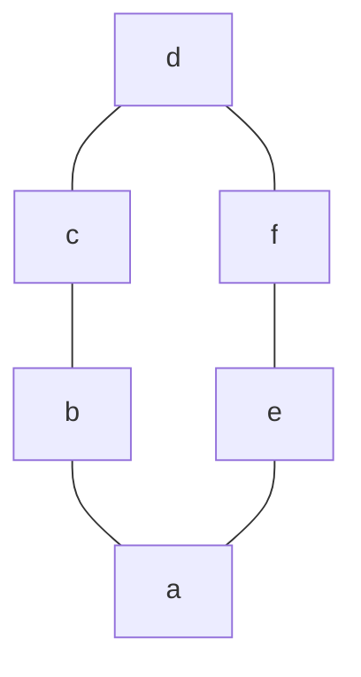
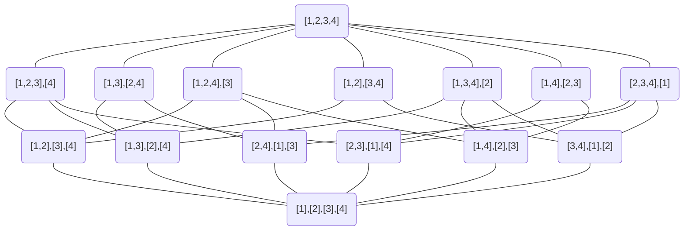
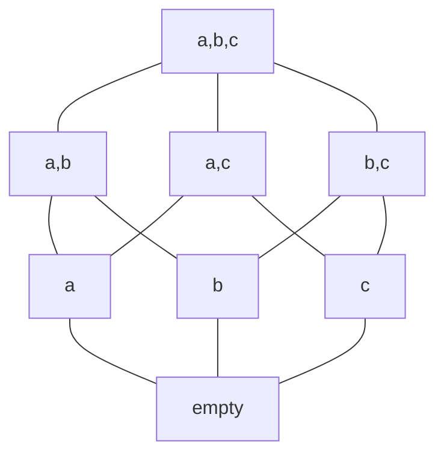
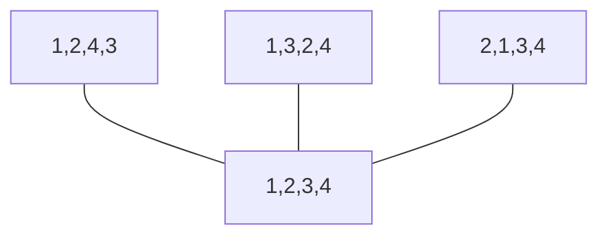

# 第 4 章 生成排列和组合（下）

> [!IMPORTANT]
> 下篇有仍有许多**模棱两可、较为困难且待完善**的 :construction: 题目，
> 欢迎各位高手发表意见，提交补充。

## EX31

> Generate the 3-permutations of {1, 2, 3, 4, 5}.

验证代码如下，结合生成 r 子集代码和求全排列代码。

:::details 验证代码

```CPP
#include <iostream>
#include <vector>
#include <unordered_set>
using namespace std;
void output(vector<int>& vi) {
    for(auto it = vi.begin(); it != vi.end(); ++ it) {
        printf("%d ", *it);
    }
    printf("\n");
}
void generatePermutation(vector<int> permList, int n) {
    vector<bool> state(n+1, false);
    while(true) {

        output(permList);

        int maxMovVal = -1;
        int maxMovIdx = -1;
        for(int i = 0; i < n; ++ i) {
            // printf("number: %d, state: %d\n", permList[i], (int)state[permList[i]]);
            if(!state[permList[i]] && i > 0) { //arrow to left
                if(permList[i] > permList[i-1] && permList[i] > maxMovVal) {
                    maxMovVal = permList[i];
                    maxMovIdx = i;
                }
            } else if (!!state[permList[i]] && i < n-1) { //arrow to right
                if(permList[i] > permList[i+1] && permList[i] > maxMovVal) {
                    maxMovVal = permList[i];
                    maxMovIdx = i;
                }
            }
        }

        if(maxMovIdx == -1) break; //no moveable variables

        if(!state[maxMovVal]) { //swap with left
            swap(permList[maxMovIdx], permList[maxMovIdx-1]);
        } else { //swap with right
            swap(permList[maxMovIdx], permList[maxMovIdx+1]);
        }
        //filp the state of number(s) which greater than selected number.
        for(int i = 0; i < n; ++ i) {
            if(permList[i] > maxMovVal) state[permList[i]] = !state[permList[i]];
        }
    }
}
void generateRSubset(vector<int>& vi, unordered_set<int>& st, int n, int r) {
    // output(vi);
    generatePermutation(vi, r);
    int k = r-1;
    for(; k >= 0; -- k) {
        if(vi[k] < n && st.find(vi[k]+1) == st.end()) {
            break;
        }
    }

    if(k < 0) return;
    int val = vi[k] + 1;
    for(int i = k; i < r; ++ i) {
        st.erase(vi[i]);
        vi[i] = val;
        st.insert(vi[i]);
        val ++;
    }
    generateRSubset(vi, st, n, r);
}
int main()
{
    int n, r;
    printf("Place input the Dictionary size(n) and the Subset size(r):\n");
    scanf("%d %d", &n, &r);
    vector<int> list;
    unordered_set<int> unord_st;
    for(int i = 1; i <= r; ++ i) {
        list.emplace_back(i);
        unord_st.insert(i);
    }
    generateRSubset(list, unord_st, n, r);
    return 0;
}
```

:::

### EX31PS

答案好像只给出了 1 开头的子集（课本定义的集合顺序）。

验证代码感觉有 Bug，~~但是本着能跑就行的原则~~，对比答案给出的部分没有差错。

## EX32 :ghost:

> Generate the 4-permutations of {1, 2, 3, 4, 5, 6}.

同上。

## EX33

> In which position does the subset 2489 occur in the lexicographic order of the  4-subsets of {1, 2, 3, 4, 5, 6, 7, 8, 9}?

$$
\binom{9}{4} - \binom{9-2}{4} - \binom{9-4}{3} - \binom{9-8}{2} - \binom{9-9}{1} = 81
$$

从所有排列中，依次减去 X X X X 型，2 X X X 型，2 4 X X 型和 2 4 8 X 型，确定 2489 所在位置。

### EX33PS

带入公式，杨辉三角之外的数全为 0。

后来会知道这些是扩展牛顿二项式。

## EX34

> Consider the r-subsets of {1, 2, ... , n} in lexicographic order.
>
> (a) What are the first (n - r + 1) r-subsets?
>
> (b) What are the last (r + 1) r-subsets?

### EX34Q(a)

显然第一个子集是$123\cdots r$，由 EX26 中的算法，考虑只调整最后一位，其余位不变，则最后一个子集是$12\cdots n$，恰好从 r 到 n 一共有 n-r+1 个数，因此前 n-r+1 个子集分别是，
$$
123\cdots r\\ 123\cdots(r+1)\\ \cdots \\123\cdots n
$$

### EX34Q(b)

容易验证最后一个子集是$(n-r+1)(n-r+2) \cdots n$，它的前驱子集为$(n-r)(n-r+2)\cdots n$，
再计算一次前驱子集$(n-r)(n-r+1) (n-r+3) \cdots n$则可以发现规律，
那么倒数第 r+1 个子集为$(n-r)(n-r+1) \cdots (n-1)$，综上，

$$
(n-r)(n-r+1) \cdots (n-1)\\
\cdots \\
(n-r)(n-r+1) (n-r+3) \cdots n \\
(n-r)(n-r+2)\cdots n \\
(n-r+1)(n-r+2) \cdots n
$$

## EX35

> The complement $\bar{A}$ of an r-subset A of {1, 2, ... , n} is the (n-r)-subset of  {1, 2, ... , n}, consisting of all those elements that do not belong to A. Let  M = $\dbinom{n}{r}$, the number of r-subsets and, at the same time, the number of (n-r)-subsets of {1, 2, ... , n}. Prove that, if
>
> $$
> A_1, A_2, A_3, \cdots, A_M
> $$
>
> are the r-subsets in lexicographic order, then
>
> $$
> \bar{A_M}, \cdots,\bar{A_3},\bar{A_2},\bar{A_1}
> $$
>
> are the (n-r)-subsets in lexicographic order.

任取两个不同的 r 子集 A 和 B，由集合字典序的定义（正文 p68）知，
如果$(A\cup B)\backslash(A\cap B)$中的最小元素如果在 A 侧，
则$A\lt B$，也即$A\cap \bar{B}$中的最小元素比$B\cap\bar{A}$中的最小元素更小，
此时对于补集有$\bar{B} \lt \bar{A}$。同理，当补集有$\bar{B} \lt \bar{A}$时，
也能推出最小元素在$(A\cup B)\backslash(A\cap B)$中的最小元素在 A 侧，
进而判断$A\lt B$。

由上可知，如果$A_1 \lt A_2$，一定有补集$\bar{A_2}\lt \bar{A_1}$，其余同理。

<!-- ### EX35PS

感觉此题不容易说清楚，有可能考。 -->

## EX36

> Let X be a set of n elements. How many different relations on X are there? How many of these relations are reflexive? Symmetric? Antisymmetric? Reflexive and symmetric? Reflexive and anti-symmetric?

有序对 (a,b) 一共有$n^2$种选择方式，每个有序对有相关和不相关两种关系，因此共有$2^{(n^2)}$种关系（relation）；

自反（reflexive）关系：自反关系必须包含所有的有序对 (a, a)，对于剩余的有序对 (x, y)（其中$x \neq y$，共$n^2-n$个），可以选择是否加入到关系中，因此可以组成$2^{n(n-1)}$种自反关系。

对称（symmetric）关系：(a, a) 可以任意出现；(x, y) 和 (y, x)（其中$x \neq y$）必须成对出现，合计有$n + (n^2-n)/2$可选项，因此一共有$2^{\frac{n(n+1)}{2}}$种关系。

反对称（Antisymmetric）关系： (a, a) 可以任意出现共有 n 个；(x, y) 和 (y, x)（其中$x \neq y$）只能有一个出现，或者都不出现，有$\dbinom{n}{2}$个，因此一共有$2^n \cdot 3^{\frac{n(n-1)}{2}}$种关系。

自反且对称：(a, a) 必须都在；(x, y) 和 (y, x)（其中$x \neq y$）必须成对出现，合计有$(n^2-n)/2$可选项，因此一共有$2^{\frac{n(n-1)}{2}}$种关系。

自反且反对称：(a, a) 必须都在；(x, y) 和 (y, x)（其中$x \neq y$）只能有一个出现，或者都不出现，因此一共有$3^{\frac{n(n-1)}{2}}$种关系。

<!-- ### EX36PS -->

<!-- 上课没听讲，以前学的离散也忘干净了。组合数学书上讲的比较简略，只能重新翻了离散数学及其应用第七版（第 9 章）回顾概念。 -->

<!-- 此题必考！~~（就因为我看了很久才弄懂？）~~ -->

:::tip

反对称和非对称是两个概念。
:::

### EX36 参考链接

[离散数学 N 元集合关系个数计算 - 百度文库 (baidu.com)](https://wenku.baidu.com/view/b6801422ed630b1c59eeb57f)

[discrete mathematics and its applications seventh edition section 9.1 47](http://www.cs.ucr.edu/~acald013/public/tmp/sol_dmaia_rosen.pdf)

## EX37

> Let R' and R" be two partial orders on a set X. Define a new relation R on X  by xRy if and only if both xR'y and xR"y hold. Prove that R is also a partial  order on X. (R is called the intersection of R' and R".)

证明 R 是 X 上的偏序关系，即证明 R 满足自反性、反对称性和传递性。

自反性：对任意的$x \in X$，都有 xR'x 和 xR''y，由 R 的定义知，一定有 xRx 成立。

反对称性：对于不同的$x, y \in X$，满足 xR'y，则由 R‘的反对称性$y\not R' x$；同理有 xR''y 和$y \not R'' x$，也能推出$y\not R x$。

传递性：$x, y, z \in X$，xR'y 且 yR'z，由 R‘的传递性有$xR'z$；同理有 xR''z，因此有 xRz。

<!-- ### EX37PS -->

<!-- 小声 BB 一句反对称性的问题， -->

:::tip

逻辑推理**若 p 则 q，若非 q 则非 p**，
那由德摩根律，非 q 是指 $y \not R{'} x$或$y \not R{''} x$，
只需要有一个就可以证明$y \not R x$。
:::

## EX38

> Let $(X_1, \le_1)$ and $(X_2, \le_2)$ be partially ordered sets. Define a relation T on the set
>
> $$
> X_1 \times X_2 = \{(x_1, x_2): x_1 \;\text{in } \; X_1, x_2 \;\text{in } \; X_2\}
> $$
>
> by
>
> $$
> (x_1, x_2)T(x_1', x_2') \text{ if and only if } x_1 \le_1 x_1' \text{ and } x_2 \le_2 x_2'
> $$
>
> Prove that $(X_1 \times X_2, T)$ is a partially ordered set. $(X_1 \times X_2, T)$ is called the *direct product* of $(X_1, \le_1)$ and $(X_2, \le_2)$ and is also denoted by $(X_1, \le_1) \times (X_2, \le_2)$. More generally, prove that the direct product $(X_1, \le_1) \times (X_2, \le_2) \times \cdots \times (X_M ,\le_m)$ of partially ordered sets is also a partially ordered set.

自反性：取$x = (x_1, x_2) \in X_1 \times X_2$，$x_1 \in X_1$，
$x_1$满足偏序关系有$x_1 \le_1 x_1$，同理，$x_2 \le_2 x_2$，所以得出 T 满足自反性。

反对称性：取$x = (x_1, x_2), x' = (x_1', x_2') \in X_1 \times X_2$，
并且设$x_1 \le_1 x_1', x_2 \le_{2} x_2'$，
由偏序关系知，如果$x_1' \le_1 x_1, x_2' \le_2 x_2$，
那么一定有$x_1 = x_1', x_2 = x_2 '$，所以 T 满足反对称性。

传递性：取$x = (x_1, x_2), x' = (x_1', x_2'),x'' = (x_1'', x_2'') \in X_1 \times X_2$，
由偏序关系知，$x_1 \le_1 x_1', x_1' \le_1 x_1''$，
所以$x_1 \le_1 x_1^{''}$，同理$x_2 \le_2 x_2^{''}$，所以 T 有传递性。

综上，T 满足偏序关系且$(X_1 \times X_2, T)$是偏序集。

显然我们可以取$x = (x_1, x_2 ,\cdots, x_m)$等采用上述方式证明$(X_1, \le_1) \times (X_2, \le_2) \times \cdots \times (X_M ,\le_m)$也是偏序集。

## EX39 :construction:

> Let $(J, \le)$ be the partially ordered set with J = {0, 1} and with 0 < 1. By identifying the subsets of a set X of n elements with the n-tuples of 0s and 1s, prove that the partially ordered set $(X, \subseteq)$ can be identified with the n-fold direct product
>
> $$
> (J, \le) \times (J, \le) \times \cdots \times (J, \le) \text{ (n factors).}
> $$

令$J^n = J \times J\times \cdots \times J$(n 项)，所以$J^n$是每一项为 0 或者 1 的 n 元组，设 $x = (x_1, x_2 , \cdots, x_n), y = (y_1, y_2, \cdots, y_n) \in J^n$，并且 x 和 y 满足偏序关系 $x \le y$ 时，对所有的 i 都有 $x_i \le y_i$。

定义 $X = \{1, 2,\cdots, n\}$上的子集集合$\mathcal{P}(X)$，
函数 $f: J^n \rightarrow \mathcal{P}(X)$ 满足，

$$
f(x) = \{i \in X| x_i = 1\}, \quad x \in J^n
$$

即$f(x)$是 x 元组中所有为 1 项的**下标**组成的集合，
显然$f(x)$既是单射又是满射，
即$J^n$与$\mathcal{P}(X)$满足一一映射（双射）关系。

所以满足偏序关系$x \le y$当且仅当$f(x) \subseteq f(y)$，
因此偏序集$(X, \subseteq)$
可以用 n 重直积$J^n$表示。

并且有如下等价命题，

1. 偏序关系$x \le y$
2. 项的关系$x_i \le y_i, 1 \le i \le n$
3. 如果项$x_i = 1$，那么一定有$y_i = 1, 1 \le i \le n$
4. 如果下标$i \in f(x)$，那么一定有$i \in f(y), 1 \le i \le n$
5. 集合关系$f(x) \subseteq f(y)$

### EX39PS

其实答案每一句话都能看懂，就是连在一起感觉没有逻辑。

还有另一种[参考](http://www.jade-cheng.com/uh/coursework/math-475/homework-03.pdf)，我也是大为震惊（因为看不懂）。

<!-- 感觉会考，只能选择把答案默写上去了。 -->

## EX40 :construction:

> Generalize Exercise 39 to the multiset of all combinations of the multiset X =  $\{n_1\cdot a_1, n_2 \cdot a_2, \cdots, n_m \cdot a_m\}$. (Part of this exercise is to determine the "natural"  partial order of these multisets.)

对于任意非负整数 r，定义由$\{0, 1, \cdots, r\}, 0 \lt 1 \lt \cdots \lt r$构成的偏序集[r]，$\mathcal{P}(X)$是所有多重集合 X 的子集构成的集合，有$x \in \mathcal{P}(X)$，

$$
x = \{x_1 \cdot a_1, x_2 \cdot a_2, \cdots, x_m \cdot a_m\}, \quad 0 \le x_j \le n_j \quad (1 \le j \le m)
$$

对于$x, y \in \mathcal{P}(X)$如下命题等价，

1. $x \subseteq y$
2. $x_j \le y_j, 1 \le j \le m$
3. 在偏序集$[n_1]\times[n_2]\times \cdots \times [n_m]$中$(x_1, x_2 , \cdots, x_m) \le (y_1, y_2, \cdots, y_m)$

所以偏序集$(\mathcal{P}(X), \subseteq)$能用直积$[n_1]\times[n_2]\times \cdots \times [n_m]$表示。

<!-- ### EX40PS

不知所言，感觉用到了 EX39 的部分，所以不太可能考？ -->

## EX41 :construction:

> Show that a partial order on a finite set is uniquely determined by its cover relation.

有限集 X 上的偏序关系$\le$由覆盖关系唯一确定需要证明如下引理。

引理：对于不同的$x, y \in X$，下列两个命题等价

1. $x \lt y$
2. 存在整数$r \ge 2$，并且取自 X 的序列 $(x_1, x_2, \cdots, x_r)$
3. 满足$x_1 = x, x_r = y$并且$x_i$覆盖 $x_{i-1}, 2\le i \le r$

先由 1 证 2，考虑取自 X 的序列 $(x_1, x_2, \cdots, x_r)$ 所构成的集合 S，
要求 S 中的元素满足 $x_1 = x, x_r = y, x_{i-1} \lt x_i$，因为 X 是有限集，
那么 S 也是有限集，并且 S 至少包含序列 (x, y)，所以 S 非空。

因此，我们可以从 S 中选择出大小为 r 的序列，使之满足覆盖条件$x_i$覆盖$x_{i-1}, 2 \le i \le r$。

再由 2 证 1，因为$x_i$能覆盖$x_{i-1}$，并且由传递性可得$x\lt y$。

综上，有限集上的偏序关系由覆盖关系唯一确定。

<!-- ### EX41PS

无语，这题也没太看懂。正文也直说传递性使覆盖决定偏序，但是也没详细展开。 -->

## EX42 :construction:

> Describe the cover relation for the partial order $\subseteq$ on the collection $\mathcal{P}(X)$ of an  subsets of a set X.

记 n = |X|，所有子集分布在 n 阶立方体上。

## EX43

> Let X = {a, b, c, d, e, f} and let the relation R on X be defined by aRb, bRc,  cRd, aRe, eRf, fRd. Verify that R is the cover relation of a partially ordered  set, and determine all the linear extensions of this partial order.



就是写出所有的拓扑排序。

abecfd, abefcd, aebcfd, aebfcd, abcefd, aefbcd.

## EX44

> Let $A_1, A_2, \cdots, A_s$ be a partition of a set X. Define a relation R on X by xRy  if and only if x and y belong to the same part of the partition. Prove that R is  an equivalence relation.

自反性：对于任意$x \in X$，x 和 x 属于划分的同一个部分。

对称性：对于$x, y \in X$，若 x 和 y 属于划分的同一个部分，则 y 和 x 属于划分的同一部分。

传递性：对于$x,y,z \in X$，若 x 和 y 属于划分的同一个部分，y 和 z 属于划分的同一个部分，那么 x 和 z 也属于划分的同一个部分。

综上，R 是等价关系。

### EX44PS

区分等价关系（自反、**对称**、传递）和偏序关系（自反、**反对称**、传递）。

## EX45

> Define a relation R on the set Z of all integers by aRb if and only if a = ±b. Is  R an equivalence relation on Z? If so, what are the equivalence classes?

R 是等价关系，证明如下。

自反性：任意$x \in Z$，都有 x=x。

对称性：任意$x, y \in Z$，如果$x = \pm y$，则一定有$y = \pm x$。

传递性：任意$x,y,z \in Z$，如果$x = \pm y, y = \pm z$，则一定有$x = \pm z$。

两个等价类，一个等价类只有 0，另一个等价类是正数和它的相反数。

## EX46

> Let m be a positive integer and define a relation R on the set X of all nonnegative  integers by aRb if and only if a and b have the same remainder when divided by  m. Prove that R is an equivalence relation on X. How many different equivalence  classes does this equivalence relation have?

自反性：对于任意的$x \in X$, x 和 x 显然除以 m 余数相同。
对称性：对于$x, y \in X$, 如果 x 和 y 除以 m 余数相同，那么 y 和 x 除以 m 余数相同。
传递性：对于$x, y, z \in X$，如果 x 和 y 除以 m 余数相同，y 和 z 除以 m 余数相同，那么 x 和 z 除以 m 余数相同。

因此 R 是等价关系。等价类根据余数划分，一共有 m 个等价类。

$$
[0], [1], \cdots, [m-1], [r] = \{r + im| i \in Z\}, 0 \le r \le m-1
$$

## EX47 :key:

> Let $\Pi_n$ denote the set of all partitions of the set {1, 2, ... ,n} into nonempty sets.
> Given two partitions $\pi$ and $\sigma$ in $\Pi_n$, define $\pi \le \sigma$, provided that each part of $\pi$ is contained in a part of $\sigma$. Thus, the partition $\pi$ can be obtained by partitioning the parts of $\sigma$.
> This relation is usually expressed by saying that $\pi$  is a *refinement*  of $\sigma$.
>
> (a) Prove that the relation of refinement is a partial order on $\Pi_m$.
>
> (b) By Theorem 4.5.3, we know that there is a one-to-one correspondence between $\Pi_m$ and the set $\Lambda_n$ of all equivalence relations on {1, 2, ... ,n}. What  is the partial order on $\Lambda_n$ that corresponds to this partial order on $\Pi_m$?
>
> (c) Construct the diagram of $(\Pi_m, \le)$ for n = 1,2,3, and 4.

### EX47Q(a)

自反性：对任意$\pi \subseteq \Pi_n$，显然$\pi \subseteq \pi$，满足自反性。

反对称性：对于$\pi, \sigma \subseteq \Pi_n$，如果$\pi \subseteq \sigma$且$\sigma \subseteq \pi$，则$\pi = \sigma$，满足反对称性。

传递性：对于$\pi, \rho, \sigma \subseteq \Pi_n$，如果$\pi \subseteq \rho,  \rho \subseteq \sigma$，则$\pi \subseteq \sigma$，满足传递性。

因此加细关系是$\Pi_n$上的一个偏序关系。

### EX47Q(b) :construction:

### EX47Q(c)

Hasse 图如下所示。



<!-- ### EX47 注

**EX47Q(c) 必考**，务必记牢。 -->

## EX48

> Consider the partial order $\le$ on the set X of positive integers given by "is a  divisor of." Let a and b be two integers. Let c be the largest integer such that  c $\le$ a and c $\le$ b, and let d be the smallest integer such that a $\le$ d and b $\le$ d.  What are c and d?

$$
a = 2^{a_1}3^{a_2}5^{a_3} \cdots,  \quad b=2^{b_1}3^{b_2}5^{b_3} \cdots \quad c = 2^{c_1}3^{c_2}5^{c_3} \cdots,  \quad d=2^{d_1}3^{d_2}5^{d_3} \cdots
$$

并且由偏序关系，可知$c_i = \min\{a_i, b_i\}, d_i = \max\{a_i, b_i\}$，因此 c 是 a 和 b 的最大公因数，d 是 a 和 b 的最小公倍数。

## EX49

> Prove that the intersection $R\cap S$ of two equivalence relations Rand S on a set  X is also an equivalence relation on X. Is the union of two equivalence relations  on X always an equivalence relation?

自反性：取$x \in X$，在关系 R 和关系 S 上均有自反性，即$xRx, xSx$，所以有$xRx \cap xSx, x(R \cap S)x$，满足自反性；

对称性：取$(x, y) \in R \cap S$，$x (R\cap S)y$，有$xRy \cap xSy$，即$xRy, xSy$，由 R 和 S 的对称性有$yRx, ySx$，即$y (R\cap S)x$，满足对称性；

传递性：取$(x, y),(y, z) \in R \cap S$，$x(R \cap S) y, y (R \cap S)z$，由 R 和 S 的传递性，有$xRz, xSz$，所以$x(R\cap S)z$，满足传递性；

综上，$R \cap S$是等价关系。下面我们举例证明两个等价关系的并并不满足等价关系。

$$
X = \{1,2,3\}; R = \{(1,1),(2,2),(3,3), (1,2),(2,1)\};S = \{(1,1),(2,2),(3,3), (2,3),(3,2)\}
$$

可以验证 R 和 S 都是 X 上的等价关系，而

$$
R \cup S = \{(1,1),(2,2),(3,3), (1,2),(2,1),(2,3),(3,2)\}
$$

不满足等价关系，因为存在$(1,2), (2, 3) \in R \cup S$但$(1,3) \notin R \cup S$，所以$R \cup S$不是等价关系。

### EX49PS

两个等价关系的并集不满足等价关系，需要从传递性方面反证，因为等价关系的并集自反性和对称性都是满足的。

## EX50

> Consider the partially ordered set (X,$\subseteq$) of subsets of the set X = {a, b, c} of  three elements. How many linear extensions are there?



技术问题，图画了个大概，方框内是集合，与顺序无关。题目需要求拓扑排序的数目。

从空集出发，必须先选择 2 个单元素集（不妨假设选了$\{a\}, \{b\}$），（所有双元素集都依赖两个单元素集），并且与顺序无关，因此有$P(3,2) = 6$种选法。

第二步则可以考虑选择剩余的单元素集（$\{c\}$）,之后双元素集合选取不受顺序限制$P(3,3)=6$种选法，最后选择全集。

或者优先选择双元素集合（$\{a,b\}$），之后只能选择剩余的单元素集（$\{c\}$），其余同上，有$P(2,2) = 2$种选法。

综上，一共有$6 \times (6 + 2) = 48$种选法。

### 参考链接

[Combinatorics and Linear Extensions - Mathematics Stack Exchange](https://math.stackexchange.com/questions/518093/combinatorics-and-linear-extensions)

## EX51 :construction: :key:

> Let n be a positive integer, and let $X_n$ be the set of n! permutations of {1, 2, ... ,n}  Let $\pi$ and $\sigma$ be two permutations in $X_n$, and define $\pi \le \sigma$ a provided that the set  of inversions of $\pi$ is a subset of the set of inversions of $\sigma$. Verify that this defines  a partial order on $X_n$ , called the *inversion poset*. **Describe the cover relation for  this partial order** and then draw the diagram for the inversion poset $(H_4, \le)$.

描述覆盖关系：$\pi$逆序列的集合真含于$\sigma$逆序列的集合，则称$\sigma$覆盖$\pi$。

### 不知所言的参考答案 :pill:

定义$\text{Inv}(\pi)$为排列$\pi$的逆序列集合，我们通过如下两个命题等价来验证当$\text{Inv}(\pi) \subseteq \text{Inv}(\sigma)$时，$\pi \le \sigma$。

1. $\sigma$覆盖$\pi$
2. 可以从$\pi$中翻转 ab 到 ba（a<b）来获得$\sigma$

先由 1 证 2：我们假设$\pi \lt \sigma$，因此有$\text{Inv}(\pi) \subseteq \text{Inv}(\sigma)$，
之后我们可以从$\sigma$中选择一个逆序 ba（$a<b$，a 是所有 b 逆序中最小的数）
这个逆序不存在$\pi$中，即有

$$
\pi = \cdots a \cdots b \cdots \quad \sigma =  \cdots b \cdots a \cdots
$$

下证，b 与 a 相邻，假设$\sigma =  \cdots b \cdots c \cdots a \cdots$，
因此 bc 和 ca 是两对逆序，那么 c 在$\pi$中 a 的左侧，b 的右侧，但这是不可能的，
所以$\sigma =  \cdots b a \cdots$，进行翻转后，
可以得到$p = \cdots ab \cdots, \pi \le p \lt \sigma$。
由$\sigma$覆盖$\pi$，所以$\pi = p$，即可以从$\pi$中翻转 ab 到 ba（$a<b$）来获得$\sigma$。

再由 2 证 1：同上，我们有

$$
\pi = \cdots a  b \cdots \quad \sigma =  \cdots b  a \cdots
$$

除 a 和 b 的坐标外，其余坐标均相同，
显然$|\text{Inv}(\pi)| + 1 = | \text{Inv}(\sigma)|$，
并且$\text{Inv}(\pi) \subseteq \text{Inv}(\sigma), \pi \le \sigma$。
$\pi, \sigma$之间不存在其他元素，所以$\sigma$
覆盖$\pi$。

### 画$H_4$图 :key:



时间关系，$H_4$的图略。

### EX51PS

<!-- 也是感觉毫无逻辑。 -->

对比 EX30，求的是字典序的逆序列，与本题所定义的偏序不同。

<!-- 可恶，就考了$H_4$的图，但是我没学怎么画。 -->

可以参考一下，[Student (jade-cheng.com)](http://www.jade-cheng.com/uh/coursework/math-475/homework-03.pdf)。

## EX52

> Verify that a binary n-tuple $a_{n-1}\cdots a_1 a_0$ is in place k in the Gray code order  list where k is determined as follows: For i = 0,1, ... ,n-1, let
>
> $$
> b_i =
> \begin{cases}
> 0, \text{ if } a_{n-1} + \cdots + a_i \text{ is even, and } \\
> 1, \text{ if } a_{n-1} + \cdots + a_i \text{ is odd }
> \end{cases}
> $$
>
> Then
>
> $$
> k = b_{n-1} \times 2^{n-1} + \cdots b_1 \times 2 + b_0 \times 2^0
> $$
>
> Thus, $a_{n-1}\cdots a_{1} a_{0}$ is in the same place in the Gray code order list of binary n-tuples as $b_{n-1}\cdots b_{1} b_{0}$ is in the lexicographic order list of binary n-tuples.

由题意，$b_{n-1}\cdots b_1 b_0$就是 k 的二进制串，
下面采用数学归纳法证明$a_{n-1}\cdots a_1 a_0$位于 Gray 表中的第 k 个位置（从 0 开始），
其中 k 为$b_{n-1}\cdots b_1 b_0$所对应的数。

显然，当 k=0 时，$b_i = 0, 0\le i \le n-1$，且$a_i = 0$符合反射 Gray 码的第 0 项。

假设当 k=m 时成立，如果$\displaystyle \sum_{i=0}^{n-1} a_i$为偶数，那么$b_0 = 0$，（m 形如$b_{n-1}\cdots b_2b_1 0$），
并且由 Problem G 知下一个反射 Gray 码是通过翻转$a_0$得到，其余位不变，
那只翻转$b_0$，使$b_0 = 1$，此时$b_{n-1}\cdots b_1 b_0$所对应的 k 为 m+1，（m+1 形如$b_{n-1}\cdots b_2b_1 1$）；

如果如果 $\displaystyle \sum_{i=0}^{n-1} a_i$ 为奇数，那么 $b_0 = 1$，
并且可以知道下一个反射 Gray 码通过翻转最右边的 1 左侧一位 $a_s, (a_{s-1}=1, a_{s-2}, \cdots a_1,a_0 = 0)$ 得到，
其余位不变，（m 形如$b_{n-1}\cdots 01\cdots1$），由于$a_j = 0, 0 \le j \le s-2$，
可以推出 $\displaystyle \sum_{i=j}^{n-1} a_i$ 为奇数，即 $b_j = 1，0 \le j \le s-1, b_s = 0$，
此时翻转$b_i, 0 \le i \le s$，得到 $b_j = 0，0 \le j \le s-1, b_s = 1$，
此时 $b_{n-1}\cdots b_1 b_0$ 所对应的 k 为 m+1，（m+1 形如$b_{n-1}\cdots 10\cdots0$）。

### EX52PS

Problem B 介绍了二进制的加法（自增 +1）和减法（自减 -1）求法；Problem G 介绍了反射 Gray 码的前驱和后继求法（联系 EX23 和 EX24）。

## EX53 :construction:

> Continuing with Exercise 52, show that $a_{n-1}\cdots a_1 a_0$ can be recovered from  $b_{n-1}\cdots b_1 b_0 $, by $a_{n-1} = b_{n-1}$ and for i = 0,1, ... , n-1,
>
> $$
> a_i =
> \begin{cases}
> 0, \text{ if } b_i + b_{i+1} \text{ is even, and } \\
> 1, \text{ if } b_i + b_{i+1} \text{ is odd }
> \end{cases}
> $$

<!-- ### 吐槽 -->

**太迷惑了，以至于没整理**。

仍旧采用数学归纳法证明，与上一题类似，

显然，当 k=0 时，$b_i = 0, 0\le i \le n-1$，且$a_i = 0$符合反射 Gray 码的第 0 项。

假设当 k=m 时成立，m 所对应的反射 Gray 码为$a_{n-1}\cdots a_1a_0$，当$b_0 = 0$时，有$\displaystyle \sum_{i=0}^{n-1} a_i$为偶数，m+1 通过翻转$b_0$得到，即翻转$a_0$；

当$b_0 = 1$时，有$\displaystyle \sum_{i=0}^{n-1} a_i$为奇数，存在 s 满足$a_s = 0, a_j = 1, 0 \le j \le s-1$，由$a_j = 0$，推出$b_j, 0 \le j \le s$同奇偶，

UNFINISHED

又是感觉答案和题目毫无关系。

## EX54

> Let $(X, \le)$ be a finite partially ordered set.
> By Theorem 4.5.2 we know that  $(X, \le)$ has a linear extension.
> Let a and b be incomparable elements of X.
> Modify the proof of Theorem 4.5.2 to obtain a linear extension of  $(X, \le)$
> such that $a < b$.
> (Hint: First find a partial order $\le '$ on X such that whenever $x \le y$,  then $x \le ' y$ and, in addition, $a \le ' b$.)

对于不可比元素 a 和 b，我们可以通过定义 b 覆盖 a（比如线性顺序列出），来找到 X 上的偏序关系$\le '$
使得$a \le ' b$，并且由定理 4.5.2 可知，这样的偏序关系对有限集一定存在。因此，我们可以得到偏序集$(X, \le ')$。

$(X, \le ')$由$(X, \le )$添加关系得到，该线性扩展也保留了原来所有的可比关系，
也一定是原偏序集的一个线性扩展。同时，因为$a \le ' b$，所以$a \lt b$。

综上，我们可以找到一种线性扩展，使偏序集$(X, \le)$中不可比的元素 a 和 b，
有$a \lt b$。

### EX54 参考链接

[Student (jade-cheng.com)](http://www.jade-cheng.com/uh/coursework/math-475/homework-03.pdf)

## EX55

> Use Exercise 54 to prove that a finite partially ordered set is the intersection of all its linear extensions.(see Exercise 37).

由 EX54 的结论可知，对于不可比元素 a 和 b，总能找到一个线性扩展使得$a<b$，满足关系 R，
同理，我们也能找到一个线性扩展使得$b<a$，满足关系 S。

因为$(a, b) \notin R, (b, a) \notin S$，所以$(a,b), (b, a) \notin R \cap S$，
所以 (a, b) 和 (b, a) 都不在这两个线性扩展的交集之中。
同理，所有不可比关系都会排除在线性扩展交集之外，
因此所有线性扩展的交集只有原来包含的关系，即交集是$(X, \le)$。

### EX55 参考链接

[Student (jade-cheng.com)](http://www.jade-cheng.com/uh/coursework/math-475/homework-03.pdf)

## EX56

> The *dimension* of a finite partially ordered set $(X, \le)$ is the smallest number
> of its linear extensions whose intersection is $(X, \le)$.
> By Exercise 55, every partially ordered set has a dimension.
> Those that have dimension 1 are the linear orders.
> Let n be a positive integer and let $i_1, i_2, \cdots, i_n$ be a permutation
> $\sigma$ of {1, 2, ... ,n} that is different from 1, 2, ... ,n.
> Let X = $\{(1,i_1),(2, i_2), \cdots,(n, i_n)\}$.
> Now define  a relation R on X by $(k, i_k)R(l, i_l)$ if and only if
> $k \le l$ (ordinary integer inequality) and $i_k \le i_l$(again ordinary inequality);
> that is, $(i_k, i_l)$ is not an inversion of  $\sigma$.
> Thus, for instance, if n = 3 and $\sigma$ = 2,3,1,
> then X = {(1, 2), (2, 3), (3, 1)},  and (1,2)R(2, 3), but
> $(1,2)\not R(3,1)$. Prove that R is a partial order on X and
> that the dimension of the partially ordered set (X, R) is 2,
> provided that  $i_1, i_2, \cdots, i_n$ is not the identity permutation 1,2, ..., n.

易证 R 是 X 上的偏序关系，

自反性：

反对称性：

传递性：

定义 X 上的偏序关系$\le_1$，只要$a \le c$，就满足偏序关系$(a, b) \le_1 (c, d)$；再定义 X 上的偏序关系$\le_2$，只要$b \le d$，就满足偏序关系$(a, b) \le_2 (c, d)$。

显然$\le_1, \le_2$都是 R 的线性扩展，R 是线性扩展的交集。因此 R 的维度不超过 2，因为$i_1, i_2 ,\cdots, i_n$不同于恒等排列$1,2,\cdots, n$，所以 R 的维度至少为 2，综上，R 的维度为 2。

<!-- ### EX56PS

我最讨厌的词就是 Routine -->

## EX57 :construction:

> Consider the set of all permutations $i_1, i_2, \cdots, i_n$ of 1,2, ... ,n such that $i_k \neq k$ for  k = 1,2, ... ,n. (Such permutations are called *derangements* and are discussed in  Chapter 6.) Describe an algorithm for generating a random derangement (modify  the algorithm given in Section 4.1 for generating a random permutation).

<!-- ### EX57PS

第六章讨论，那咱就别考了呗。 -->

<!-- ### EX57 参考链接

回头整理。

[生成所有错位排列的算法 | naturerun 的计算机科学博客](https://naturerun.github.io/post/43861.html) -->

## EX58 :construction:

> Consider the complete graph $K_n$ defined in Chapter 2, in which each edge is  colored either red or blue. Define a relation on the n points of $K_n$ by saying  that one point is related to another point provided that the edge joining them is  colored red. Determine when this relation is an equivalence relation, and, when  it is, determine the equivalence classes.

R 被定义在完全图的点集$V(K_n) = \{1,2,\cdots, n\}$上，$E(K_n)$则是完全图的边集。

R 可以定义为：$xRy$，对于任意的$x,y \in V(K_n)$，$xy \in E(K_n)$是一条红边（不是蓝边）。

自反性：对于$x \in V(K_n)$，$xx \in E(K_n)$是一条平凡的边，R 满足自反性。

对称性：对于$x, y \in V(K_n)$，$xy \in E(K_n)$是一条红边，$yx \in E(K_n)$是同一条红边。

传递性：

当$K_i( 2\le i \le n)$子图包含$K_n$所有的红边时，形成等价关系。

等价类时所有的完全图$\{K_2, K_3 \cdots, K_n\}$。

<!-- PS 买的答案也没看懂传递性。 -->

> [!WARNING]
> 传递性证明没能完成

## EX59

> Let $n \ge 2$ be an integer. Prove that the total number of inversions of *all* n!  permutations of 1,2, ... ,n equals
>
> $$
> \frac{1}{2}n!\binom{n}{2} = n!\frac{n(n-1)}{4}
> $$
>
> (Hint: Pair up the permutations so that the number of inversions in each pair is  n(n - 1)/2.)

第一步，计算逆序可能出现的组合数量：因为逆序是两两配对，逆序组合不超过$\dbinom{n}{2} = \dfrac{n(n-1)}{2}$个；(这一点可以参考 EX8)
第二步，给选出的逆序安排位置，$\dbinom{n}{2}$种方式；
第三步，排列其余 n-2 项，(n-2)! 种方式。

因此，所有排列中的逆序总数为

$$
\binom{n}{2} \cdot \binom{n}{2} \cdot (n-2)! = \frac{n(n-1)}{2} \times \frac{n(n-1)}{2} \times (n-2)! = n! \frac{n(n-1)}{4}
$$
