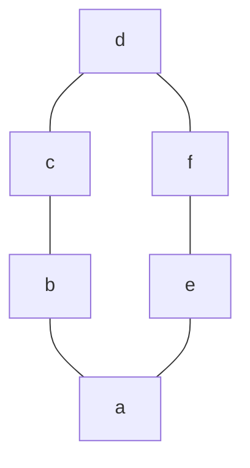
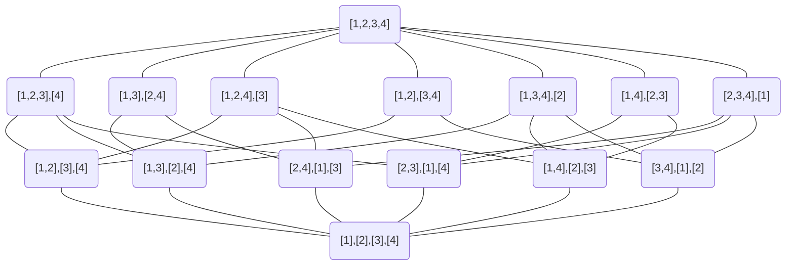
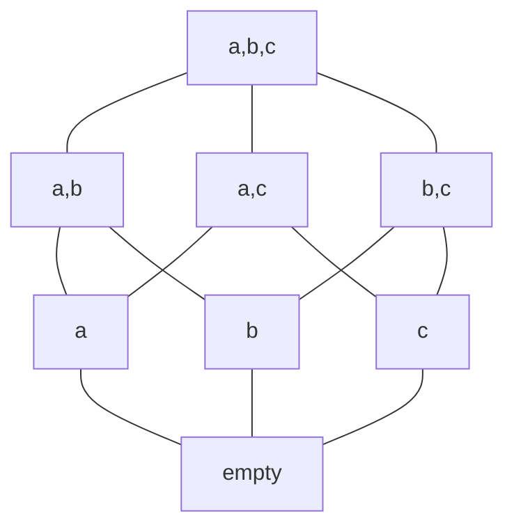
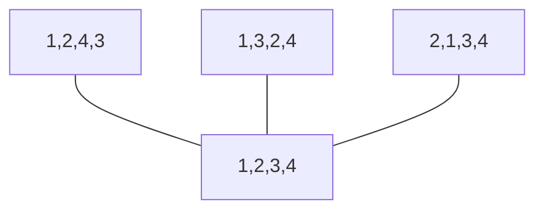

# 第4章 生成排列和组合

## EX1

> Which permutation of {1, 2, 3, 4, 5} follows 31524 in using the algorithm described in Section 4.1? Which permutation comes before 31524?

在31524后面的是35124，前面的是31254。

说说具体如何手工定位到31524，首先，容易写出2位排列的表，

$$
\begin{matrix}
1  & 2\\
2  & 1
\end{matrix}
$$

插入3之前需要把表的每一行复制成三行，之后可以画出3位排列的表，定位312在第3行（奇数行）。

$$
\begin{matrix}
&1  & & 2  & 3\\
&1 & 3 & 2 \\
3& 1 &  & 2 \\
3& 2 &  & 1 \\
& 2 & 3 & 1 \\
& 2 &  & 1 & 3
\end{matrix}
$$

从插入3的规则发现，对于原来的奇数行是从右向左插入，偶数行则是从左向右插入，
可以判断4位排序的表中，312所在的子表中4是从右向左插入的，因此可以得到该子表。

$$
\begin{matrix}
& 3 & & 1 & & 2 &4\\
& 3 & & 1 &4& 2 \\
& 3 &4 & 1 & & 2 \\
4& 3 & & 1 & & 2 \\
\end{matrix}
$$

同理，我们可以确定4124在该表中的第九行（$2 \times 4 + 1 = 9$），
因此在5位排序的子表中，5也从右向左插入的，可以画出该子表，

$$
\begin{matrix}
& 3 & & 1 & & 2 & &4 &5\\
& 3 & & 1 & & 2 &5 &4\\
& 3 & & 1 &5 & 2 & &4\\
& 3 &5 & 1 & & 2 & &4\\
5& 3 & & 1 & & 2 & &4\\
\end{matrix}
$$

所以题目可以得出结论，在31524后面的是35124，前面的是31254。

### 验证程序

```cpp
#include <iostream>
#include <vector>
using namespace std;
void output(vector<int>& vi) {
    for(auto item: vi) {
        printf("%d ", item);
    }
    printf("\n");
}

int main()
{

    int n;
    scanf("%d", &n);
    vector<int> permList;
    for(int i = 1; i <= n; ++ i) permList.emplace_back(i);

    //use 0 for left and 1 for right
    vector<bool> state(n+1, false);
    while(true) {
        output(permList);
        int maxMovVal = -1;
        int maxMovIdx = -1;
        for(int i = 0; i < n; ++ i) {
            // printf("number: %d, state: %d\n", permList[i], (int)state[permList[i]]);
            if(!state[permList[i]] && i > 0) { //arrow to left
                if(permList[i] > permList[i-1] && permList[i] > maxMovVal) {
                    maxMovVal = permList[i];
                    maxMovIdx = i;
                }
            } else if (!!state[permList[i]] && i < n-1) { //arrow to right
                if(permList[i] > permList[i+1] && permList[i] > maxMovVal) {
                    maxMovVal = permList[i];
                    maxMovIdx = i;
                }
            }
        }

        if(maxMovIdx == -1) break; //no moveable variables

        if(!state[maxMovVal]) { //swap with left
            swap(permList[maxMovIdx], permList[maxMovIdx-1]);
        } else { //swap with right
            swap(permList[maxMovIdx], permList[maxMovIdx+1]);
        }
        //filp the state of number(s) which greater than selected number.
        for(int i = 0; i < n; ++ i) {
            if(permList[i] > maxMovVal) state[permList[i]] = !state[permList[i]];
        }
    }
    return 0;
}
```

### EX1考后感

*感觉可能会考*。确实会考。

## EX2

> Determine the mobile integers in
>
> $$
> \overrightarrow{4} \;\overleftarrow{8}\; \overrightarrow{3} \; \overleftarrow{1} \; \overrightarrow{6} \; \overleftarrow{7}\; \overleftarrow{2} \; \overrightarrow{5} \;.
> $$

比较数字和该数字箭头所指数字的大小，显然只有8、3和7可移动。

## EX3

> Use the algorithm of Section 4.1 to generate the first 50 permutations {I, 2, 3, 4, 5},
> starting with $\overleftarrow{1} \;\overleftarrow{2} \;\overleftarrow{3} \;\overleftarrow{4} \;\overleftarrow{5}$.

我们调整一下EX1中的代码，可以获得50个输出。

```cpp
#include <iostream>
#include <vector>
using namespace std;
void output(vector<int>& vi) {
    for(auto item: vi) {
        printf("%d ", item);
    }
    printf("; ");
}

int main()
{

    int n;
    scanf("%d", &n);
    vector<int> permList;
    for(int i = 1; i <= n; ++ i) permList.emplace_back(i);

    //use 0 for left and 1 for right
    vector<bool> state(n+1, false);
    int cnt = 50;
    while(cnt --) {
        output(permList);
        if(cnt % 5 == 0) printf("\n");
        int maxMovVal = -1;
        int maxMovIdx = -1;
        for(int i = 0; i < n; ++ i) {
            // printf("number: %d, state: %d\n", permList[i], (int)state[permList[i]]);
            if(!state[permList[i]] && i > 0) { //arrow to left
                if(permList[i] > permList[i-1] && permList[i] > maxMovVal) {
                    maxMovVal = permList[i];
                    maxMovIdx = i;
                }
            } else if (!!state[permList[i]] && i < n-1) { //arrow to right
                if(permList[i] > permList[i+1] && permList[i] > maxMovVal) {
                    maxMovVal = permList[i];
                    maxMovIdx = i;
                }
            }
        }

        if(maxMovIdx == -1) break; //no moveable variables

        if(!state[maxMovVal]) { //swap with left
            swap(permList[maxMovIdx], permList[maxMovIdx-1]);
        } else { //swap with right
            swap(permList[maxMovIdx], permList[maxMovIdx+1]);
        }
        //filp the state of number(s) which greater than selected number.
        for(int i = 0; i < n; ++ i) {
            if(permList[i] > maxMovVal) state[permList[i]] = !state[permList[i]];
        }
    }
    return 0;
}
```

### 输出结果

```md
1 2 3 4 5 ; 1 2 3 5 4 ; 1 2 5 3 4 ; 1 5 2 3 4 ; 5 1 2 3 4 ;
5 1 2 4 3 ; 1 5 2 4 3 ; 1 2 5 4 3 ; 1 2 4 5 3 ; 1 2 4 3 5 ;
1 4 2 3 5 ; 1 4 2 5 3 ; 1 4 5 2 3 ; 1 5 4 2 3 ; 5 1 4 2 3 ;
5 4 1 2 3 ; 4 5 1 2 3 ; 4 1 5 2 3 ; 4 1 2 5 3 ; 4 1 2 3 5 ;
4 1 3 2 5 ; 4 1 3 5 2 ; 4 1 5 3 2 ; 4 5 1 3 2 ; 5 4 1 3 2 ;
5 1 4 3 2 ; 1 5 4 3 2 ; 1 4 5 3 2 ; 1 4 3 5 2 ; 1 4 3 2 5 ;
1 3 4 2 5 ; 1 3 4 5 2 ; 1 3 5 4 2 ; 1 5 3 4 2 ; 5 1 3 4 2 ;
5 1 3 2 4 ; 1 5 3 2 4 ; 1 3 5 2 4 ; 1 3 2 5 4 ; 1 3 2 4 5 ;
3 1 2 4 5 ; 3 1 2 5 4 ; 3 1 5 2 4 ; 3 5 1 2 4 ; 5 3 1 2 4 ;
5 3 1 4 2 ; 3 5 1 4 2 ; 3 1 5 4 2 ; 3 1 4 5 2 ; 3 1 4 2 5 ;
```

### PS

我觉得这题必不可能考，没这么大空间，也没什么技巧性。

## EX4

> Prove that in the algorithm of Section 4.1, which generates directly the permutations of {1, 2, ... , n}, the directions of 1 and 2 never change.

某个数方向变化的条件是本轮选择的数m比该数小，而排列中不存在比1小的数，因此1从不发生方向改变；2可能发生方向变化的情况是1被选为m，而选中m的条件是m是本轮比较中的最大值，而1绝不可能是该最大值，所以1不可能被选为m，因此2也不可能发生方向变化。

## EX5

> Let $i_1 i_2 \cdots i_n$ in be a permutation of {1, 2, ... , n}
> with inversion sequence $b_1, b_2, \cdots, b_n$  and
> let $k = b_1 + b_2+ \cdots + b_n$. Show by induction that
> we cannot bring $i_1 i_2 \cdots i_n$ by fewer than k successive switches of adjacent terms.

对于相邻的两个数$i_x， i_y$，交换它们要么会增多一组逆序，要么会减少一组逆序，因此要消除k组逆序，交换相邻两个数的次数不能少于k次。

### EX5 PS

注意**逆序列**的概念。

## EX6

> Determine the inversion sequences of the following permutations of {1, 2, ... ,8}:
>
> (a) 35168274
>
> (b) 83476215

### EX6 Q(a)

|  $i$  |  1   |  2   |  3   |  4   |  5   |  6   |  7   |  8   |
| :---: | :--: | :--: | :--: | :--: | :--: | :--: | :--: | :--: |
| $a_n$ |  2   |  4   |  0   |  4   |  0   |  0   |  1   |  0   |

### EX6 Q(b)

|  $i$  |  1   |  2   |  3   |  4   |  5   |  6   |  7   |  8   |
| :---: | :--: | :--: | :--: | :--: | :--: | :--: | :--: | :--: |
| $a_n$ |  6   |  5   |  1   |  1   |  3   |  2   |  1   |  0   |

### EX6 PS

关于逆序列稍微说两句，首先就是逆序列的概念，容易望文生义（理解错）。$a_j$是排列在j前面且大于j的整数个数，逆序列是$a_1, a_2, \cdots , a_n$按顺序写出的序列。

## EX7

> Construct the permutations of {1, 2, ... ,8} whose inversion sequences are
>
> (a) 2,5,5,0,2,1,1,0
>
> (b) 6,6,1,4,2,1,0,0

### EX7 Q(a)

从大向小插，逆序数就是待插入数据前面的数字个数。

$$
\begin{aligned}
&8 \\
&87 \\
&867 \\
&8657 \\
&48657 \\
&486573 \\
&4865723 \\
&48165723
\end{aligned}
$$

### EX7 Q(b)

从小往大插入，逆序数就是待插入数字前面的空位数。

$$
\begin{matrix}
 &  &  &  &  &  & 1 &  \\
 &  &  &  &  &  & 1  & 2 \\
 & 3 &  &  &  &  & 1  & 2  \\
& 3 &  &  &  & 4 & 1  & 2 \\
 & 3 &  & 5 &  & 4 & 1 & 2 \\
 & 3 & 6 & 5 &  & 4 & 1 & 2 \\
7 & 3 & 6 & 5 &  & 4 & 1 & 2 \\
7 & 3 & 6 & 5 & 8 & 4 & 1 & 2 \\
\end{matrix}
$$

## EX8

> How many permutations of {1, 2, 3, 4, 5, 6} have
>
> (a) exactly 15 inversions?
>
> (b) exactly 14 inversions?
>
> (c) exactly 13 inversions?

### EX8 Q(a)

考虑逆序列满足$0 \le b_i \le n-i$，所以对于 6 位排序，
逆序数的最大个数分别为 5, 4, 3, 2, 1, 0，合计 15 个。

因此只有一种排列存在15个逆序。

### EX8 Q(b)

那么，我们只需要从上面的逆序中删除一个，则得到14个逆序，那么有5中删除方式，所以14个逆序的排列有5种方式。

### EX8 Q(c)

删除两个逆序的方式可以是从同一个数中删除2个逆序，也可以是从两个不同的数中分别删除一个逆序，

因此一共有$4 + \dbinom{5}{2} =14$种方式。

## EX9

> Show that the largest number of inversions of a permutation of {1, 2, ... , n} equals $n(n-1)/2$.
> Determine the unique permutation with $n(n -1)/2$ inversions.
> Also determine all those permutations with one fewer inversion.

最大逆序的个数就是任选两个数，$i_j, i_k, j < k$都有$i_j \gt i_k$，
因此最多有$\dbinom{n}{2} = \dfrac{n(n-1)}{2}$个逆序，
该排列是$n(n-1)\cdots321$；从该排列中任意交换一组逆序，
即可得到有$\dfrac{n(n-1)}{2}-1$个逆序的排列。

## EX10

> Bring the permutations 256143 and 436251 to 123456 by successive switches of adjacent numbers.

略

### EX10 PS

就按题目说的相邻两个数交换，肯定不考。

## EX11

> Let S = $\{x_7, x_6, \cdots , x_1, x_0\}$. Determine the 8-tuples of 0s and Is corresponding  to the following subsets of S:
>
> (a) $\{x_5, x_4, x_3\}$
>
> (b) $\{x_7, x_5, x_3, x_1\}$
>
> (c) $\{x_6\}$

### EX11 Q(a)

| $x_i$ | 7    | 6    | 5    | 4    | 3    | 2    | 1    | 0    |
| ----- | ---- | ---- | ---- | ---- | ---- | ---- | ---- | ---- |
| 0/1   | 0    | 0    | 1    | 1    | 1    | 0    | 0    | 0    |

### EX11 Q(b)

| $x_i$ | 7    | 6    | 5    | 4    | 3    | 2    | 1    | 0    |
| ----- | ---- | ---- | ---- | ---- | ---- | ---- | ---- | ---- |
| 0/1   | 1    | 0    | 1    | 0    | 1    | 0    | 1    | 0    |

### EX11 Q(c)

| $x_i$ | 7    | 6    | 5    | 4    | 3    | 2    | 1    | 0    |
| ----- | ---- | ---- | ---- | ---- | ---- | ---- | ---- | ---- |
| 0/1   | 0    | 1    | 0    | 0    | 0    | 0    | 0    | 0    |

## EX12

> Let S = $\{x_7, x_6, \cdots , x_1, x_0\}$. Determine the subsets of S corresponding to the  following 8-tuples:
>
> (a) 00011011
>
> (b) 01010101
>
> (c) 00001111

### EX12 PS

不可能考，略

## EX13

> Generate the 5-tuples of Os and Is by using the base 2 arithmetic generating  scheme and identify them with subsets of the set $\{x_4, x_3, x_2 , x_1, x_0\}$.

### EX13 PS

同上

## EX14

> Repeat Exercise 13 for the 6-tuples of 0s and 1s.

### EX14 PS

同上

## EX15

> For each of the following subsets of $\{x_7, x_6, \cdots , x_1, x_0\}$, determine the subset  that immediately follows it by using the base 2 arithmetic generating scheme:
>
> (a) $\{x_4, x_1, x_0\}$
>
> (b) $\{x_7, x_5, x_3\}$
>
> (c) $\{x_7, x_6, x_5, x_4, x_3, x_2 , x_1, x_0\}$
>
> (d) $\{x_0\}$

以(a)为例，其余略。

### EX15 Q(a)

现在第4位，第1位和第0位填1，二进制数为00010011B，下一个二进制数则为00010100B，对应的子集为$\{x_4, x_2\}$。

## EX16

> For each of the subsets (a), (b), (c), and (d) in the preceding exercise, determine the subset that immediately precedes it in the base 2 arithmetic generating  scheme.

### EX16PS

这题写前驱子集，同样略。

## EX17

> Which subset of $\{x_7, x_6, \cdots , x_1, x_0\}$ is 150th on the list of subsets of S when the  base 2 arithmetic generating scheme is used? 200th? 250th? (As in Section 4.3,  the places on the list are numbered beginning with 0.)

$150 = 2^7 + 2^4 + 2^2 + 2^1$，对应的二进制为10010110B，对应的子集为$\{x_7, x_4, x_2, x_1\}$，其余同理，略。

## EX18

> Build (the corners and edges of) the 4-cube, and indicate the reflected Gray code  on it.

同样，我们还是给出验证程序。

```cpp
#include <iostream>
#include <vector>
#include <cmath>
using namespace std;
void output(vector<int>& vi) {
    for(auto it = vi.rbegin(); it != vi.rend(); ++ it) {
        printf("%d ", *it);
    }
    printf("\n");
}
void reflectedGrayCode(vector<int>& vi, int n, int cnt, bool isEven) {
    if(cnt == n) return;
    printf("%d :\t", cnt+1);
    output(vi);

    if(isEven) { //
        vi[0] = !vi[0];
    } else {
        for(int i = 0; i+1 < vi.size(); ++ i) {
            if(vi[i] == 1) {
                vi[i+1] = !vi[i+1];
                break;
            }
        }
    }
    reflectedGrayCode(vi, n, cnt+1, !isEven);
}
int main()
{
    int n;
    scanf("%d", &n);
    vector<int> list(n, 0);
    reflectedGrayCode(list, (int)pow(2, n), 0, true);
    return 0;
}
```

## EX19

> Give an example of a noncyclic Gray code of order 3.

| 序号 | 编码 |
| ---- | ---- |
| 0    | 000  |
| 1    | 001  |
| 2    | 011  |
| 3    | 010  |
| 4    | 110  |
| 5    | 100  |
| 6    | 101  |
| 7    | 111  |

### EX19PS

画立方体直观找答案，参考正文p65。

不知道是否有算法求非循环Gray码。

## EX20

> Give an example of a cyclic Gray code of order 3 that is not the reflected Gray  code.

| 序号 | 编码 |
| ---- | ---- |
| 0    | 000  |
| 1    | 001  |
| 2    | 011  |
| 3    | 111  |
| 4    | 101  |
| 5    | 100  |
| 6    | 110  |
| 7    | 010  |

### EX20PS

画立方体求解，画立方体直观找答案，区分几个概念。

Gray码：每个顶点访问一次；

循环：起始点和中止点共边（能回到起始点）；

反射：采用递归的方式构建。

## EX21

> Construct the reflected Gray code of order 5 by
>
> (a) using the inductive definition, and
>
> (b) using the Gray code algorithm.

参考EX18的验证代码。

## EX22

> Determine the reflected Gray code of order 6.

同上。

## EX23

> Determine the immediate successors of the following 9-tuples in the reflected  Gray code of order 9:
>
> (a) 010100110
>
> (b) 110001100
>
> (c) 111111111

### Q(a)

$\sigma(a_7\cdots a_1a_0) = 4$为偶数，后继为$a_0$取反，010100111。

### Q(b)

$\sigma(a_7\cdots a_1a_0) = 4$，后继为110001101。

### Q(c)

$\sigma(a_7\cdots a_1a_0) = 9$为奇数，从右向左寻找第一位1，并翻转它左侧的位，后继为111111101。

## EX24

> Determine the predecessors of each of the 9-tuples in Exercise 23 in the reflected  Gray code of order 9.

### EX24Q(a)

$\sigma(a_7\cdots a_1a_0) = 4$为偶数，它由前驱翻转1个位得到，因此前驱的$\sigma(a_7\cdots a_1a_0) = 3$为奇数，那么该数是由前驱翻转最右边的1左侧的位所得，可以求出前驱为010100010 。

### EX24Q(b)

$\sigma(a_7\cdots a_1a_0) = 4$，前驱$\sigma(a_7\cdots a_1a_0) = 3$，翻转最后一个1的左侧位得到前驱110000100。

### EX24Q(c)

$\sigma(a_7\cdots a_1a_0) = 9$为奇数，前驱$\sigma(a_7\cdots a_1a_0) = 8$，翻转最后一位得到前驱111111110。

## EX25

> \* The reflected Gray code of order n is properly called the reflected binary Gray  code since it is a listing of the n-tuples of Os and Is. It can be generalized  to any base system, in particular the ternary and decimal system. Thus, the  reflected decimal Gray code of order n is a listing of all the decimal numbers of  n digits such that consecutive numbers in the list differ in only one place and the  absolute value of the difference is 1. Determine the reflected decimal Gray codes  of orders 1 and 2. (Note that we have not said precisely what a reflected decimal  Gray code is. Part of the problem is to discover what it is.) Also, determine the  reflected ternary Gray codes of orders 1,2, and 3.

### EX25PS

加星题看都不看。

## EX26

> Generate the 2-subsets of {1, 2, 3, 4, 5} in lexicographic order by using the algorithm described in Section 4.4.

给出验证程序。

```cpp
#include <iostream>
#include <vector>
#include <unordered_set>
using namespace std;
void output(vector<int>& vi) {
    for(auto it = vi.begin(); it != vi.end(); ++ it) {
        printf("%d ", *it);
    }
    printf("\n");
}
void generateRSubset(vector<int>& vi, unordered_set<int>& st, int n, int r) {
    output(vi);
    int k = r-1;
    for(; k >= 0; -- k) {
        if(vi[k] < n && st.find(vi[k]+1) == st.end()) {
            break;
        }
    }

    if(k < 0) return;
    int val = vi[k] + 1;
    for(int i = k; i < r; ++ i) {
        st.erase(vi[i]);
        vi[i] = val;
        st.insert(vi[i]);
        val ++;
    }
    generateRSubset(vi, st, n, r);
}
int main()
{
    int n, r;
    printf("Place input the Dictionary size(n) and the Subset size(r):\n");
    scanf("%d %d", &n, &r);
    vector<int> list;
    unordered_set<int> unord_st;
    for(int i = 1; i <= r; ++ i) {
        list.emplace_back(i);
        unord_st.insert(i);
    }
    generateRSubset(list, unord_st, n, r);
    return 0;
}
```

## EX27

> Generate the 3-subsets of {1, 2, 3, 4, 5, 6} in lexicographic order by using the  algorithm described in Section 4.4.

同上。

## EX28

> Determine the 6-subset of {1, 2, ... ,10} that immediately follows 2,3,4,6,9,10  in the lexicographic order. Determine the 6-subset that immediately precedes  2,3,4,6,9,10.

首先从右向左寻找$a_k$，使$a_k < 10$并且$a_k + 1$不在序列中，则定位到$a_k = 6$，然后进行$a_{k+i} = a_{k+i-1}+1, 1 \le i \lt r-k$替换，可以得到后继为2,3,4,7,8,9。这也是EX26算法的求解步骤。

求前驱的过程与求后继的过程相反，优先考虑能否从最右端开始进行「减一」，如果「减一」后与前面重复，则不合理；向左移动一位后重复操作，如果能够「减一」，并且验算合理则求出前驱，因此前驱为2,3,4,6,8,10。

## EX29

> Determine the 7-subset of {1, 2, ... , 15} that immediately follows 1,2,4,6,8,14,15  in the lexicographic order. Then determine the 7-subset that immediately precedes 1,2,4,6,8,14,15.

同上，我们只给出结果，后继为1,2,4,6,9,10,11；前驱为1,2,4,6,8,13,15。

## EX30

> Generate the inversion sequences of the permutations of {1, 2, 3} in the lexicographic order, and write down the corresponding permutations. Repeat for the  inversion sequences of permutations of {1, 2, 3, 4}.

逆序数$a_j$表示排在j前面比$j$大的数字个数。

可以先按照字典序写出所有的逆序列，再根据逆序列反推排序（EX7）。

根据逆序数的取值范围，$0 \le b_i \le n-i$，对于n=4，逆序数各位最大取值为3, 2, 1, 0。我们在求字典序的时候，可以看作是进行「逆序列加法」，不过这个数的每一位进制都不同，最低位是满0进1！这样我们就有了生成字典序逆序列的方法，之后只要按照EX7中根据逆序列来生成排列。

### EX30PS

时间关系，这里不再给出验证代码。大体上与r进制加法的代码类似。

### 一个失败的尝试

想要根据EX1的代码进行修改，但得到的逆序列并不是字典序的。

```cpp
#include <iostream>
#include <vector>
using namespace std;

int main()
{
    int n;
    scanf("%d", &n);
    vector<int> permList;
    for(int i = 1; i <= n; ++ i) permList.emplace_back(i);

    //use 0 for left and 1 for right
    vector<bool> state(n+1, false);

    //inversion list
    vector<int> invList(n+1, 0);

    while(true) {
        for(auto item: permList) {
            printf("%d ", item);
        }
        printf("\n");
        for(int i = 0; i < n; ++ i) {
            printf("%d ", invList[permList[i]]);
        }
        printf("\n\n");

        int maxMovVal = -1;
        int maxMovIdx = -1;
        for(int i = 0; i < n; ++ i) {
            // printf("number: %d, state: %d\n", permList[i], (int)state[permList[i]]);
            if(!state[permList[i]] && i > 0) { //arrow to left
                if(permList[i] > permList[i-1] && permList[i] > maxMovVal) {
                    maxMovVal = permList[i];
                    maxMovIdx = i;
                }
            } else if (!!state[permList[i]] && i < n-1) { //arrow to right
                if(permList[i] > permList[i+1] && permList[i] > maxMovVal) {
                    maxMovVal = permList[i];
                    maxMovIdx = i;
                }
            }
        }

        if(maxMovIdx == -1) break; //no moveable variables

        if(!state[maxMovVal]) { //swap with left
            swap(permList[maxMovIdx], permList[maxMovIdx-1]);
            invList[maxMovVal] ++;
        } else { //swap with right
            swap(permList[maxMovIdx], permList[maxMovIdx+1]);
            invList[maxMovVal] --;
        }
        //filp the state of number(s) which greater than selected number.
        for(int i = 0; i < n; ++ i) {
            if(permList[i] > maxMovVal) state[permList[i]] = !state[permList[i]];
        }
    }
    return 0;
}
```

## EX31

> Generate the 3-permutations of {1, 2, 3, 4, 5}.

验证代码如下，结合生成r子集代码和求全排列代码。

```CPP

#include <iostream>
#include <vector>
#include <unordered_set>
using namespace std;
void output(vector<int>& vi) {
    for(auto it = vi.begin(); it != vi.end(); ++ it) {
        printf("%d ", *it);
    }
    printf("\n");
}
void generatePermutation(vector<int> permList, int n) {
    vector<bool> state(n+1, false);
    while(true) {

        output(permList);

        int maxMovVal = -1;
        int maxMovIdx = -1;
        for(int i = 0; i < n; ++ i) {
            // printf("number: %d, state: %d\n", permList[i], (int)state[permList[i]]);
            if(!state[permList[i]] && i > 0) { //arrow to left
                if(permList[i] > permList[i-1] && permList[i] > maxMovVal) {
                    maxMovVal = permList[i];
                    maxMovIdx = i;
                }
            } else if (!!state[permList[i]] && i < n-1) { //arrow to right
                if(permList[i] > permList[i+1] && permList[i] > maxMovVal) {
                    maxMovVal = permList[i];
                    maxMovIdx = i;
                }
            }
        }

        if(maxMovIdx == -1) break; //no moveable variables

        if(!state[maxMovVal]) { //swap with left
            swap(permList[maxMovIdx], permList[maxMovIdx-1]);
        } else { //swap with right
            swap(permList[maxMovIdx], permList[maxMovIdx+1]);
        }
        //filp the state of number(s) which greater than selected number.
        for(int i = 0; i < n; ++ i) {
            if(permList[i] > maxMovVal) state[permList[i]] = !state[permList[i]];
        }
    }
}
void generateRSubset(vector<int>& vi, unordered_set<int>& st, int n, int r) {
    // output(vi);
    generatePermutation(vi, r);
    int k = r-1;
    for(; k >= 0; -- k) {
        if(vi[k] < n && st.find(vi[k]+1) == st.end()) {
            break;
        }
    }

    if(k < 0) return;
    int val = vi[k] + 1;
    for(int i = k; i < r; ++ i) {
        st.erase(vi[i]);
        vi[i] = val;
        st.insert(vi[i]);
        val ++;
    }
    generateRSubset(vi, st, n, r);
}
int main()
{
    int n, r;
    printf("Place input the Dictionary size(n) and the Subset size(r):\n");
    scanf("%d %d", &n, &r);
    vector<int> list;
    unordered_set<int> unord_st;
    for(int i = 1; i <= r; ++ i) {
        list.emplace_back(i);
        unord_st.insert(i);
    }
    generateRSubset(list, unord_st, n, r);
    return 0;
}
```

### EX31PS

答案好像只给出了1开头的子集（课本定义的集合顺序）。

验证代码感觉有Bug，~~但是本着能跑就行的原则~~，对比答案给出的部分没有差错。

## EX32

> Generate the 4-permutations of {1, 2, 3, 4, 5, 6}.

同上。

## EX33

> In which position does the subset 2489 occur in the lexicographic order of the  4-subsets of {1, 2, 3, 4, 5, 6, 7, 8, 9}?

$$
\binom{9}{4} - \binom{9-2}{4} - \binom{9-4}{3} - \binom{9-8}{2} - \binom{9-9}{1} = 81
$$

从所有排列中，依次减去X X X X型，2 X X X型，2 4X X型和2 4 8 X型，确定2489所在位置。

### EX33PS

带入公式，杨辉三角之外的数全为0。

后来会知道这些是扩展牛顿二项式。

## EX34

> Consider the r-subsets of {1, 2, ... , n} in lexicographic order.
>
> (a) What are the first (n - r + 1) r-subsets?
>
> (b) What are the last (r + 1) r-subsets?

### EX34Q(a)

显然第一个子集是$123\cdots r$，由EX26中的算法，考虑只调整最后一位，其余位不变，则最后一个子集是$12\cdots n$，恰好从r到n一共有n-r+1个数，因此前n-r+1个子集分别是，
$$
123\cdots r\\ 123\cdots(r+1)\\ \cdots \\123\cdots n
$$

### EX34Q(b)

容易验证最后一个子集是$(n-r+1)(n-r+2) \cdots n$，它的前驱子集为$(n-r)(n-r+2)\cdots n$，
再计算一次前驱子集$(n-r)(n-r+1) (n-r+3) \cdots n$则可以发现规律，
那么倒数第r+1个子集为$(n-r)(n-r+1) \cdots (n-1)$，综上，

$$
(n-r)(n-r+1) \cdots (n-1)\\
\cdots \\
(n-r)(n-r+1) (n-r+3) \cdots n \\
(n-r)(n-r+2)\cdots n \\
(n-r+1)(n-r+2) \cdots n
$$

## EX35

> The complement $\bar{A}$ of an r-subset A of {1, 2, ... , n} is the (n-r)-subset of  {1, 2, ... , n}, consisting of all those elements that do not belong to A. Let  M = $\dbinom{n}{r}$, the number of r-subsets and, at the same time, the number of (n-r)-subsets of {1, 2, ... , n}. Prove that, if
>
> $$
> A_1, A_2, A_3, \cdots, A_M
> $$
>
> are the r-subsets in lexicographic order, then
>
> $$
> \bar{A_M}, \cdots,\bar{A_3},\bar{A_2},\bar{A_1}
> $$
>
> are the (n-r)-subsets in lexicographic order.

任取两个不同的r子集A和B，由集合字典序的定义（正文p68）知，
如果$(A\cup B)\backslash(A\cap B)$中的最小元素如果在A侧，
则$A\lt B$，也即$A\cap \bar{B}$中的最小元素比$B\cap\bar{A}$中的最小元素更小，
此时对于补集有$\bar{B} \lt \bar{A}$。同理，当补集有$\bar{B} \lt \bar{A}$时，
也能推出最小元素在$(A\cup B)\backslash(A\cap B)$中的最小元素在A侧，
进而判断$A\lt B$。

由上可知，如果$A_1 \lt A_2$，一定有补集$\bar{A_2}\lt \bar{A_1}$，其余同理。

### EX35PS

感觉此题不容易说清楚，有可能考。

## EX36

> Let X be a set of n elements. How many different relations on X are there? How many of these relations are reflexive? Symmetric? Antisymmetric? Reflexive and symmetric? Reflexive and anti-symmetric?

有序对(a,b)一共有$n^2$种选择方式，每个有序对有相关和不相关两种关系，因此共有$2^{(n^2)}$种关系（relation）；

自反（reflexive）关系：自反关系必须包含所有的有序对(a, a)，对于剩余的有序对(x, y)（其中$x \neq y$，共$n^2-n$个），可以选择是否加入到关系中，因此可以组成$2^{n(n-1)}$种自反关系。

对称（symmetric）关系：(a, a)可以任意出现；(x, y)和(y, x)（其中$x \neq y$）必须成对出现，合计有$n + (n^2-n)/2$可选项，因此一共有$2^{\frac{n(n+1)}{2}}$种关系。

反对称（Antisymmetric）关系： (a, a)可以任意出现共有n个；(x, y)和(y, x)（其中$x \neq y$）只能有一个出现，或者都不出现，有$\dbinom{n}{2}$个，因此一共有$2^n \cdot 3^{\frac{n(n-1)}{2}}$种关系。

自反且对称：(a, a)必须都在；(x, y)和(y, x)（其中$x \neq y$）必须成对出现，合计有$(n^2-n)/2$可选项，因此一共有$2^{\frac{n(n-1)}{2}}$种关系。

自反且反对称：(a, a)必须都在；(x, y)和(y, x)（其中$x \neq y$）只能有一个出现，或者都不出现，因此一共有$3^{\frac{n(n-1)}{2}}$种关系。

### EX36PS

上课没听讲，以前学的离散也忘干净了。组合数学书上讲的比较简略，只能重新翻了离散数学及其应用第七版（第9章）回顾概念。

此题必考！~~（就因为我看了很久才弄懂？）~~

反对称和非对称是两个概念。

### EX36参考链接

[离散数学N元集合关系个数计算 - 百度文库 (baidu.com)](https://wenku.baidu.com/view/b6801422ed630b1c59eeb57f)

[discrete mathematics and its applications seventh edition section 9.1 47](http://www.cs.ucr.edu/~acald013/public/tmp/sol_dmaia_rosen.pdf)

## EX37

> Let R' and R" be two partial orders on a set X. Define a new relation R on X  by xRy if and only if both xR'y and xR"y hold. Prove that R is also a partial  order on X. (R is called the intersection of R' and R".)

证明R是X上的偏序关系，即证明R满足自反性、反对称性和传递性。

自反性：对任意的$x \in X$，都有xR'x和xR''y，由R的定义知，一定有xRx成立。

反对称性：对于不同的$x, y \in X$，满足xR'y，则由R‘的反对称性$y\not R' x$；同理有xR''y和$y \not R'' x$，也能推出$y\not R x$。

传递性：$x, y, z \in X$，xR'y且yR'z，由R‘的传递性有$xR'z$；同理有xR''z，因此有xRz。

### EX37PS

小声BB一句反对称性的问题，应该有逻辑「若p则q，若非q则非p」，那由德摩根律，非q是指「$y \not{R^{'}} x$或$y \not{R^{''}} x$」，只需要有一个就可以证明$y \not R x$。

## EX38

> Let $(X_1, \le_1)$ and $(X_2, \le_2)$ be partially ordered sets. Define a relation T on the set
>
> $$
> X_1 \times X_2 = \{(x_1, x_2): x_1 \;\text{in } \; X_1, x_2 \;\text{in } \; X_2\}
> $$
>
> by
>
> $$
> (x_1, x_2)T(x_1', x_2') \text{ if and only if } x_1 \le_1 x_1' \text{ and } x_2 \le_2 x_2'
> $$
>
> Prove that $(X_1 \times X_2, T)$ is a partially ordered set. $(X_1 \times X_2, T)$ is called the *direct product* of $(X_1, \le_1)$ and $(X_2, \le_2)$ and is also denoted by $(X_1, \le_1) \times (X_2, \le_2)$. More generally, prove that the direct product $(X_1, \le_1) \times (X_2, \le_2) \times \cdots \times (X_M ,\le_m)$ of partially ordered sets is also a partially ordered set.

自反性：取$x = (x_1, x_2) \in X_1 \times X_2$，$x_1 \in X_1$，
$x_1$满足偏序关系有$x_1 \le_1 x_1$，同理，$x_2 \le_2 x_2$，所以得出T满足自反性。

反对称性：取$x = (x_1, x_2), x' = (x_1', x_2') \in X_1 \times X_2$，
并且设$x_1 \le_1 x_1', x_2 \le_{2} x_2'$，
由偏序关系知，如果$x_1' \le_1 x_1, x_2' \le_2 x_2$，
那么一定有$x_1 = x_1', x_2 = x_2 '$，所以T满足反对称性。

传递性：取$x = (x_1, x_2), x' = (x_1', x_2'),x'' = (x_1'', x_2'') \in X_1 \times X_2$，
由偏序关系知，$x_1 \le_1 x_1', x_1' \le_1 x_1''$，
所以$x_1 \le_1 x_1^{''}$，同理$x_2 \le_2 x_2^{''}$，所以T有传递性。

综上，T满足偏序关系且$(X_1 \times X_2, T)$是偏序集。

显然我们可以取$x = (x_1, x_2 ,\cdots, x_m)$等采用上述方式证明$(X_1, \le_1) \times (X_2, \le_2) \times \cdots \times (X_M ,\le_m)$也是偏序集。

## EX39

> Let $(J， \le)$ be the partially ordered set with J = {0, 1} and with 0 < 1. By identifying the subsets of a set X of n elements with the n-tuples of 0s and 1s, prove that the partially ordered set $(X, \subseteq)$ can be identified with the n-fold direct product
>
> $$
> (J, \le) \times (J, \le) \times \cdots \times (J, \le) \text{ (n factors).}
> $$

令$J^n = J \times J\times \cdots \times J$(n项)，所以$J^n$是每一项为0或者1的n元组，设$x = (x_1, x_2 , \cdots, x_n), y = (y_1, y_2, \cdots, y_n) \in J^n$，并且x和y满足偏序关系$x \le y$时，对所有的i都有$ x_i \le y_i$。

定义$X = \{1, 2,\cdots, n\}$上的子集集合$\mathcal{P}(X)$，函数$f: J^n \rightarrow \mathcal{P}(X)$满足，

$$
f(x) = \{i \in X| x_i = 1\}, \quad x \in J^n
$$

即$f(x)$是x元组中所有为1项的**下标**组成的集合，
显然$f(x)$既是单射又是满射，
即$J^n$与$\mathcal{P}(X)$满足一一映射（双射）关系。

所以满足偏序关系$x \le y$当且仅当$f(x) \subseteq f(y)$，
因此偏序集$(X, \subseteq)$
可以用n重直积$J^n$表示。

并且有如下等价命题，

1. 偏序关系$x \le y$
2. 项的关系$x_i \le y_i, 1 \le i \le n$
3. 如果项$x_i = 1$，那么一定有$y_i = 1, 1 \le i \le n$
4. 如果下标$i \in f(x)$，那么一定有$i \in f(y), 1 \le i \le n$
5. 集合关系$f(x) \subseteq f(y)$

### EX39PS

其实答案每一句话都能看懂，就是连在一起感觉没有逻辑。

还有另一种[参考](http://www.jade-cheng.com/uh/coursework/math-475/homework-03.pdf)，我也是大为震惊（因为看不懂）。

感觉会考，只能选择把答案默写上去了。

## EX40

> Generalize Exercise 39 to the multiset of all combinations of the multiset X =  $\{n_1\cdot a_1, n_2 \cdot a_2, \cdots, n_m \cdot a_m\}$. (Part of this exercise is to determine the "natural"  partial order of these multisets.)

对于任意非负整数r，定义由$\{0, 1, \cdots, r\}, 0 \lt 1 \lt \cdots \lt r$构成的偏序集[r]，$\mathcal{P}(X)$是所有多重集合X的子集构成的集合，有$x \in \mathcal{P}(X)$，

$$
x = \{x_1 \cdot a_1, x_2 \cdot a_2, \cdots, x_m \cdot a_m\}, \quad 0 \le x_j \le n_j \quad (1 \le j \le m)
$$

对于$x, y \in \mathcal{P}(X)$如下命题等价，

1. $x \subseteq y$
2. $x_j \le y_j, 1 \le j \le m$
3. 在偏序集$[n_1]\times[n_2]\times \cdots \times [n_m]$中$(x_1, x_2 , \cdots, x_m) \le (y_1, y_2, \cdots, y_m)$

所以偏序集$(\mathcal{P}(X), \subseteq)$能用直积$[n_1]\times[n_2]\times \cdots \times [n_m]$表示。

### EX40PS

不知所言，感觉用到了EX39的部分，所以不太可能考？

## EX41

> Show that a partial order on a finite set is uniquely determined by its cover relation.

有限集X上的偏序关系$\le$由覆盖关系唯一确定需要证明如下引理。

引理：对于不同的$x, y \in X$，下列两个命题等价

1. $ x \lt y$
2. 存在整数$r \ge 2$，并且取自X的序列$(x_1, x_2, \cdots, x_r)$
3. 满足$x_1 = x, x_r = y$并且$x_i$覆盖$x_{i-1}, 2\le i \le r$。

先由1证2，考虑取自X的序列$(x_1, x_2, \cdots, x_r)$所构成的集合S，
要求S中的元素满足$x_1 = x, x_r = y, x_{i-1} \lt x_i$，因为X是有限集，
那么S也是有限集，并且S至少包含序列(x, y)，所以S非空。

因此，我们可以从S中选择出大小为r的序列，使之满足覆盖条件$x_i$覆盖$x_{i-1}, 2 \le i \le r$。

再由2证1，因为$x_i$能覆盖$x_{i-1}$，并且由传递性可得$x\lt y$。

综上，有限集上的偏序关系由覆盖关系唯一确定。

### EX41PS

无语，这题也没太看懂。正文也直说传递性使覆盖决定偏序，但是也没详细展开。

## EX42

> Describe the cover relation for the partial order $\subseteq$ on the collection $\mathcal{P}(X)$ of an  subsets of a set X.

记n = |X|，所有子集分布在n阶立方体上。

## EX43

> Let X = {a, b, c, d, e, f} and let the relation R on X be defined by aRb, bRc,  cRd, aRe, eRf, fRd. Verify that R is the cover relation of a partially ordered  set, and determine all the linear extensions of this partial order.



就是写出所有的拓扑排序。

abecfd, abefcd, aebcfd, aebfcd, abcefd, aefbcd.

## EX44

> Let $A_1, A_2, \cdots, A_s$ be a partition of a set X. Define a relation R on X by xRy  if and only if x and y belong to the same part of the partition. Prove that R is  an equivalence relation.

自反性：对于任意$x \in X$，x和x属于划分的同一个部分。

对称性：对于$x, y \in X$，若x和y属于划分的同一个部分，则y和x属于划分的同一部分。

传递性：对于$x,y,z \in X$，若x和y属于划分的同一个部分，y和z属于划分的同一个部分，那么x和z也属于划分的同一个部分。

综上，R是等价关系。

### EX44PS

区分等价关系（自反、**对称**、传递）和偏序关系（自反、**反对称**、传递）。

## EX45

> Define a relation R on the set Z of all integers by aRb if and only if a = ±b. Is  R an equivalence relation on Z? If so, what are the equivalence classes?

R是等价关系，证明如下。

自反性：任意$x \in Z$，都有x=x。

对称性：任意$x, y \in Z$，如果$x = \pm y$，则一定有$y = \pm x$。

传递性：任意$x,y,z \in Z$，如果$x = \pm y, y = \pm z$，则一定有$x = \pm z$。

两个等价类，一个等价类只有0，另一个等价类是正数和它的相反数。

## EX46

> Let m be a positive integer and define a relation R on the set X of all nonnegative  integers by aRb if and only if a and b have the same remainder when divided by  m. Prove that R is an equivalence relation on X. How many different equivalence  classes does this equivalence relation have?

自反性：对于任意的$x \in X$, x和x显然除以m余数相同。
对称性：对于$x, y \in X$, 如果x和y除以m余数相同，那么y和x除以m余数相同。
传递性：对于$x, y, z \in X$，如果x和y除以m余数相同，y和z除以m余数相同，那么x和z除以m余数相同。

因此R是等价关系。等价类根据余数划分，一共有m个等价类。

$$
[0], [1], \cdots, [m-1], [r] = \{r + im| i \in Z\}, 0 \le r \le m-1
$$

## EX47

> Let $\Pi_n$ denote the set of all partitions of the set {1, 2, ... ,n} into nonempty sets.
> Given two partitions $\pi$ and $\sigma$ in $\Pi_n$, define $\pi \le \sigma$, provided that each part of $\pi$ is contained in a part of $\sigma$. Thus, the partition $\pi$ can be obtained by partitioning the parts of $\sigma$.
> This relation is usually expressed by saying that $\pi$  is a *refinement*  of $\sigma$.
>
> (a) Prove that the relation of refinement is a partial order on $\Pi_m$.
>
> (b) By Theorem 4.5.3, we know that there is a one-to-one correspondence between $\Pi_m$ and the set $\Lambda_n$ of all equivalence relations on {1, 2, ... ,n}. What  is the partial order on $\Lambda_n$ that corresponds to this partial order on $\Pi_m$?
>
> (c) Construct the diagram of $(\Pi_m, \le)$ for n = 1,2,3, and 4.

### EX47Q(a)

自反性：对任意$\pi \subseteq \Pi_n$，显然$\pi \subseteq \pi$，满足自反性。

反对称性：对于$\pi, \sigma \subseteq \Pi_n$，如果$\pi \subseteq \sigma$且$\sigma \subseteq \pi$，则$\pi = \sigma$，满足反对称性。

传递性：对于$\pi, \rho, \sigma \subseteq \Pi_n$，如果$\pi \subseteq \rho,  \rho \subseteq \sigma$，则$\pi \subseteq \sigma$，满足传递性。

因此加细关系是$\Pi_n$上的一个偏序关系。

### EX47Q(b)

unfinished

### EX47Q(c)

Hasse图如下所示。



### EX47注

**EX47Q(c)必考**，务必记牢。

## EX48

> Consider the partial order $\le$ on the set X of positive integers given by "is a  divisor of." Let a and b be two integers. Let c be the largest integer such that  c $\le$ a and c $\le$ b, and let d be the smallest integer such that a $\le$ d and b $\le$ d.  What are c and d?

$$
a = 2^{a_1}3^{a_2}5^{a_3} \cdots,  \quad b=2^{b_1}3^{b_2}5^{b_3} \cdots \quad c = 2^{c_1}3^{c_2}5^{c_3} \cdots,  \quad d=2^{d_1}3^{d_2}5^{d_3} \cdots
$$

并且由偏序关系，可知$c_i = \min\{a_i, b_i\}, d_i = \max\{a_i, b_i\}$，因此c是a和b的最大公因数，d是a和b的最小公倍数。

## EX49

> Prove that the intersection $R\cap S$ of two equivalence relations Rand S on a set  X is also an equivalence relation on X. Is the union of two equivalence relations  on X always an equivalence relation?

自反性：取$x \in X$，在关系R和关系S上均有自反性，即$xRx, xSx$，所以有$xRx \cap xSx, x(R \cap S)x$，满足自反性；

对称性：取$(x, y) \in R \cap S$，$x (R\cap S)y$，有$xRy \cap xSy$，即$xRy, xSy$，由R和S的对称性有$yRx, ySx$，即$y (R\cap S)x$，满足对称性；

传递性：取$(x, y),(y, z) \in R \cap S$，$x(R \cap S) y, y (R \cap S)z$，由R和S的传递性，有$xRz, xSz$，所以$x(R\cap S)z$，满足传递性；

综上，$R \cap S$是等价关系。下面我们举例证明两个等价关系的并并不满足等价关系。

$$
X = \{1,2,3\}; R = \{(1,1),(2,2),(3,3), (1,2),(2,1)\};S = \{(1,1),(2,2),(3,3), (2,3),(3,2)\}
$$

可以验证R和S都是X上的等价关系，而

$$
R \cup S = \{(1,1),(2,2),(3,3), (1,2),(2,1),(2,3),(3,2)\}
$$

不满足等价关系，因为存在$(1,2), (2, 3) \in R \cup S$但$(1,3) \notin R \cup S$，所以$R \cup S$不是等价关系。

### EX49PS

两个等价关系的并集不满足等价关系，需要从传递性方面反证，因为等价关系的并集自反性和对称性都是满足的。

## EX50

> Consider the partially ordered set (X,$\subseteq$) of subsets of the set X = {a, b, c} of  three elements. How many linear extensions are there?



技术问题，图画了个大概，方框内是集合，与顺序无关。题目需要求拓扑排序的数目。

从空集出发，必须先选择2个单元素集（不妨假设选了$\{a\}, \{b\}$），（所有双元素集都依赖两个单元素集），并且与顺序无关，因此有$P(3,2) = 6$种选法。

第二步则可以考虑选择剩余的单元素集（$\{c\}$）,之后双元素集合选取不受顺序限制$P(3,3)=6$种选法，最后选择全集。

或者优先选择双元素集合（$\{a,b\}$），之后只能选择剩余的单元素集（$\{c\}$），其余同上，有$P(2,2) = 2$种选法。

综上，一共有$6 \times (6 + 2) = 48$种选法。

### 参考链接

[Combinatorics and Linear Extensions - Mathematics Stack Exchange](https://math.stackexchange.com/questions/518093/combinatorics-and-linear-extensions)

## EX51

> Let n be a positive integer, and let $X_n$ be the set of n! permutations of {1, 2, ... ,n}  Let $\pi$ and $\sigma$ be two permutations in $X_n$, and define $\pi \le \sigma$ a provided that the set  of inversions of $\pi$ is a subset of the set of inversions of $\sigma$. Verify that this defines  a partial order on $X_n$ , called the *inversion poset*. **Describe the cover relation for  this partial order** and then draw the diagram for the inversion poset $(H_4, \le)$.

描述覆盖关系：$\pi$逆序列的集合真含于$\sigma$逆序列的集合，则称$\sigma$覆盖$\pi$。

### 不知所言的参考答案

定义$\text{Inv}(\pi)$为排列$\pi$的逆序列集合，我们通过如下两个命题等价来验证当$\text{Inv}(\pi) \subseteq \text{Inv}(\sigma)$时，$\pi \le \sigma$。

1. $\sigma$覆盖$\pi$
2. 可以从$\pi$中翻转ab到ba（a<b）来获得$\sigma$

先由1证2：我们假设$\pi \lt \sigma$，因此有$\text{Inv}(\pi) \subseteq \text{Inv}(\sigma)$，
之后我们可以从$\sigma$中选择一个逆序ba（$a<b$，a是所有b逆序中最小的数）
这个逆序不存在$\pi$中，即有

$$
\pi = \cdots a \cdots b \cdots \quad \sigma =  \cdots b \cdots a \cdots
$$

下证，b与a相邻，假设$\sigma =  \cdots b \cdots c \cdots a \cdots$，
因此bc和ca是两对逆序，那么c在$\pi$中a的左侧，b的右侧，但这是不可能的，
所以$\sigma =  \cdots b a \cdots$，进行翻转后，
可以得到$p = \cdots ab \cdots, \pi \le p \lt \sigma$。
由$\sigma$覆盖$\pi$，所以$\pi = p$，即可以从$\pi$中翻转ab到ba（$a<b$）来获得$\sigma$。

再由2证1：同上，我们有

$$
\pi = \cdots a  b \cdots \quad \sigma =  \cdots b  a \cdots
$$

除a和b的坐标外，其余坐标均相同，
显然$|\text{Inv}(\pi)| + 1 = | \text{Inv}(\sigma)|$，
并且$\text{Inv}(\pi) \subseteq \text{Inv}(\sigma), \pi \le \sigma$。
$\pi, \sigma$之间不存在其他元素，所以$\sigma$
覆盖$\pi$。

### 画$H_4$图



时间关系，$H_4$的图略。

### EX51PS

也是感觉毫无逻辑。

对比EX30，求的是字典序的逆序列，与本题所定义的偏序不同。

可恶，就考了$H_4$的图，但是我没学怎么画。可以参考一下，[Student (jade-cheng.com)](http://www.jade-cheng.com/uh/coursework/math-475/homework-03.pdf)。

## EX52

> Verify that a binary n-tuple $a_{n-1}\cdots a_1 a_0$ is in place k in the Gray code order  list where k is determined as follows: For i = 0,1, ... ,n-1, let
>
> $$
> b_i =
> \begin{cases}
> 0, \text{ if } a_{n-1} + \cdots + a_i \text{ is even, and } \\
> 1, \text{ if } a_{n-1} + \cdots + a_i \text{ is odd }
> \end{cases}
> $$
>
> Then
>
> $$
> k = b_{n-1} \times 2^{n-1} + \cdots b_1 \times 2 + b_0 \times 2^0
> $$
>
> Thus, $a_{n-1}\cdots a_1 a_0$ is in the same place in the Gray code order list of binary  n-tuples as $b_{n-1}\cdots b_1 b_0 $ is in the lexicographic order list of binary n-tuples.

由题意，$b_{n-1}\cdots b_1 b_0$就是k的二进制串，下面采用数学归纳法证明$a_{n-1}\cdots a_1 a_0$位于Gray表中的第k个位置（从0开始），其中k为$b_{n-1}\cdots b_1 b_0$所对应的数。

显然，当k=0时，$b_i = 0, 0\le i \le n-1$，且$a_i = 0$符合反射Gray码的第0项。

假设当k=m时成立，如果$\displaystyle \sum_{i=0}^{n-1} a_i$为偶数，那么$b_0 = 0$，（m形如$b_{n-1}\cdots b_2b_1 0$），
并且由Problem G知下一个反射Gray码是通过翻转$a_0$得到，其余位不变，
那只翻转$b_0$，使$b_0 = 1$，此时$b_{n-1}\cdots b_1 b_0$所对应的k为m+1，（m+1形如$b_{n-1}\cdots b_2b_1 1$）；

如果如果$\displaystyle \sum_{i=0}^{n-1} a_i$为奇数，那么$b_0 = 1$，
并且可以知道下一个反射Gray码通过翻转最右边的1左侧一位$a_s, (a_{s-1}=1, a_{s-2}, \cdots a_1,a_0 = 0)$得到，
其余位不变，（m形如$b_{n-1}\cdots 01\cdots1$），由于$a_j = 0, 0 \le j \le s-2$，
可以推出$\displaystyle \sum_{i=j}^{n-1} a_i $为奇数，即$b_j = 1， 0 \le j \le s-1, b_s = 0$，
此时翻转$b_i, 0 \le i \le s$，得到$b_j = 0， 0 \le j \le s-1, b_s = 1$，
此时$b_{n-1}\cdots b_1 b_0$所对应的k为m+1，（m+1形如$b_{n-1}\cdots 10\cdots0$）。

### EX52PS

Problem B介绍了二进制的加法（自增+1）和减法（自减-1）求法；Problem G介绍了反射Gray码的前驱和后继求法（联系EX23和EX24）。

## EX53

> Continuing with Exercise 52, show that $a_{n-1}\cdots a_1 a_0$ can be recovered from  $b_{n-1}\cdots b_1 b_0 $, by $a_{n-1} = b_{n-1}$ and for i = 0,1, ... , n-1,
>
> $$
> a_i =
> \begin{cases}
> 0, \text{ if } b_i + b_{i+1} \text{ is even, and } \\
> 1, \text{ if } b_i + b_{i+1} \text{ is odd }
> \end{cases}
> $$

### 吐槽

**太迷惑了，以至于没整理。**甚至

仍旧采用数学归纳法证明，与上一题类似，

显然，当k=0时，$b_i = 0, 0\le i \le n-1$，且$a_i = 0$符合反射Gray码的第0项。

假设当k=m时成立，m所对应的反射Gray码为$a_{n-1}\cdots a_1a_0$，当$b_0 = 0$时，有$\displaystyle \sum_{i=0}^{n-1} a_i$为偶数，m+1通过翻转$b_0$得到，即翻转$a_0$；

当$b_0 = 1$时，有$\displaystyle \sum_{i=0}^{n-1} a_i$为奇数，存在s满足$a_s = 0, a_j = 1, 0 \le j \le s-1$，由$a_j = 0$，推出$b_j, 0 \le j \le s$同奇偶，

UNFINISHED

又是感觉答案和题目毫无关系。

## EX54

> Let $(X, \le)$ be a finite partially ordered set.
> By Theorem 4.5.2 we know that  $(X, \le)$ has a linear extension.
> Let a and b be incomparable elements of X.
> Modify the proof of Theorem 4.5.2 to obtain a linear extension of  $(X, \le)$
> such that $a < b$.
> (Hint: First find a partial order $\le '$ on X such that whenever $x \le y$,  then $x \le ' y$ and, in addition, $a \le ' b$.)

对于不可比元素a和b，我们可以通过定义b覆盖a（比如线性顺序列出），来找到X上的偏序关系$\le '$
使得$a \le ' b$，并且由定理4.5.2可知，这样的偏序关系对有限集一定存在。因此，我们可以得到偏序集$(X, \le ')$。

$(X, \le ')$由$(X, \le )$添加关系得到，该线性扩展也保留了原来所有的可比关系，
也一定是原偏序集的一个线性扩展。同时，因为$a \le ' b$，所以$a \lt b$。

综上，我们可以找到一种线性扩展，使偏序集$(X, \le)$中不可比的元素a和b，
有$a \lt b$。

### EX54参考链接

[Student (jade-cheng.com)](http://www.jade-cheng.com/uh/coursework/math-475/homework-03.pdf)

## EX55

> Use Exercise 54 to prove that a finite partially ordered set is the intersection of all its linear extensions.(see Exercise 37).

由EX54的结论可知，对于不可比元素a和b，总能找到一个线性扩展使得$a<b$，满足关系R，
同理，我们也能找到一个线性扩展使得$b<a$，满足关系S。

因为$(a, b) \notin R, (b, a) \notin S$，所以$(a,b), (b, a) \notin R \cap S$，
所以(a, b)和(b, a)都不在这两个线性扩展的交集之中。
同理，所有不可比关系都会排除在线性扩展交集之外，
因此所有线性扩展的交集只有原来包含的关系，即交集是$(X, \le)$。

### EX55参考链接

[Student (jade-cheng.com)](http://www.jade-cheng.com/uh/coursework/math-475/homework-03.pdf)

## EX56

> The *dimension* of a finite partially ordered set $(X, \le)$ is the smallest number
> of its linear extensions whose intersection is $(X, \le)$.
> By Exercise 55, every partially ordered set has a dimension.
> Those that have dimension 1 are the linear orders.
> Let n be a positive integer and let $i_1, i_2, \cdots, i_n$ be a permutation
> $\sigma$ of {1, 2, ... ,n} that is different from 1, 2, ... ,n.
> Let X = $\{(1,i_1),(2, i_2), \cdots,(n, i_n)\}$.
> Now define  a relation R on X by $(k, i_k)R(l, i_l)$ if and only if
> $k \le l$ (ordinary integer inequality) and $i_k \le i_l$(again ordinary inequality);
> that is, $(i_k, i_l)$ is not an inversion of  $\sigma$.
> Thus, for instance, if n = 3 and $\sigma$ = 2,3,1,
> then X = {(1, 2), (2, 3), (3, 1)},  and (1,2)R(2, 3), but
> $(1,2)\not R(3,1)$. Prove that R is a partial order on X and
> that the dimension of the partially ordered set (X, R) is 2,
> provided that  $i_1, i_2, \cdots, i_n$ is not the identity permutation 1,2, ..., n.

易证R是X上的偏序关系，

自反性：

反对称性：

传递性：

定义X上的偏序关系$\le_1$，只要$a \le c$，就满足偏序关系$(a, b) \le_1 (c, d)$；再定义X上的偏序关系$\le_2$，只要$b \le d$，就满足偏序关系$(a, b) \le_2 (c, d)$。

显然$\le_1, \le_2$都是R的线性扩展，R是线性扩展的交集。因此R的维度不超过2，因为$i_1, i_2 ,\cdots, i_n$不同于恒等排列$1,2,\cdots, n$，所以R的维度至少为2，综上，R的维度为2。

### EX56PS

我最讨厌的词就是Routine

## EX57

> Consider the set of all permutations $i_1, i_2, \cdots, i_n$ of 1,2, ... ,n such that $i_k \neq k$ for  k = 1,2, ... ,n. (Such permutations are called *derangements* and are discussed in  Chapter 6.) Describe an algorithm for generating a random derangement (modify  the algorithm given in Section 4.1 for generating a random permutation).

### EX57PS

第六章讨论，那咱就别考了呗。

### EX57参考链接

回头整理。

[生成所有错位排列的算法 | naturerun的计算机科学博客](https://naturerun.github.io/post/43861.html)

## EX58

> Consider the complete graph $K_n$ defined in Chapter 2, in which each edge is  colored either red or blue. Define a relation on the n points of $K_n$ by saying  that one point is related to another point provided that the edge joining them is  colored red. Determine when this relation is an equivalence relation, and, when  it is, determine the equivalence classes.

R被定义在完全图的点集$V(K_n) = \{1,2,\cdots, n\}$上，$E(K_n)$则是完全图的边集。

R可以定义为：$xRy$，对于任意的$x,y \in V(K_n)$，$xy \in E(K_n)$是一条红边（不是蓝边）。

自反性：对于$x \in V(K_n)$，$xx \in E(K_n)$是一条平凡的边，R满足自反性。

对称性：对于$x, y \in V(K_n)$，$xy \in E(K_n)$是一条红边，$yx \in E(K_n)$是同一条红边。

传递性：

当$K_i( 2\le i \le n)$子图包含$K_n$所有的红边时，形成等价关系。

等价类时所有的完全图$\{K_2, K_3 \cdots, K_n\}$。

PS买的答案也没看懂传递性。

## EX59

> Let $n \ge 2$ be an integer. Prove that the total number of inversions of *all* n!  permutations of 1,2, ... ,n equals
>
> $$
> \frac{1}{2}n!\binom{n}{2} = n!\frac{n(n-1)}{4}
> $$
>
> (Hint: Pair up the permutations so that the number of inversions in each pair is  n(n - 1)/2.)

第一步，计算逆序可能出现的组合数量：因为逆序是两两配对，逆序组合不超过$\dbinom{n}{2} = \dfrac{n(n-1)}{2}$个；(这一点可以参考EX8)
第二步，给选出的逆序安排位置，$\dbinom{n}{2}$种方式；
第三步，排列其余n-2项，(n-2)!种方式。

因此，所有排列中的逆序总数为

$$
\binom{n}{2} \cdot \binom{n}{2} \cdot (n-2)! = \frac{n(n-1)}{2} \times \frac{n(n-1)}{2} \times (n-2)! = n! \frac{n(n-1)}{4}
$$
