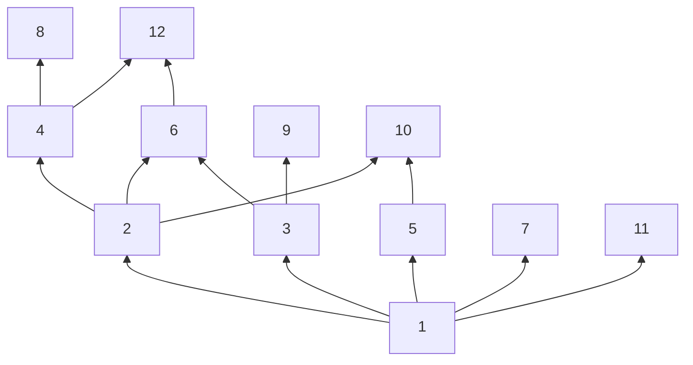

# 第 5 章 二项式系数

## EX1

> Prove Pascal's formula by substituting the values of the binomial coefficients as  given in equation (5.1).

从右向左证明帕斯卡公式

$$
\begin{aligned}
\binom{n-1}{k-1}+ \binom{n-1}{k} =& \frac{(n-1)!}{(k-1)!(n-k)!} + \frac{(n-1)!}{k!(n-k-1)!} \\
=&\frac{(n-1)!}{(k-1)!(n-k-1)!} \times(\frac{1}{n-k}+ \frac{1}{k}) \\
=&\frac{(n-1)!}{(k-1)!(n-k-1)!} \times \frac{k+(n-k)}{k(n-k)} \\
=&\frac{n!}{k!(n-k)!} = \binom{n}{k}
\end{aligned}
$$

## EX2

> Fill in the rows of Pascal's triangle corresponding to n = 9 and 10.

:::details 验证程序

```CPP
#include <iostream>
#include <vector>
using namespace std;

const int tableSize = 67;
vector<vector<long long>> combinTable(tableSize, vector<long long>(tableSize, 0));
void buildCombinTable() {
    for(int i = 1; i < tableSize; ++ i) {
        combinTable[i][i] = combinTable[i][0] = 1;
    }
    for(int i = 2; i < tableSize; ++ i) {
        for(int j = i/2; j > 0; -- j) {
            combinTable[i][j] = combinTable[i-1][j-1] + combinTable[i-1][j];
   combinTable[i][i-j] = combinTable[i][j];
        }
    }
}
long long getCombin(int n, int m) {
    return combinTable[n][m];
}

int main() {
    buildCombinTable();
    int n = 10;
    printf("\t");
    for(int i = 0; i <= n; ++ i) {
        printf("%d\t", i);
    }
    printf("\n");
    for(int i = 0; i <= n; ++ i) {
        printf("%d\t", i);
        for(int j = 0; j <= i; ++ j) {
            printf("%lld\t", combinTable[i][j]);
        }
        printf("\n");
    }
    return 0;
}
```

:::

## EX3

> Consider the sum of the binomial coefficients along the diagonals of Pascal's  triangle running upward from the left. The first few are 1,1,1 + 1 = 2,1 + 2 =  3, 1 + 3 + 1 = 5, 1 + 4 + 3 = 8. Compute several more of these diagonal sums,  and determine how these sums are related. (Compare them with the values of  the counting function f in Exercise 4 of Chapter 1.)

可以发现所求序列就是每条斜对角线之和构成的序列，

$$
F(n) = \sum \binom{n-k}{k}
$$

并且 k 要满足，$k \ge 0, n-k \ge k$，所以 k 的取值范围为$0 \le k \le \lfloor n/2 \rfloor$。

显然，我们有平凡的解，$F(0) = 1, F(1) = 1$，设 Z 为每一项中 k 的定义域，当$n \ge 2$时，对于每一项使用帕斯卡公式展开，并且记$h = k-1$。

$$
\begin{aligned}
 F(n) =& \sum_{k \in Z} \binom{n-k}{k} = \sum_{k \in Z} \binom{n-k-1}{k} + \sum_{k \in Z''} \binom{n-k-1}{k-1}\\
 =& \sum_{k \in Z'} \binom{(n-1)-k}{k} + \sum_{k \in Z} \binom{(n-2)-(k-1)}{k-1} \\
 =& \sum_{k \in Z'} \binom{(n-1)-k}{k} + \sum_{h \in Z} \binom{(n-2)-h}{h} \\
 =& F(n-1) + F(n-2)
 \end{aligned}
$$

第一章 EX4 中的 f(x) 就是斐波那契数列。

## EX4

> Expand $(x + y)^5$ and $(x + y)^6$ using the binomial theorem.

$$
x^5+5x^4y+10x^3y^2+10x^2y^3+5xy^4+y^5 \\ x^6+6x^5y+15x^4y^2+20x^3y^3+15x^2y^4+6xy^5+y^6
$$

## EX5

> Expand $(2x - y)^7$ using the binomial theorem.

$$
\sum _{i=0}^7\binom{7}{i}\left(2x\right)^{\left(7-i\right)}\left(-y\right)^i = \\ 128x^7-448x^6y+672x^5y^2-560x^4y^3+280x^3y^4-84x^2y^5+14xy^6-y^7
$$

## EX6

> What is the coefficient of $x^5y^{13}$ in the expansion of $(3x - 2y)^{18}$ ?
> What is the  coefficient of $x^8y^9$ ? (There is not a misprint in this last question!)

从 18 项中选择 5 项 x，其余项为 y，因此$x^5y^{13}$的系数为
$\dbinom{18}{5}\times3^5\times (-2)^{13} = -17055940608$；$8+9 \neq 18$，
不存在$x^8 y^9$的项。

## EX7

> Use the binomial theorem to prove that
>
> $$
> 3^n = \sum_{k=0}^n \binom{n}{k} 2^k
> $$
>
> Generalize to find the sum
> $$
> \sum_{k=0}^n \binom{n}{k}r^k
> $$
>
> for any real number r.

$$
(x+1)^n = \sum_{k=0}^n \binom{n}{k} x^k1^{n-k} = \sum_{k=0}^n \binom{n}{k} x^k
$$

带入 x=2 即有，

$$
3^n = \sum_{k=0}^n \binom{n}{k} 2^k
$$

所以，带入 x=r 有，

$$
\sum_{k=0}^n \binom{n}{k} r^k = (r+1)^n
$$

## EX8

> Use the binomial theorem to prove that
>
> $$
> 2^n = \sum_{k=0}^n (-1)^k \binom{n}{k} 3^{n-k}
> $$

$$
\sum_{k=0}^n \binom{n}{k} (-1)^k \cdot  3^{n-k} = (-1 + 3)^n = 2^n
$$

## EX9

> Evaluate the sum
>
> $$
> \sum_{k=0}^n (-1)^k \binom{n}{k} 10^{k}
> $$

$$
\sum_{k=0}^n (-1)^k \binom{n}{k} 10^{k} = \sum_{k=0}^n  \binom{n}{k} (-10)^{k}\cdot 1^{n-k} = (-10+1)^n = (-1)^n \cdot9^n
$$

## EX10

> Use *combinatorial* reasoning to prove the identity (5.2).

设 x 是$\{1,2 \cdots, n\}$的 k 子集，y 是 x 中的一个元素，有如下两种方式构造 (x, y) 元组。

1. 先构造 x，从 n 个元素中选 k 个，有$\dbinom{n}{k}$种方法，再从 x 中选择 y，共有 k 种方法，由乘法原理共有$k\dbinom{n}k$种方法。
2. 先选 y，从 n 个元素中选 1 个，有 n 种方法，再添加 n-1 个元素补全 x，有$\dbinom{n-1}{k-1}$种方法，由乘法原理共有$n\dbinom{n-1}{k-1}$种方法。

因为 1 和 2 是相同问题的不同解法，因此结果等价，

$$
k\binom{n}k = n \binom{n-1}{k-1}
$$

<!-- ### EX10 注

为了方便考试记忆，组合推理的题目建议还是使用「具体」案例进行推导，对于本题采用如下方式进行描述： -->

:::tip 有助于理解的方法

方法一：从 n 位同学中先选出 k 位班委，再从 k 位班委中选出 1 位班长；

方法二：先从 n 位同学中选出 1 位班长，再从剩余 n-1 位同学中选出剩余 k-1 位班委。

:::

## EX11

> Use *combinatorial* reasoning to prove the identity (in the form given)
>
> $$
> \binom{n}k - \binom{n-3}{k} = \binom{n-1}{k-1} + \binom{n-2}{k-1} + \binom{n-3}{k-1}
> $$
>
> (Hint: Let S be a set with three distinguished elements a, b, and c and count  certain k-subsets of S.)

设 S 是$\{1, 2, \cdots, n\}$的 k 子集，$S_1$是包含 1 的 k 子集，$S_2$是包含 2 但不包含 1 的 k 子集，$S_3$是包含 3 但不包含 1 和 2 的 k 子集，$S_4$是不包含 1，2，3 的 k 子集。由定义可以计算，

$$
|S| = \binom{n}{k}, \quad |S_1| = \binom{n-1}{k-1}, \quad |S_2| = \binom{n-2}{k-1}, \quad |S_3| = \binom{n-3}{k-1}, \quad |S_4| = \binom{n-3}{k}
$$

下面考虑问题：集合$\{1,2,\cdots, n\}$的 k 子集中包含 1，2，3 中至少一个的 k 子集数目。有如下两种解法，

1. 所有的 k 子集数减去不包含 1，2，3 的 k 子集数；
2. 包含 1，包含 2 但不包含 1，包含 3 但不包含 1，2 三种 k 子集数之和。

我们给出直观的图来判断集合之间的关系：


两种解法等价，因此有，

$$
|S|-|S_4| = |S_1| + |S_2| + |S_3| \Rightarrow \binom{n}k - \binom{n-3}{k} = \binom{n-1}{k-1} + \binom{n-2}{k-1} + \binom{n-3}{k-1}
$$

## EX12

> Let n be a positive integer. Prove that
>
> $$
> \sum_{k=0}^n (-1)^k \binom{n}{k}^2 =
> \begin{cases}
> 0, & \text{ if n is odd} \\
> (-1)^n \dbinom{2m}{m} & \text{ if n=2m.}
> \end{cases}
> $$
>
> (Hint: For n = 2m, consider the coefficient of $x^n$ in $(1-x^2)^n = (1+x)^n (1-x)^n$.)

$$
(1-x^2)^n = \sum_{k=0}^{n} \binom{n}{k}(-x^2)^k = \sum_{k=0}^{n} (-1)^k \binom{n}{k}x^{2k} \\
(1+x)^n (1-x)^n = \sum_{k=0}^n \binom{n}{k} (-x)^k \sum_{j=0}^n \binom{n}{j} x^j
$$

当$n=2m+1, m \ge 0$时，对比两式$x^n$的系数，前者只有偶数项，因此系数为 0；后者前半部分取 k 阶时，后半部分只能取 n-k 阶，因此有

$$
\sum_{k=0}^n \binom{n}{k} (-x)^k \binom{n}{n-k}x^{n-k} = \sum_{k=0}^n (-1)^k \binom{n}{k}^2 x^n = 0
$$

因此有，

$$
\sum_{k=0}^n (-1)^k \binom{n}{k}^2  = 0
$$

当$n = 2m, n \ge 0$时，对比两式$x^n$的系数，前者 k 取 m，有$(-1)^m \dbinom{n}{m} x^{2m}$，
后者前半部分取 k 阶时，后半部分只能取 n-k 阶，
因此有$\displaystyle \sum_{k=0}^n \binom{n}{k}(-x)^k \binom{n}{n-k} x^{n-k} = \sum_{k=0}^n (-1)^k \binom{n}{k}^2 x^{n}$，
代换 n=2m，进而有，

$$
\sum_{k=0}^n (-1)^k \binom{n}{k}^2  = (-1)^m \binom{2m}{m}
$$

综上，证毕。

## EX13

> Find one binomial coefficient equal to the following expression:
>
> $$
> \binom{n}{k} + 3\binom{n}{k-1} + 3 \binom{n}{k-2} + \binom{n}{k-3}
> $$

连续使用帕斯卡公式进行合并。

$$
\begin{aligned}
\text{原式}=&(\binom{n}{k} + \binom{n}{k-1}) + 2  (\binom{n}{k-1} +  \binom{n}{k-2}) +  (\binom{n}{k-2}+ \binom{n}{k-3}) \\
=& \binom{n+1}{k} + 2\binom{n+1}{k-1} +  \binom{n+1}{k-2} \\
=&\binom{n+2}{k} + \binom{n+2}{k-1} \\
=& \binom{n+3}{k}
\end{aligned}
$$

## EX14

> Prove that
>
> $$
> \binom{r}{k} = \frac{r}{r-k} \binom{r-1}{k}
> $$
>
> for r a real number and k an integer with $r \neq k$.

对于实数 r，有二项式系数定义，

$$
\binom{r}{k} = \begin{cases} \dfrac{r(r-1) \cdots (r-k+1)}{k!}  & k \ge 1 \\ 1 & k=0 \\ 0 & k \le -1 \end{cases}
$$

因此，当$k=0$或$k \le -1$时，等式显然成立，当$k \ge 1$时，

$$
\frac{r}{r-k} \binom{r-1}{k} = \frac{r}{r-k} \times \frac{(r-1)(r-2) \cdots (r-k)}{k!} = \frac{r(r-1) \cdots (r-k+1)}{k!} = \binom{r}{k}
$$

## EX15

> Prove, that for every integer n > 1,
>
> $$
> \binom{n}{1} - 2\binom{n}{2} + 3\binom{n}{3} + \cdots + (-1)^{n-1} n \binom{n}{n} = 0
> $$
>

$$
(x+1)^n = \sum_{k=0}^{n} \binom{n}{k} x^k
$$

两边同时求一阶导数，

$$
n(x+1)^{n-1} = \sum_{k=1}^n k \binom{n}{k} x^{k-1}
$$

两边同时带入 x=-1，即证明上式。

## EX16

> By integrating the binomial expansion, prove that, for a positive integer n,
>
> $$
> 1 + \frac{1}{2}\binom{n}{1}  + \frac{1}{3}\binom{n}{2} +  \cdots + \frac{1}{n+1} \binom{n}{n} = \frac{2^{n+1}-1}{n+1}
> $$

$$
(x+1)^n = \sum_{k=0}^{n} \binom{n}{k} x^k
$$

两边同时对 x 进行积分，

$$
\frac{(x+1)^{n+1}}{n+1} + C = \sum_{k=0}^{n} \binom{n}{k} \frac{ x^{k+1}}{k+1}
$$

两边同时带入 x=0，求得$C = -\dfrac{1}{n+1}$；再带入 x=1 证明上式成立。

## EX17

> Prove the identity in the previous exercise by using (5.2) and (5.3).

$$
k \binom{n}{k} = n \binom{n-1}{k-1} \tag{5.2}
$$

$$
\binom{n}{0} + \binom{n}{1} + \cdots + \binom{n}{n} = 2^n \tag{5.3}
$$

对于$\dfrac{1}{k+1} \dbinom{n}{k}$，通过式 (5.2) 进行变换，

$$
\begin{aligned}
\dfrac{1}{k+1} \dbinom{n}{k}
=& \frac{1}{k+1} \frac{n}{k} \binom{n-1}{k-1} \\
=& \frac{1}{k+1} \frac{n}{k} \frac{(n-1)!}{(k-1)!(n-k)!} \\
=& \frac{n!}{(k+1)!(n-k)!} \\
=& \frac{1}{n+1} \frac{(n+1)!}{(k+1)!(n-k)!}\\
=& \frac{1}{n+1} \binom{n+1}{k+1}
\end{aligned}
$$

因此，提出公共部分，由式 (5.3) 可得，

$$
\sum_{k=0}^n\frac{1}{k+1}\binom{n}{k} = \frac{1}{n+1} \sum_{k=0}^n \binom{n+1}{k+1} = \frac{2^{n+1}-1}{n+1}
$$

## EX18

> Evaluate the sum
>
> $$
> 1 -\frac{1}{2}\binom{n}{1}  + \frac{1}{3}\binom{n}{2} -\frac{1}{4}\binom{n}{3} +  \cdots + (-1)^n \frac{1}{n+1} \binom{n}{n}
> $$

由 EX16 结论，带入 x=-1，并将整个式子添加负号，有

$$
-\sum_{k=0}^{n} \binom{n}{k} \frac{ (-1)^{k+1}}{k+1} =  - (\frac{(-1+1)^{n+1}}{n+1}  - \frac{1}{n+1}) = \frac{1}{n+1}
$$

## EX19

> Sum the series $1^2 + 2^2 + 3^2 + \cdots + n^2$ by observing that
>
> $$
> m^2 = 2\binom{m}{2} + \binom{m}{1}
> $$
>
> and using the identity (5.19).

$$
2\binom{m}{2} + \binom{m}{1} = 2 \times \frac{m(m-1)}{2} + m = m^2
$$

因此每个平方数都可以写成组合数和的形式，

$$
\begin{aligned}
\sum_{k=1}^n k^2
=& \sum_{k=1}^n (2\binom{k}{2} + \binom{k}{1}) \\
=& 2\sum_{k=0}^n \binom{k}{2} + \sum_{k=0}^n \binom{k}{1} \\
=& 2\binom{n+1}{3} + \binom{n+1}{2} \\
=& \frac{n(n+1)(2n+1)}{6}
\end{aligned}
$$

:::info
使用到帕斯卡的迭代形式，具体参考正文 p85，公式 (5.19)。
:::

## EX20 :key:

> Find integers a, b, and c such that
>
> $$
> m^3 = a \binom{m}{3} + b \binom{m}{2} + c \binom{m}{1}
> $$
>
> for all m. Then sum the series $1^3 +2^3 + 3^3 + \cdots + n^3$.

$$
a \binom{m}{3} + b \binom{m}{2} + c \binom{m}{1} = a\frac{m(m-1)(m-2)}{6} + b \frac{m(m-1)}{2} +cm = m^3
$$

所以有方程组，

$$
\begin{cases}
\displaystyle \frac{a}{6} = 1 \\
\displaystyle -\frac{a}{2}+  \frac{b}{2} = 0\\
\displaystyle \frac{a}{3} - \frac{b}{2} + c = 0 \\
\end{cases}
$$

所以，$a=6,b= 6,c=1$；参考 EX19 有

$$
\begin{aligned}
\sum_{j=1}^n  j^3
=& \sum_{j=0}^n (6\binom{j}{3} + 6 \binom{j}{2} + \binom{j}{1}) \\
=& 6 \binom{n+1}{4} + 6 \binom{n+1}{3} + \binom{n+1}{2} \\
=& \frac{n^2(n+1)^2}{4}
\end{aligned}
$$

## EX21

> Prove that, for all real numbers r and all integers k,
>
> $$
> \binom{-r}{k} = (-1)^k \binom{r+k-1}{k}
> $$

当$k \lt 0$时，二项式为 0，当$k \ge 0$时，

$$
\begin{aligned} \binom{-r}{k} =& \frac{(-r)(-r-1) \cdots (-r-k+1)}{k!} \\
=& (-1)^{k} \frac{r(r+1) \cdots (r+k-1)}{k!} \\
=&(-1)^k \binom{r+k-1}{k}\end{aligned}
$$

## EX22

> Prove that, for all real numbers r and all integers k and m,
>
> $$
> \binom{r}{m} \binom{m}{k} = \binom{r}{k} \binom{r-k}{m-k}
> $$

当$m \lt 0$或者$k \lt 0$时，二项式为 0，当$0 \le k \le m$时，

$$
\begin{aligned}\binom{r}{m} \binom{m}{k}
=& \frac{r(r-1) \cdots (r-m+1)}{m!} \times \frac{m!}{k!(m-k)!}  \\
=& \frac{r(r-1) \cdots (r-k+1)}{k!} \frac{(r-k)(r-k-1) \cdots (r-m+1)}{(m-k)!} \\
=& \binom{r}{k} \binom{r-k}{m-k}
\end{aligned}
$$

## EX23

> Every day a student walks from her home to school, which is located 10 blocks  east and 14 blocks north from home. She always takes a shortest walk of 24  blocks.
>
> (a) How many different walks are possible?
>
> (b) Suppose that four blocks east and five blocks north of her home lives her  best friend, whom she meets each day on her way to school. Now how many  different walks are possible?
>
> (c) Suppose, in addition, that three blocks east and six blocks north of her  friend's house there is a park where the two girls stop each day to rest and  play. Now how many different walks are there?
>
> (d) Stopping at a park to rest and play, the two students often get to school  late. To avoid the temptation of the park, our two students decide never  to pass the intersection where the park is. Now how many different walks  are there?

### EX25 Q(a)

移动 24 次，一共往东 10 次，$\dbinom{24}{10} = 1961256$。

### EX25 Q(b)

拆成两部分，先到朋友家，再到学校，$\dbinom{9}{4} \dbinom{24-9}{10-4} = 630630$。

### EX25 Q(c)

拆成三部分，$\dbinom{9}{4}\dbinom{9}{3}\dbinom{6}{3} = 211680$。

### EX25 Q(d)

总路径数，减去经过公园的路径数，$\dbinom{9}{4} \dbinom{15}{6} - \dbinom{9}{4}\dbinom{9}{3}\dbinom{6}{3} = 630630- 211680 =418950$。

:::tip 顺便一提 :bulb:
本题的**街区**和第二章 EX28 的*街区*有些不同，前者视作一个点，后者则看作一个块。
:::

## EX24

> Consider a three-dimensional grid whose dimensions are 10 by 15 by 20. You  are at the front lower left corner of the grid and wish to get to the back upper  right corner 45 "blocks" away. How many different routes are there in which you  walk exactly 45 blocks?

这本质上是一个[分组问题](../extras/notes/trick-for-char2.md#分组问题)，可以想想为把 45 个带号求，放入 x，y 和 z 三个盒子中。

因此一共有$\dfrac{45!}{10! \cdot15! \cdot 20!}$条路径。

## EX25

> Use a combinatorial argument to prove the *Vandermonde convolution* for the  binomial coefficients: For all positive integers $m_1, m_2$, and n,
>
> $$
> \sum_{k=0}^n \binom{m_1}{k} \binom{m_2}{n-k} = \binom{m_1+m_2}{n}
> $$
>
> Deduce the identity (5.16) as a special case.

考虑从$m_1$名男同学，$m_2$位女同学中选出 n 位班委的问题，由两种解法。

1. 先考虑从男同学中选出 k 名同学担任班委，则还需要从女同学中选出剩余 n-k 名班委，而对于每一个 k 的选法，符合加法法则；
2. 不考虑性别，直接考虑从$m_1 + m_2$名同学选出 n 名同学担任班委。

显然，方法 1 和方法 2 是等价的，因此得证。

对于式 (5.16)，只需要取$m_1 = m_2 = n \ge 0$，即有，

$$
\sum_{k=0}^n \binom{m_1}{k} \binom{m_2}{n-k} = \sum_{k=0}^n \binom{n}{k} \binom{n}{n-k} = \sum_{k=0}^n \binom{n}{k}^2 = \binom{2n}{n}
$$

## EX26

> Let n and k be integers with $1 \le k \le n$. Prove that
>
> $$
> \sum_{k=1}^n \binom{n}{k} \binom{n}{k-1} = \frac{1}{2} \binom{2n+2}{n+1} - \binom{2n}{n}
> $$

由 EX25 可知，

$$
\begin{aligned}
\sum_{k=1}^n \binom{n}{k} \binom{n}{k-1} \\
=& \binom{n}{0}\binom{n}{-1} + \sum_{k=1}^n \binom{n}{k} \binom{n}{k-1} + \binom{n}{n+1}\binom{n}{n} \\
=& \sum_{k=0}^{n+1} \binom{n}{k}\binom{n}{n+1-k} \\=& \binom{2n}{n+1}
\end{aligned}
$$

即证，

$$
\binom{2n}{n+1} = \frac{1}{2} \binom{2n+2}{n+1} - \binom{2n}{n}
$$

结合帕斯卡公式，这是很容易验证的。

<!-- ### EX26 注 -->

:::tip 小技巧

本题凑二项式系数的范德蒙德卷积公式时，补充的两项都是$\dbinom{r}{k}$的扩展定义，当$k \le -1$或者$k \gt n$时，由定义这两项都是 0。

再者，就是范德蒙德卷积公式的 k 并非只能从 0 取到 n，补充定义也是可以的。

:::

## EX27

> Let n and k be positive integers. Give a *combinatorial proof* of the identity  (5.15):
>
> $$
> n(n+1) 2^{n-2} = \sum_{k=1}^n k^2 \binom{n}{k}
> $$

还是使用学生的例子从 n 名同学中，先预选 k 名班委，再在 k 名班委中选出班长与学习委员（可以为同一人）。

由上面的例子，可以确定选出 k 名班委有$\dbinom{n}{k}$种方案；
从班委中选出班长和学习委员各有 k 种方案；
由乘法法则，一共有$k^2 \dbinom{n}{k}$种方案。
对于 k 可能的取值为 1，2，…，n，每一个 k 之间符合加法法则，
因此共有$\displaystyle \sum_{k=1}^n k^2 \binom{n}{k}$种方案。

下面进行逆向思考，先委任班长与学习委员。
如果班长与学习委员为同一人，其余人要么是班委，要么不是班委，一共有$n  2^{n-1}$种方案；
如果班长与学习委员不是同一人，则有$n(n-1)2^{n-2}$种方案。合计共$n(n+1)2^{n-2}$种方案。

两种解法求解的是同一问题，因此结果等价，题目得证。

## EX28

> Let nand k be positive integers. Give a *combinatorial proof* that
>
> $$
> \sum_{k=1}^n k \binom{n}{k}^2 = n \binom{2n-1}{n-1}
> $$

从 n 名男同学和 n 名女同学中选出 n 名班委，其中必须有一位女同学担任班长。

从女同学中选出 k 名班委，再从男同学中选出 n-k 名班委，k 名女同学中选出一人为班长，
有$k \dbinom{n}{k} \dbinom{n}{n-k}$种方法，
对于每一个 k，符合加法法则，共有$\sum_{k=1}^n k \dbinom{n}{k}^2$种方法。

或者，先从 n 名女同学中选出班长，再从剩余 2n-1 名同学中选择 n-1 名班委，即$n \dbinom{2n-1}{n-1}$种选法，两种解法等价，题目得证。

## EX29

> Find and prove a formula for
>
> $$
> \sum_{\substack{r,s, t \ge 0 \\  r+s+t = n}} \binom{m_1}{r} \binom{m_2}{s} \binom{m_3}{t}
> $$
>
> where the summation extends over all nonnegative integers r, s and t with sum  r + s + t = n.

$$
(x+1)^{m_1+m_2+m_3} = (x+1)^{m_1}(x+1)^{m_2}(x+1)^{m_3}
$$

对比两端$x^n$的系数，则有

$$
\sum_{\substack{r,s, t \ge 0 \\  r+s+t = n}} \binom{m_1}{r} \binom{m_2}{s} \binom{m_3}{t} = \binom{m_1+m_2+m_3}{n}
$$

<!-- ### EX29 注 -->
:::tip

有些类似 EX12 的思路。
:::

## EX30

> Prove that the only antichain of S = {1, 2, 3, 4} of size 6 is the antichain of all  2-subsets of S.

由定理 5.3.3 知，n 元素集合的最大反链长为$\dbinom{n}{\lfloor n/2 \rfloor}$。

设$\mathcal{A}$是 S 的最大反链，满足，

$$
|\mathcal{A}| = \binom{n}{\lfloor n/2 \rfloor}
$$

设$\alpha_k$是反链$\mathcal{A}$中大小为 k 的子集个数，因此有，

$$
|\mathcal{A}| = \sum_{k=0}^{n} \alpha_k = \binom{n}{\lfloor n/2 \rfloor}
$$

也即

$$
\sum_{k=0}^{n} \frac{\alpha_k}{\dbinom{n}{\lfloor n/2 \rfloor}} = 1
$$

由二项式系数的单峰性，可知，$\dbinom{n}{\lfloor n/2 \rfloor} \ge \dbinom{n}{k}$，结合定理 5.3.3 知，

$$
\sum_{k=0}^{n} \frac{\alpha_k}{\dbinom{n}{k}} \le 1
$$

做差整理可得，

$$
\sum_{k=0}^{n} \alpha_k  \frac{\dbinom{n}{\lfloor n/2 \rfloor} -\dbinom{n}{k}}{\dbinom{n}{\lfloor n/2 \rfloor} \dbinom{n}{k}} \le 0
$$

但是，$\alpha_k$和$\dbinom{n}{\lfloor n/2 \rfloor}-\dbinom{n}{k}$均为非负数，因此上式恒为 0。
要么$\alpha_k$为 0，要么$\alpha_k$的系数为 0，显然，除$k = \lfloor n/2 \rfloor$和$k = \lceil n/2 \rceil$外，一定有$\alpha_k = 0$。

并且当 n=4 时，$k = \lceil n/2 \rceil = \lfloor n/2 \rfloor  = 2$，所以最大反链唯一，最大反链长为$\dbinom{4}{2} = 6$。
并且只有 2 子集的反链数$\alpha_2 \gt 0$，因此 S 大小为 6 的反链就是 S 的所有 2 子集的反链。

<!-- ### EX30PS -->

:::tip 解题思路
先说明大小为 6 的反链就是最大反链，再论证最大反链唯一，最后说明为最大反链是 2 子集的反链。
:::

## EX31

> Prove that there are only two antichains of S = {1, 2, 3, 4, 5} of size 10 (10 is maximum by Spemer's theorem), namely, the antichain of all 2-subsets of Sand the antichain of all 3-subsets.

由 EX30 知，n=5 的最大反链长为$\dbinom{5}{2} = 10$，k 可以取 2 或 3，并且有$\alpha_2 + \alpha_3 = 10$。
所有的 2 子集和所有的 3 子集分别构成的反链均是最大反链。
下证$\alpha_2, \alpha_3$中必有一个为 0，即大小为 10 的反链只能是所有 2 子集的反链或所有 3 子集的反链。
对于所有 2 子集构成的反链，每添加一个 3 子集需要从中删除$\dbinom{3}{2} = 3$个 2 子集才能维持反链，而此时$|\mathcal{A}| < 10$，不是最大反链，因此最大反链不可能由 2 子集和 3 子集共同构成。
因此只能是$\alpha_2 = 10, \alpha_3 = 0$或$\alpha_2 = 0, \alpha_3 = 10$。

## EX32 :star:

> \* Let S be a set of n elements. Prove that, if n is even,
> the only antichain of size $\binom{n}{\lfloor n/2 \rfloor}$ is the antichain
> of all $\frac{n}{2}$-subsets; if n is odd,
> prove that the only antichains of this size are the antichain of
> all $\frac{n-1}{2}$-subsets and the antichain of
> all $\frac{n+1}{2}$-subsets.

略

## EX33

> Construct a partition of the subsets of {1, 2, 3, 4, 5} into symmetric chains.

需要采用递推的方式，由前一项构造后一项；满足如下两点，

1. 把最后一个子集复制并插入 n，把该子集作为新的最后一个子集；
2. 把 n 插入到除最后一个子集外所有的子集（并删除最后一个子集）。

我们给出 n=4 的结果（可以在草稿上求出），

$$
\begin{aligned}
&\emptyset , 1, 12, 123, 1234 \\
& 4, 14, 124 \\
&2, 23, 234 \\
&24 \\
&3, 13, 134 \\
&34
\end{aligned}
$$

$$
\begin{aligned}
&\emptyset, 1, 12,123,1234,12345 \\
&5,15,125,1235\\
&4,14,124,1245\\
&45,145\\
&2,23,234,2345\\
&25,235\\
&24,245\\
&3,13,134,1345\\
&35,135\\
&34,345
\end{aligned}
$$

### EX33PS

对于特殊的行 24，它没有除最后一个子集外的所有子集，所以不执行第二项操作。

## EX34 :construction: :pill:

> In a partition of the subsets of {1,2, ... ,n} into symmetric chains, how many chains have only one subset in them? two subsets? k subsets?

### EX34 参考链接

[一个没看懂的解法](https://www.math.hkust.edu.hk/~mabfchen/Math391I/Homework3.pdf)

<!-- 后来和舍友讨论一下，感觉清楚很多， -->

:::tip 待完善 :construction:
大意就是求出$\ge k$的子集个数的通项公式，然后用$\ge k-1$的部分减去$\ge k$的部分，就是$=k$的部分。
:::

<!--
~~不过，鉴于本题没考，就不再多说了。（虽然第六章漏掉的 EX32 考了，但我也不整理了）。~~

### EX34 注

我感觉这个问题涉及的「对称链划分」课上没讲过；但考虑到第一章竟然考了构造拉丁方，这题还是很有必要背一下的。

莫名其妙，我做作业的时候漏掉了这题。
-->

## EX35

> A talk show host has just bought 10 new jokes. Each night he tells some of the jokes. What is the largest number of nights on which you can tune in so that you never hear on one night at least all the jokes you heard on one of the other nights? (Thus, for instance, it is acceptable that you hear jokes 1, 2, and 3 on one night, jokes 3 and 4 on another, and jokes 1, 2, and 4 on a third. It is not acceptable that you hear jokes 1 and 2 on one night and joke 2 on another night.)

本题等价于求 10 个元素的集合最大反链长度，由公式$\dbinom{10}{10/2} = 252$。

<!-- ### EX35 吐槽

这么短的题目不会考的。 -->

## EX36

> Prove the identity of Exercise 25 using the binomial theorem and the relation $(1+x)^{m_l}(1+x)^{m_2} = (1+x)^{m_1+m_2}$.

两端展开，对比$x^n$的系数可得，

$$
\sum_{k=0}^{n} \binom{m_1}{k} \binom{m_2}{n-k} = \binom{m_1+m_2}{n}
$$

## EX37

> Use the multinomial theorem to show that, for positive integers nand t,
>
> $$
> t^n = \sum\binom{n}{n_1 n_2 \cdots n_t},
> $$
>
> where the summation extends over all nonnegative integral solutions $n_1, n_2, ... , n_t$ of $n_1 + n_2 + ... + n_t = n$.

由多项式定理，直接带入，

$$
\begin{aligned}
    t^n =& (1+1+\cdots + 1)^n \\
    =& \sum \binom{n}{n_1 n_2 \cdots n_t} 1^{n_1} 1^{n_2} \cdots 1^{n_t} \\
    =& \sum \binom{n}{n_1 n_2 \cdots n_t}
\end{aligned}
$$

## EX38

> Use the multinomial theorem to expand $(x_1 + x_2 + x_3)^4$.

$$
\begin{aligned}
    (x_1 + x_2 +x_3)^4 =& \sum \binom{4}{n_1 n_2 n_3} x_1^{n_1} x_2^{n_2} x_3^{n_3} \\
    =& (x_1^4 + x_2^4 + x_3^4) + 4(x_1^3x_2 + x_2^3x_3 + x_3^3x_1) + \\
    &6(x_1^2 x_2^2 + x_1^2 x_3^2 + x_2^2 x_3^2) + 12(x_1^2x_2x_3 + x_1x_2^2x_3 + x_1x_2x_3^2)
\end{aligned}
$$

## EX39

> Determine the coefficient of $x_1^3 x_2 x_3^4 x_5^2$ in the expansion of
>
> $$
> (x_1 + x_2 + x_3 + x_4 + x_5) ^{10}
> $$

系数为$\dbinom{10}{3\; 1\; 4\; 0\; 2} = \dfrac{10!}{3! \times 1! \times 4! \times 0! \times 2!} = 12600$。

## EX40

> What is the coefficient of $x_1^3 x_2^3 x_3 x_4^2$ in the expansion of
>
> $$
> (x_1 - x_2 + 2 x_3 -2x_4)^9
> $$

$$
\binom{9}{3 \; 3 \; 1 \; 2} (x_1)^3 (-x_2)^3 (2x_3) (-2x_4)^2 = \frac{9!}{3! \times 3! \times 1! \times 2!} \times (-1)^3 \times 2 \times (-2)^2 x_1^3 x_2^3 x_3 x_4^2= -40320x_1^3 x_2^3 x_3 x_4^2
$$

## EX41

> Expand $(x_1 + x_2 + x_3)^n$ by boserving that
>
> $$
> (x_1 + x_2 + x_3)^n = ((x_1 + x_2) + x_3)^n
> $$
>
> and then using the binomial theorem.

$$
\begin{aligned}
    (x_1 + x_2 + x_3)^n =& ((x_1 + x_2) + x_3)^n \\
    =& \sum_{k=0}^n \binom{n}{k} (x_1 + x_2)^k x_3^{n-k} \\
    =& \sum_{k=0}^n \binom{n}{k} (\sum_{j=0}^k \binom{k}{j} x_1^j x_2^{k-j}) x_3^{n-k} \\
    =& \sum_{K=0}^n \sum_{j=0}^k \frac{n!}{k!(n-k)!} \frac{k!}{j!(k-j)!} x_1^j x_2^{k-j} x_3^{n-k}
\end{aligned}
$$

记$n_1 = j, n_2 = k-j, n_3 = n-k$，所以上式可以化简为，

$$
\begin{aligned}
(x_1 + x_2 + x_3)^n
=& \sum_{n_1 + n_2} ^ {n_1 + n_2 + n_3} \sum_{n_1} ^{n_1 + n_2} \frac{n!}{n_1 ! \times n_2! \times n_3!} x_1^{n_1} x_2^{n_2} x_3^{n_3} \\
=&  \underset{n_1 + n_2 + n_3 = n}{\sum} \binom{n}{n_1 \; n_2 \; n_3} x_1^{n_1} x_2^{n_2} x_3^{n_3}
\end{aligned}
$$

## EX42

> Prove the identity (5.21) by a combinatorial argument. (Hint: Consider the permutations of a multiset of objects of t different types with repetition numbers $n_l, n_2, ... ,n_t$, respectively. Partition these permutations according to what type of object is in the first position.)

多重集合$\{n_1 \cdot x_1, n_2 \cdot x_2, \cdots, n_t \cdot x_t\}$的 n 排列，
其中$n_1 + n_2 + \cdots + n_t = n$，多重集合 n 排列满足结论$\dfrac{n!}{n_1 ! n_2 ! \cdots n_t!}$，得到左式。

之后采用另一种算法，优先决定第一个位置放哪种元素，有 t 种情况，之后对剩余的 n-1 个元素进行 n-1 排列，
假如第一个位置选择$x_2$，那么对应的 n-1 排列则为$\dfrac{(n-1)!}{n_1! (n_2-1)! \cdots n_t!}$，
即等于$\dbinom{n-1}{n_1\;(n_2-1)\;\cdots \; n_t}$，对 t 种情况进行求和，得到右式。

综上，证毕。

## EX43

> Prove by induction on n that, for n a positive integer,
>
> $$
> \frac{1}{(1-z)^n} = \sum_{k=0}^{\infty} \binom{n+k-1}{k} z^k, \quad |z| \lt 1
> $$
>
> Assume the validity of
>
> $$
> \frac{1}{1-z} = \sum_{k=0}^{\infty} z^k, \quad |z| \lt 1
> $$
>

当 n=1 是显然成立；假设对正整数 n 上式仍然成立（$n \ge 1$），对于正整数 n+1 有

$$
\begin{aligned}
    \frac{1}{(1-z)^{n+1}} =& \frac{1}{n}(\frac{1}{(1-z)^n})' \\
    =& \frac{1}{n} \sum_{k=1}^{\infty} \binom{n+k-1}{k} k z^{k-1} \\
    =& \sum_{k=1}^{\infty} \frac{1}{n} \frac{(n+k-1)!}{k!(n-1)!} k z^{k-1} \\
    =& \sum_{k=1}^{\infty} \frac{(n+k-1)!}{(k-1)!n!} z^{k-1} \\
    =& \sum_{k=1}^{\infty} \binom{n+k-1}{k-1} z^{k-1} \\
    =& \sum_{k=0}^{\infty} \binom{(n+1)+k-1}{k} z^k
\end{aligned}
$$

综上，证毕。

### EX43PS

<!-- 看到$\dfrac{1}{1-z}$DNA 都动了，这不能不求导？ -->

如果使用帕斯卡公式，中间化简合并的过程类似生成函数。

## EX44

> Prove that
>
> $$
> \underset{n_1 + n_2 + n_3 = n}{\sum} \binom{n}{n_1 \, n_2 \, n_3} (-1)^{n_1-n_2 + n_3} = (-3)^n
> $$
>
> where the summation extends over all nonnegative integral solutions of $n_1 + n_2 + n_3 = n$.

由 EX41 可以得到公式，

$$
(x_1 + x_2 + x_3)^n = \underset{n_1 + n_2 + n_3 = n}{\sum} \binom{n}{n_1 \, n_2 \, n_3} x_1^{n_1} x_2^{n_2} x_3^{n_3}
$$

化简题目中的式子，

$$
\begin{aligned}
    \underset{n_1 + n_2 + n_3 = n}{\sum} \binom{n}{n_1 \, n_2 \, n_3} (-1)^{n_1-n_2 + n_3}
    = & \underset{n_1 + n_2 + n_3 = n}{\sum} \binom{n}{n_1 \, n_2 \, n_3} (-1)^{n_1} (1/(-1))^{n_2} + (-1)^{n_3} \\
    = & (-1 + 1/(-1) + -1)^n \\
    = & (-3)^n
\end{aligned}
$$

<!-- ### EX44PS -->

> [!IMPORTANT]
> 本题英文原版书中要证明该式等于 1，应该是印刷错误。

## EX45

> Prove that
>
> $$
> \underset{n_1 + n_2 + n_3 + n_4= n}{\sum} \binom{n}{n_1 \, n_2 \, n_3 \, n_4} (-1)^{n_2 + n_4} = 0
> $$
>

相比上一题，本题更为直接，没有倒数需要处理。

$$
\begin{aligned}
    \underset{n_1 + n_2 + n_3 + n_4= n}{\sum} \binom{n}{n_1 \, n_2 \, n_3 \, n_4} (-1)^{n_2 + n_4}
    =& \underset{n_1 + n_2 + n_3 + n_4= n}{\sum} \binom{n}{n_1 \, n_2 \, n_3 \, n_4} (-1)^{n_2} (-1)^{n_4} 1^{n_1} 1^{n_3} \\
    =& (1 + (-1) + 1 + (-1))^n \\
    =& 0
\end{aligned}
$$

> [!IMPORTANT]
> 本题英文原版书中**幂指数**印刷错误。

## EX46

> Use Newton's binomial theorem to approximate $\sqrt{30}$.

参考正文 P91，

$$
\begin{aligned}
    \sqrt{30} =& 5(1 + z)^{\frac{1}{2}}  \quad z = \frac{1}{5} \\
    =& 5 \sum_{k=1}^{\infty} \binom{1/2}{k} z^k
\end{aligned}
$$

### EX46PS

事实上，上面的系数就是泰勒展开的系数。

$$
(1+x)^\alpha = 1 + \alpha x + \frac{\alpha (\alpha -1)}{2!}  x^2 + \frac{\alpha (\alpha-1)(\alpha-2)}{3!} x^3 + \cdots o(x^3)
$$

## EX47

> Use Newton's binomial theorem to approximate $10^{1/3}$.

参考答案给出的构造方法，

$$
\begin{aligned}
    10^{1/3} = 2(\frac{10}{8})^{\frac{1}{3}} = 2(1+z)^{\frac{1}{3}} \quad z = \frac{1}{4}
\end{aligned}
$$

我自己想的构造，

$$
\begin{aligned}
    10^{1/3} = 10(1-0.99)^{\frac{1}{3}} = 10(1-z)^{\frac{1}{3}} \quad z = -0.99
\end{aligned}
$$

结果应该是一致的。

## EX48

> Use Theorem 5.6.1 to show that, if m and n are positive integers, then a partially ordered set of mn + 1 elements has a chain of size m + 1 or an antichain of size n+1.

采用反证法，假设命题不成立，即 mn+1 个元素的偏序集，链长度最大为 m，反链长度最大为 n。

设 r 为最大链长，显然有$r \le m$，并且由定理 5.6.1 知，偏序集可以被划分为 r 条反链$\{A_i\}_{i=1}^r, |A_i| \le n$。因此，

$$
mn+1 = \sum_{i=1}^r |A_i| \le rn \le mn
$$

产生了矛盾，假设不成立。

故 mn+1 个元素的偏序集有一个大小为 m+1 的链或大小为 n+1 的反链。

## EX49

> Use the result of the previous exercise to show that a sequence of mn + 1 real numbers either contains an increasing subsequence of m + 1 numbers or a decreasing subsequence of n + 1 numbers (see Application 9 of Section 2.2).

取 mn+1 个实数$\{a_i\}_{i=0}^{mn}$，
用 X 表示有序对集合$\{(i,a_i)| 0 \le i \le mn\}$，并定义 X 上的偏序关系：
对于 X 上不同的元素$x=(i, a_i), y = (j, a_j)$，
如果有$i \lt j, a_i \le a_j$则$x \lt y$。

可以发现：链对应递增子序列$\{a_i\}_{i=0}^{mn}$，
反链对应递减子序列$\{a_i\}_{i=0}^{mn}$。
由上题可知，一定能找到长度为 m+1 的链或 n+1 的反链，相应地，也一定有长度为 m+1 的递增子序列或长度为 n+1 的递减子序列。

### EX49PS

结论在 3.2 节，稍作调整即有结论：由 mn+1 个实数构成的序列，要么含有长度为 m+1 的递增（非递减）子序列，要么含有长度为 n+1 的递减子序列。

书中递增一般指非严格递增，递减则是严格递减。

## EX50

> Consider the partially ordered set (X, |) on the set X = {1, 2, ... ,12} of the first 12 positive integers, partially ordered by "is divisible by."
> (a) Determine a chain of largest size and a partition of X into the smallest number of antichains.
> (b) Determine an antichain of largest size and a partition of X into the smallest number of chains.

### EX50Q(a)



最大大小的链为 1,2,4 8，最大链长为 4，反链划分如下，

$$
\begin{aligned}
    &8, 12 \\
    &4, 6, 9, 10 \\
    &2, 3, 5, 7, 11\\
    &1
\end{aligned}
$$

### EX50Q(b)

最大大小的反链为 7, 8, 9, 10, 11, 12，（选出度为 0 的所有结点）反链长为 6，链的划分如下，

$$
\begin{aligned}
    &1, 2, 4, 8 \\
    &3, 6, 12 \\
    &9 \\
    &5, 10 \\
    &7 \\
    &11
\end{aligned}
$$

## EX51

> Let Rand S be two partial orders on the same set X. Considering R and S as subsets of $X \times X$, we assume that $R \subseteq S$ but $R \neq S$. Show that there exists an ordered pair (p, q), where $(p, q) \in S$ and $(p, q) \notin R$ such hat $R' = R \cup \{(p, q)\}$ is also a partial order on X. Show by example that not every such (p, q) has the property that R' is a partial order on X.

举反例的题目，取

$$
X = \{1,2,3\}, \quad R = \{(1,1),(2,2),(3,3),(1,2)\}, \\ S=\{(1,1),(2,2),(3,3),(1,2), (1,3), (2,3)\}
$$

取 p=2,q=3，这时$R' = \{1,1),(2,2),(3,3),(1,2),(2,3)\}$，然而$R'$不满足传递关系（不包含 (1,3)），因此$R'$不是 X 上的偏序。
